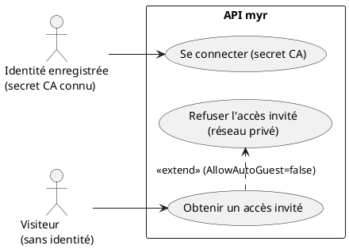
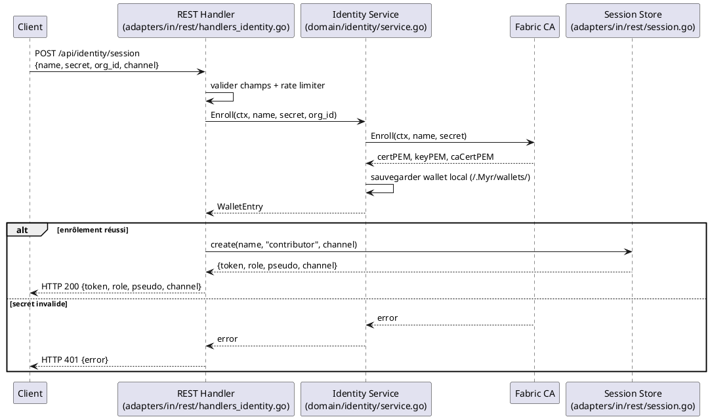

# Se Connecter

## Diagramme d'acteurs

## Contexte

Se connecter ne produit pas de JWT : `POST /api/identity/session` (re-)enrôle l'identité auprès de la Fabric CA avec le secret fourni, puis émet un **token opaque de session** (32 octets aléatoires, encodés hex — pas de JWT, pas de claims signées) à transmettre dans l'en-tête `X-Myr-Token` pour toutes les requêtes protégées suivantes. Le token expire après **7 jours** (`sessionTTL`).

Il n'y a pas de distinction « connexion standard / première connexion avec provisionnement Wallet » : l'appel à `Enroll()` est fait à chaque connexion, qu'un wallet local existe déjà ou non — c'est la Fabric CA elle-même qui décide si le secret est encore valide (comportement dépendant de sa configuration `max_enrollments`).

Un second flux, **invité**, ne passe par aucune identité CA : `POST /api/identity/guest` délivre directement un token `reader` si le réseau autorise l'accès automatique (`AllowAutoGuest=true`), sans secret ni pseudo obligatoires.

## Pré-conditions

- **Connexion avec secret** : une identité a été enregistrée auprès de la CA (UCA01) et son secret est connu du client
- **Accès invité** : le réseau actif existe (aucune identité requise)

## Scénario

### Flux nominal — Connexion avec secret CA

1. Le client soumet `POST /api/identity/session` avec `{name, secret, org_id, channel}` (`channel` optionnel)
2. Le handler valide que `name`, `secret` et `org_id` sont renseignés
3. `identitySvc.Enroll(ctx, name, secret, org_id)` (ré-)enrôle l'identité auprès de la CA et sauvegarde le wallet local (`~/.Myr/wallets/<name>@<org>/msp/`)
4. Une session REST est créée : `h.sessions.create(name, "contributor", channel)` — **le rôle est actuellement toujours fixé à `"contributor"`, jamais lu depuis l'attribut `Myr.role` du certificat CA** (voir Écart ci-dessous)
5. Réponse `HTTP 200` avec `{token, role, pseudo, channel}`
6. Le client conserve ce token et l'envoie dans l'en-tête `X-Myr-Token` de chaque requête protégée suivante — c'est aussi la seule occasion où le client reçoit son rôle (voir UCA04/UCA07)

### Flux nominal — Accès invité (réseau public)

1. Le client soumet `POST /api/identity/guest` (corps optionnel : `{pseudo, display_name, email, org_id, message}`)
2. Le réseau actif a `AllowAutoGuest=true`
3. Une session est créée immédiatement avec le rôle `reader`, pseudo `"guest"` par défaut (ou celui fourni)
4. Réponse `HTTP 200` avec `{token, role:"reader", pseudo, channel, guest:true}` — aucun enrôlement CA n'a lieu

### Flux alternatif — Accès invité refusé (réseau privé)

1. `AllowAutoGuest=false`
2. Si `pseudo`, `email` et `org_id` sont fournis dans le corps : une `AccountRequest` est enregistrée en best-effort (voir UCA01)
3. Réponse `HTTP 403` avec `{"error": "ce réseau ne permet pas l'accès automatique — contactez l'administrateur"}`

### Flux erreur — Secret invalide ou identité inconnue

1. `identitySvc.Enroll` échoue (secret incorrect, identité inexistante ou déjà consommée selon la configuration CA)
2. Réponse `HTTP 401` avec le message d'erreur renvoyé par la CA

### Flux erreur — Champs requis manquants

1. `name`, `secret` ou `org_id` absent
2. Réponse `HTTP 400` avec `{"error": "name, secret et org_id sont requis"}`

### Flux erreur — Trop de tentatives

1. Rate limiter (`authLimiter`) dépassé pour l'IP cliente
2. Réponse `HTTP 429`

## Post-conditions

- Une session REST existe côté serveur (token opaque, TTL 7 jours), associée à `{pseudo, role, channel}`
- Un wallet local à jour existe pour l'identité (connexion avec secret uniquement)
- Le client dispose du token à envoyer dans `X-Myr-Token` pour toute requête protégée

## Diagramme de séquence

## Règles métier déclenchées

- **RM20** — Se connecter et enrôler l'identité CA sont la même opération : il n'y a pas de provisionnement blockchain différé à une étape ultérieure.
- **RM22** — Le rôle qui conditionne l'accès aux ressources protégées est celui porté par la session REST (voir écart ci-dessous sur son origine réelle).

## Exigences non-fonctionnelles

- **ENF01** — La création de session doit répondre rapidement (hors latence CA elle-même).
- **ENF12** — La validation de session est strictement côté serveur — le client ne peut pas forger de rôle (le token est opaque, non décodable).

## Notes d'implémentation

**⚠️ Écart critique — le rôle de session ignore le rôle CA réel :** `handleIdentitySession` (`adapters/in/rest/handlers_identity.go`) appelle `h.sessions.create(req.Name, "contributor", channel)` — le rôle `"contributor"` est **codé en dur**, quel que soit l'attribut `Myr.role` réellement porté par le certificat CA de l'identité. Concrètement : un administrateur peut changer le rôle d'une identité via `myr identity set-role` (UCA08), mais la session REST obtenue à la connexion suivante affichera quand même `"contributor"`. C'est l'équivalent moderne de l'ancien écart « rôle par défaut incorrect » — à corriger en lisant le rôle depuis le certificat enrôlé (`WalletEntry`/attributs CA) plutôt qu'en le figeant.

**Endpoints réels :**
- `POST /api/identity/session` → `handleIdentitySession`
- `POST /api/identity/guest` → `handleIdentityGuest`
- `POST /api/identity/enroll` → `handleIdentityEnroll` (variante sans création de session REST — récupère juste le wallet local, utile hors contexte HTTP)

**Pas de JWT :** malgré des commentaires de code encore présents ailleurs (`handlers.go`, `handlers_network.go`) mentionnant « JWT Bearer », il n'y a aucune bibliothèque JWT, aucun claim signé. Le seul mécanisme réel est le token opaque + en-tête `X-Myr-Token`.

**Durée de session :** `sessionTTL = 7 * 24 * time.Hour`, constante dans `adapters/in/rest/session.go`.
