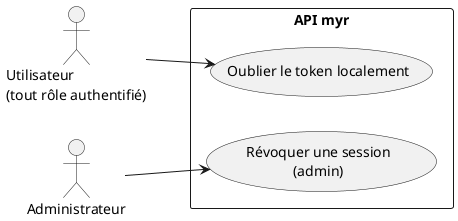
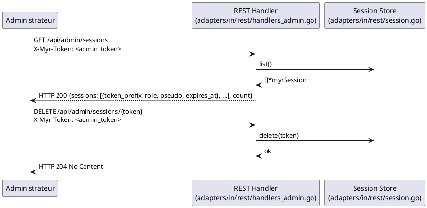

# Se Déconnecter

## Diagramme d'acteurs

## Contexte

**Il n'existe aucun endpoint de déconnexion en libre-service.** Un client authentifié ne peut pas invalider son propre token — seules deux options existent :

1. **Côté client** : cesser d'envoyer le token (`X-Myr-Token`). Le token reste techniquement valide côté serveur jusqu'à son expiration naturelle (7 jours, `sessionTTL`).
2. **Côté administrateur** : révocation forcée via `DELETE /api/admin/sessions/{token}`, après consultation de `GET /api/admin/sessions` (liste toutes les sessions actives, réservé au rôle `admin`).

C'est un écart fonctionnel significatif par rapport à un comportement attendu de « se déconnecter » — traité ici comme le comportement réel, pas comme une simplification narrative.

## Pré-conditions

- **Oubli côté client** : le client détient un token de session (peu importe sa validité)
- **Révocation admin** : l'administrateur dispose du token exact de la session à révoquer (voir écart ci-dessous — la liste ne l'expose que tronqué)

## Scénario

### Flux nominal — Le client cesse d'utiliser son token

1. Le client supprime le token qu'il avait conservé localement
2. Aucun appel serveur n'est nécessaire ni possible pour cette action
3. Le token reste valide côté serveur jusqu'à expiration (7 jours) — toute requête le portant encore sera acceptée pendant ce délai

### Flux alternatif — Révocation par l'administrateur

1. L'administrateur appelle `GET /api/admin/sessions` (rôle `admin` requis) — reçoit `{token_prefix, role, pseudo, network_id, expires_at}` pour chaque session active
2. L'administrateur appelle `DELETE /api/admin/sessions/{token}` avec le token **complet** de la session à révoquer
3. La session est supprimée immédiatement du store — la requête suivante portant ce token reçoit `HTTP 401`

## Post-conditions

- **Oubli côté client** : aucun changement d'état côté serveur ; le token reste valide jusqu'à expiration
- **Révocation admin** : la session est supprimée du store, effet immédiat

## Diagramme de séquence

## Règles métier déclenchées

Aucune règle métier dédiée. La révocation est une opération d'administration système (RBAC `PermAdmin`), pas une règle de gestion.

## Exigences non-fonctionnelles

- **ENF12** — La révocation est strictement côté serveur, réservée au rôle `admin` (`requireRole(rbac.PermAdmin, ...)`).

## Notes d'implémentation

**Endpoints réels :**
- `GET /api/admin/sessions` → `handleAdminSessions`
- `DELETE /api/admin/sessions/{token}` → `handleAdminSession`

**⚠️ Écart — la liste ne permet pas de retrouver le token à révoquer :** `GET /api/admin/sessions` n'expose que `token_prefix` (8 premiers caractères, tronqué par sécurité), alors que `DELETE /api/admin/sessions/{token}` exige le token complet en URL. En l'état, un administrateur ne peut pas relier ces deux endpoints pour révoquer une session précise sans connaître le token complet par un autre moyen (ex. le retrouver dans les logs, ou le fichier de persistance JSON des sessions si activé). Corriger nécessiterait soit d'exposer un identifiant stable non sensible (ex. un ID de session distinct du token), soit d'accepter le préfixe en paramètre de révocation.

**Pas de révocation en libre-service :** Aucun endpoint `POST /api/identity/logout` ou équivalent n'existe. Si ce comportement est jugé nécessaire, il resterait à concevoir (ex. un endpoint qui révoque le token porté par la requête elle-même, sans besoin de droits admin).

**Durée résiduelle :** un token « oublié » côté client reste exploitable par quiconque le détiendrait pendant jusqu'à 7 jours (`sessionTTL`) — accepté comme risque résiduel en l'absence de logout self-service.
