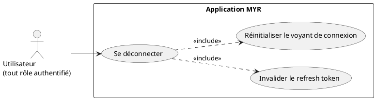
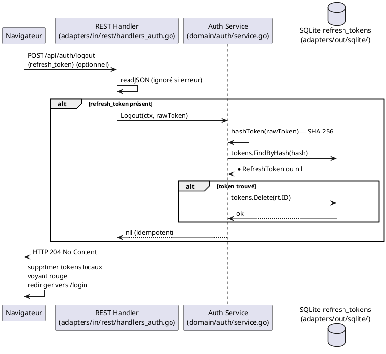

# Se Déconnecter

## Diagramme d'acteurs

## Contexte

UCA03 met fin à la session active de l'utilisateur. La déconnexion opère à deux niveaux :

1. **Côté serveur** : invalidation du refresh token en base SQLite (suppression de l'enregistrement dans `refresh_tokens`). L'access token JWT reste techniquement valide jusqu'à son expiration naturelle (15 min) — il n'existe pas de mécanisme de révocation d'access token dans l'implémentation actuelle.

2. **Côté client** : suppression des tokens stockés dans le navigateur, retour à l'état non-authentifié, voyant de connexion rouge.

La déconnexion est **idempotente** : si le refresh token est déjà invalide ou absent, le serveur répond `204 No Content` sans erreur.

Si `JWT_SECRET` n'est pas configuré (`authSvc == nil`), le handler retourne directement `204` — comportement dégradé silencieux.

## Pré-conditions

- L'utilisateur est connecté (session JWT active)
- Le client dispose d'un refresh token valide (ou non — la déconnexion reste idempotente)

## Scénario

**Étape initiale :** L'utilisateur clique sur le bouton de déconnexion

### Flux nominal — Déconnexion réussie

1. Le client soumet `POST /api/auth/logout` avec `{refresh_token}` (body JSON optionnel)
2. Le handler REST parse le body et extrait le `refresh_token`
3. Si le refresh token est présent, `domain/auth.Logout()` est appelé :
   - Hash SHA-256 du token
   - Recherche dans `refresh_tokens` par hash
   - Suppression de l'enregistrement (`tokens.Delete`)
4. Réponse `HTTP 204 No Content`
5. Le client supprime les tokens stockés (localStorage / sessionStorage)
6. Le voyant de connexion passe au rouge
7. L'interface redirige vers l'écran de connexion

### Flux alternatif — Refresh token absent ou déjà invalidé

1. Le body est vide ou le refresh token est introuvable en base
2. `Logout()` est idempotent — aucune erreur n'est levée
3. Réponse `HTTP 204 No Content` identique au flux nominal
4. Le client nettoie ses tokens locaux et redirige vers la page de connexion

## Post-conditions

- Le refresh token est supprimé de la table `refresh_tokens`
- L'access token JWT reste valide jusqu'à expiration (max 15 min) — toute requête le portant sera acceptée pendant ce délai
- La session est considérée comme terminée côté client
- Le voyant de connexion est rouge

## Diagramme de séquence

## Règles métier déclenchées

- **RM22** — Après déconnexion, l'access token JWT expiré ne donne plus accès aux ressources protégées. Un access token encore valide (< 15 min) reste techniquement utilisable jusqu'à expiration — point d'attention sécurité.

## Exigences non-fonctionnelles

- **ENF12** — L'invalidation du refresh token est strictement côté serveur.
- **ENF27** — Aucune donnée personnelle n'est exposée lors de la déconnexion.

## Notes d'implémentation

**Révocation de l'access token :** L'implémentation actuelle ne révoque pas l'access token JWT. Cela signifie qu'un utilisateur déconnecté mais dont le token n'a pas encore expiré peut encore effectuer des requêtes pendant la fenêtre résiduelle (≤ 15 min). Pour une sécurité renforcée, une blocklist d'access tokens (Redis ou SQLite) pourrait être ajoutée — non prévu dans la v1.

**Statut d'implémentation :**
- `POST /api/auth/logout` : **opérationnel** (`handleAuthLogout`)
- Idempotence : **respectée** (`Logout()` retourne nil si token absent)
- Révocation access token : **non implémentée** (acceptable v1)
