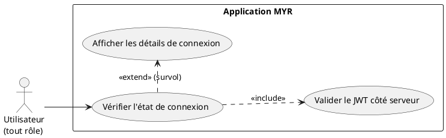
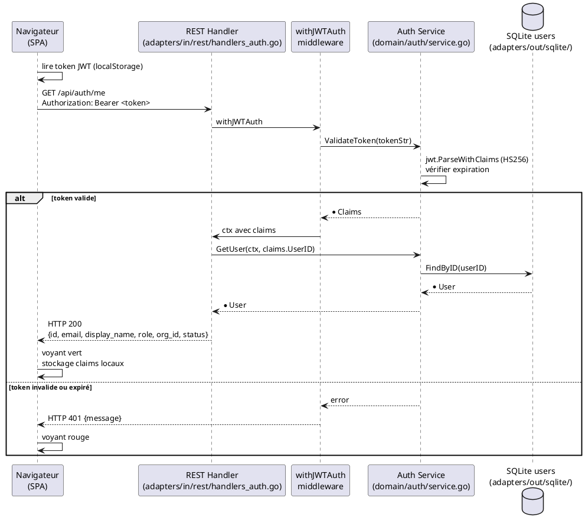

# Vérification de la connexion

## Diagramme d'acteurs

## Contexte

UCA04 couvre deux mécanismes complémentaires de vérification de l'état de session :

1. **Indicateur visuel permanent** : un voyant coloré (vert = connecté, rouge = déconnecté) est affiché en continu dans l'interface. Il est mis à jour côté client sans solliciter le serveur.

2. **Validation JWT côté serveur** : l'endpoint `GET /api/auth/validate` (ou `GET /api/auth/me`) permet au client de vérifier qu'un token stocké est encore valide et de récupérer les informations de session courantes (rôle, organisation, email).

Cet UC est déclenché automatiquement au chargement de la SPA (Single Page Application) pour déterminer si une session précédente peut être restaurée.

L'endpoint de référence dans le code est `GET /api/auth/me` (handler `handleAuthMe`), qui retourne les informations complètes de l'utilisateur authentifié. Il requiert le middleware `withJWTAuth`.

## Pré-conditions

- L'application est ouverte dans le navigateur
- Pour la validation serveur : un access token JWT doit être présent dans le stockage local du navigateur

## Scénario

**Étape initiale :** L'application affiche en permanence un voyant de statut de connexion

### Flux nominal — Connecté, JWT valide

1. Au chargement de la SPA, le client lit le token JWT stocké localement
2. Le client envoie `GET /api/auth/me` avec `Authorization: Bearer <token>`
3. Le middleware `withJWTAuth` valide la signature JWT (HS256) et vérifie la date d'expiration
4. `handleAuthMe` appelle `authSvc.GetUser(ctx, claims.UserID)` pour confirmer que le compte est toujours actif
5. Réponse `HTTP 200` avec `{id, email, display_name, role, org_id, status}`
6. Le voyant s'affiche en vert
7. En survolant le voyant, les détails s'affichent : réseau, organisation, rôle actif

### Flux nominal — Déconnecté (pas de token ou token expiré)

1. Aucun token présent localement, ou le token est expiré
2. Pas d'appel serveur (ou `GET /api/auth/me` retourne `HTTP 401`)
3. Le voyant s'affiche en rouge
4. En survolant, un message indique "Non connecté" (ou la raison si applicable)

### Flux alternatif — Token expiré, refresh automatique

1. L'access token est expiré (≥ 15 min depuis émission)
2. Le client détecte l'expiration (via `exp` dans le payload JWT décodé localement)
3. Le client tente `POST /api/auth/refresh` avec le refresh token
4. Si le refresh token est valide, un nouvel access token est émis
5. Le voyant reste vert — l'utilisateur ne perçoit pas l'interruption

## Post-conditions

- L'utilisateur connaît à tout moment l'état de sa connexion (voyant vert/rouge)
- Le client dispose d'informations de session à jour (rôle, organisation) si connecté
- En cas de token expiré non renouvelable, le client nettoie les tokens et affiche le voyant rouge

## Diagramme de séquence

## Règles métier déclenchées

- **RM22** — La vérification du rôle et du statut du compte est effectuée côté serveur à chaque appel de `GET /api/auth/me`. Un compte suspendu retourne une erreur même si le token est valide.

## Exigences non-fonctionnelles

- **ENF01** — La validation JWT doit répondre en < 100 ms (opération en mémoire pure pour la vérification de signature).
- **ENF22** — L'indicateur visuel (voyant) doit fonctionner sur Chrome 120+, Firefox 120+, Safari 17+, Edge 120+.
- **ENF12** — La validation de l'état de connexion est serveur — le client ne décide pas seul qu'une session est valide.

## Notes d'implémentation

**Endpoint :** L'Expression utilise `GET /api/auth/validate` comme nom d'endpoint, mais le code implémente `GET /api/auth/me` (`handleAuthMe`). Les deux termes réfèrent à la même fonctionnalité. Le nom canonique retenu pour l'analyse est `GET /api/auth/me`.

**Voyant UI :** L'implémentation du voyant visuel est dans `ui/static/` (SPA Vanilla JS). Le comportement exact (couleur, survol, tooltip) est à vérifier dans le code frontend.

**Statut d'implémentation :**
- `GET /api/auth/me` : **opérationnel** (`handleAuthMe` + `withJWTAuth`)
- Voyant visuel : à vérifier dans `ui/static/`
- Refresh automatique côté client : à vérifier dans le JS frontend
