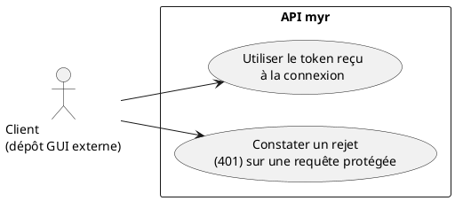
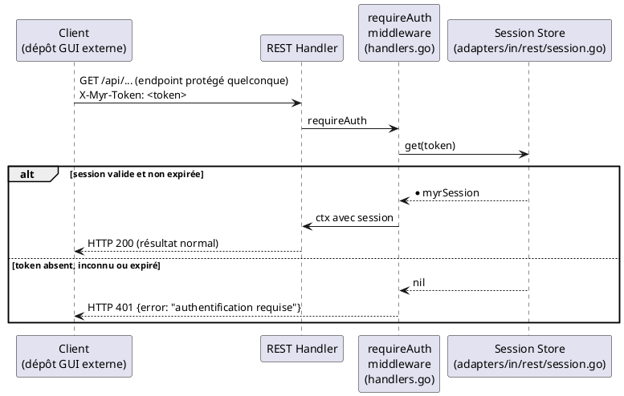

# Vérification de la connexion

## Diagramme d'acteurs

## Contexte

**Il n'existe aucun endpoint qui répond « suis-je connecté ? / quel est mon rôle actuel ? ».** Il n'y a pas d'équivalent de `GET /api/auth/me` dans le code réel.

Le seul moment où le client apprend son rôle, son pseudo et son canal est la réponse de `POST /api/identity/session` ou `POST /api/identity/guest` (UCA02) — il doit les mettre en cache lui-même. Ensuite, la seule façon de savoir si la session est toujours valide est de tenter un appel protégé et d'observer la réponse :

- `HTTP 200` (ou tout code de succès métier) → le token est toujours valide
- `HTTP 401` → le token est absent, invalide ou expiré — il faut se reconnecter (UCA02)

> La restitution visuelle de cet état (indicateur coloré, tooltip au survol, etc.) est un choix d'interface qui relève du dépôt GUI externe — hors périmètre de ce document.

## Pré-conditions

- Le client dispose (ou non) d'un token obtenu via UCA02

## Scénario

### Flux nominal — Token toujours valide

1. Le client envoie une requête protégée quelconque avec `X-Myr-Token: <token>`
2. `requireAuth` retrouve la session dans le store et vérifie qu'elle n'a pas expiré
3. La requête aboutit normalement — le client en déduit que sa session est active

### Flux nominal — Aucun token disponible

1. Le client n'a pas (ou plus) de token en cache
2. Il doit passer par UCA02 (connexion ou accès invité) avant tout appel protégé

### Flux erreur — Token expiré ou invalide

1. Le client envoie une requête protégée avec un token absent du store ou expiré
2. `requireAuth` répond `HTTP 401` avec `{"error": "authentification requise"}`
3. Le client doit se reconnecter (UCA02) pour obtenir un nouveau token — il n'y a pas de rafraîchissement automatique (pas de refresh token, le token opaque est valide 7 jours en bloc)

## Post-conditions

- Le client sait, après une tentative de requête, si son token est encore valide ou non
- Aucune information de session n'est accessible autrement que par cette tentative ou par ce qui a été mis en cache à la connexion

## Diagramme de séquence

## Règles métier déclenchées

- **RM22** — La validité de la session est vérifiée côté serveur à chaque requête protégée (`requireAuth`) ; le client ne peut pas décider seul qu'une session est valide.

## Exigences non-fonctionnelles

- **ENF12** — La validation de session est strictement côté serveur.

## Notes d'implémentation

**Pas d'endpoint dédié :** `requireAuth` (`adapters/in/rest/handlers.go`) est un middleware appliqué à des routes métier — il n'existe pas de route « neutre » dont le seul rôle serait de vérifier/retourner l'état de connexion.

**Mode simulation locale :** si aucun peer Fabric n'est configuré et qu'aucun service réseau n'est injecté (`h.netInfo.Network == "" && h.networkSvc == nil`), `requireAuth` **contourne entièrement l'authentification** et injecte une session `admin` factice — utile en développement local, mais à garder en tête pour ne pas confondre ce mode avec un comportement de production.

**Statut d'implémentation :**
- Vérification de session sur requête protégée : **opérationnelle** (`requireAuth`)
- Endpoint de consultation de session (« whoami ») : **inexistant** — écart réel, pas une simplification de cette spec
