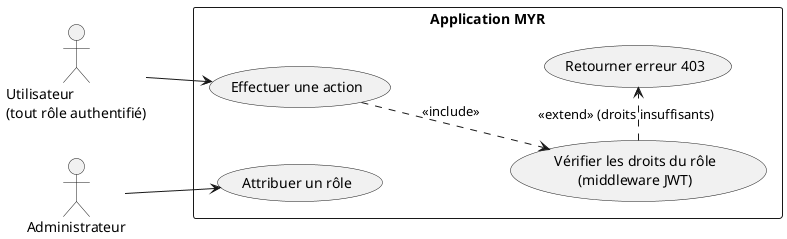
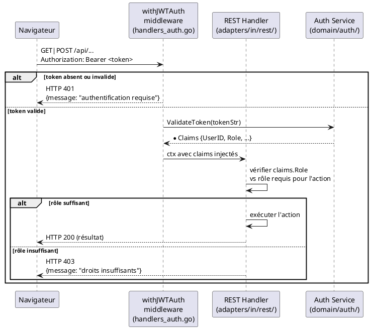

# Vérification des accès du rôle attribué

## Diagramme d'acteurs

## Contexte

UCA05 décrit le mécanisme de contrôle d'accès par rôle (RBAC) qui protège chaque action du système. Ce n'est pas un use case déclenché explicitement par l'utilisateur : il s'exécute de manière transparente à chaque appel d'endpoint protégé.

Le contrôle d'accès est implémenté en deux couches :

1. **Authentification** : middleware `withJWTAuth` — vérifie que le token JWT est valide et non expiré. Retourne `401` si absent ou invalide.

2. **Autorisation** : vérification du rôle dans le handler — retourne `403` si le rôle est insuffisant pour l'action demandée.

Les rôles disponibles dans le système sont hiérarchisés :

| Rôle | Code | Droits |
|------|------|--------|
| Lecteur | `reader` | Lecture authentifiée |
| Concepteur | `contributor` (code provisoire) | Lecture + écriture assets |
| Consommateur | `consumer` | Lecture + commande |
| Manufactureur | `manufacturer` | Lecture sur demande |
| Développeur | `developer` | Lecture + API/CLI |
| Administrateur | `admin` | Tous droits réseau |

Le rôle est encodé dans le JWT au moment du login et relié directement à la valeur stockée en base `users.role`.

## Pré-conditions

- L'utilisateur est authentifié (JWT valide, non expiré)
- Un rôle est attribué à l'utilisateur (toujours le cas après UCA01)

## Scénario

**Étape initiale :** L'utilisateur tente d'effectuer une action via l'interface ou l'API

### Flux nominal — Action autorisée

1. Le client envoie la requête avec `Authorization: Bearer <token>`
2. `withJWTAuth` valide le JWT et extrait les claims (dont `role`)
3. Le handler vérifie que `claims.Role` correspond au rôle requis pour l'action
4. L'action est exécutée normalement

### Flux erreur — Authentification absente (401)

1. Aucun token ou token invalide dans la requête
2. `withJWTAuth` retourne `HTTP 401` avec `{"message": "authentification requise"}`
3. L'interface redirige vers la page de connexion

### Flux erreur — Rôle insuffisant (403)

1. Le token JWT est valide mais le rôle est insuffisant pour l'action demandée
2. Le handler retourne `HTTP 403` avec `{"message": "Vous n'avez pas les droits nécessaires pour cette action"}`
3. L'interface affiche le message d'erreur sans redirection

## Post-conditions

- Si autorisé : l'action est exécutée, le rôle de l'utilisateur n'est pas modifié
- Si refusé : aucun effet de bord, l'état du système est inchangé

## Diagramme de séquence

## Règles métier déclenchées

- **RM22** — Tout accès à une action protégée déclenche une vérification de rôle côté serveur. Le client ne peut pas contourner ce contrôle en modifiant le JWT (signature HS256 vérifiée).

## Exigences non-fonctionnelles

- **ENF12** — Le contrôle de rôle est strictement côté serveur — jamais basé uniquement sur une décision client.
- **ENF18** — Le middleware `withJWTAuth` est dans l'adapter `in/rest/` — il ne contient pas de logique métier, uniquement de l'extraction de claims.

## Notes d'implémentation

**Middleware `withJWTAuth` :** Implémenté dans `adapters/in/rest/handlers_auth.go`. Il injecte les claims JWT dans le contexte de requête via `ctxWithJWTClaims`. Les handlers downstream extraient les claims via `jwtClaimsFromCtx(r)`.

**Rôles `consumer`, `manufacturer`, `developer` :** Ces rôles sont définis dans les specs et la table d'acteurs (`Analyse_des_besoins.md §3.1`) mais ne sont pas encore présents dans `SetUserRole()` (`domain/auth/service.go`), qui n'accepte que `reader`, `contributor`, `admin`. À ajouter lors de l'implémentation de UCA08.

**Rôle `contributor` :** Alias provisoire du rôle **Concepteur** dans le code. Le code de rôle cible (`designer`) est à confirmer avec le product owner.

**Statut d'implémentation :**
- Middleware `withJWTAuth` : **opérationnel**
- Vérification de rôle dans les handlers existants (model, channel, payment) : **opérationnelle** pour `reader`/`contributor`/`admin`
- Rôles `consumer`, `manufacturer`, `developer` : **non implémentés**
