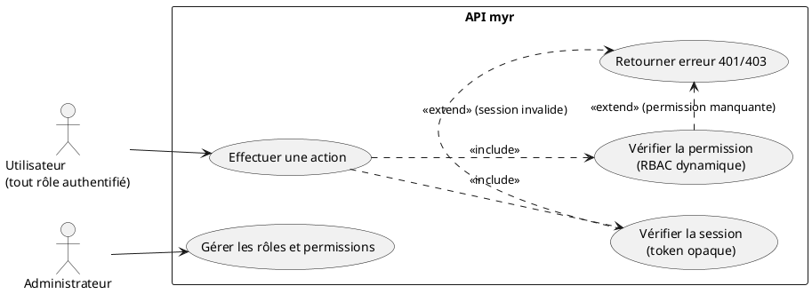
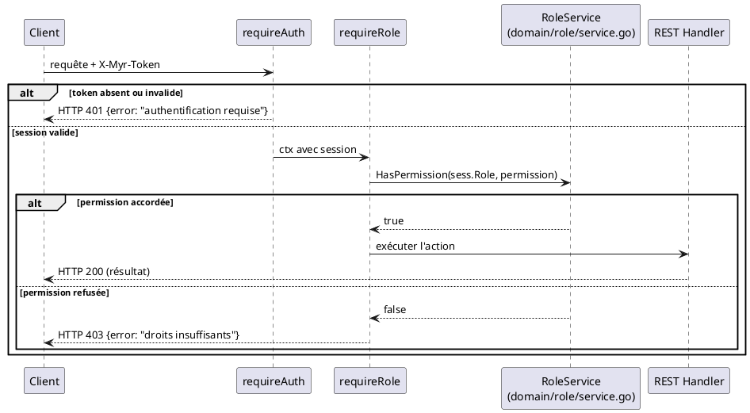

# Vérification des accès du rôle attribué

## Diagramme d'acteurs

## Contexte

Le contrôle d'accès repose sur deux couches, toutes deux dans `adapters/in/rest/handlers.go` :

1. **Authentification** (`requireAuth`) — vérifie que le token opaque `X-Myr-Token` correspond à une session active et non expirée. Retourne `401` sinon.
2. **Autorisation** (`requireRole`) — vérifie que le rôle de la session porte la **permission** requise pour l'action, via `domain/role.RoleService.HasPermission(role, permission)`. Retourne `403` sinon.

Les permissions forment un catalogue plat (pas de hiérarchie implicite) : `read`, `write`, `network.admin`, `role.admin`, `identity.admin`, `admin`. Un rôle est une association arbitraire à un sous-ensemble de ces permissions (RBAC dynamique, `domain/role`), pas une simple étiquette ordonnée.

Quatre rôles **intégrés** existent toujours et ne peuvent pas être modifiés ni supprimés : `reader`, `contributor`, `auditor`, `admin` (voir `myr role list`). Des rôles personnalisés (ex. `consumer`, `manufacturer`) peuvent être créés par un administrateur via `myr role create` avec n'importe quel sous-ensemble de permissions.

**Si aucun `role.RoleService` n'est injecté** dans le serveur (config minimale), `requireRole` retombe sur une hiérarchie historique câblée en dur : `reader(1) < contributor(2) < admin(3)`, comparée au rang requis par la permission (`legacyRoleRank` / `legacyPermRank` dans `handlers.go`).

## Pré-conditions

- L'utilisateur dispose d'un token de session valide (UCA02)
- Un rôle est associé à la session (celui fixé à la connexion — voir écart UCA02 sur le rôle figé à `"contributor"`)

## Scénario

### Flux nominal — Action autorisée

1. Le client envoie la requête avec `X-Myr-Token: <token>`
2. `requireAuth` retrouve la session ; `requireRole` vérifie `roleSvc.HasPermission(sess.Role, permission_requise)`
3. La permission est accordée — l'action est exécutée normalement

### Flux erreur — Session absente ou invalide (401)

1. Aucun token, ou token inconnu/expiré
2. `requireAuth` retourne `HTTP 401` avec `{"error": "authentification requise"}`

### Flux erreur — Permission insuffisante (403)

1. La session est valide mais `HasPermission` retourne `false` pour la permission requise (ou repli sur `legacyRoleRank` si aucun `RoleService` injecté)
2. `requireRole` retourne `HTTP 403` avec `{"error": "droits insuffisants"}`

## Post-conditions

- Si autorisé : l'action est exécutée, le rôle de la session n'est pas modifié
- Si refusé : aucun effet de bord, l'état du système est inchangé

## Diagramme de séquence

## Règles métier déclenchées

- **RM22** — Tout accès à une action protégée déclenche une vérification côté serveur (session + permission). Le client ne peut pas contourner ce contrôle : le token est opaque, non forgeable.

## Exigences non-fonctionnelles

- **ENF12** — Le contrôle d'accès est strictement côté serveur.
- **ENF18** — `requireAuth`/`requireRole` (adapter `in/rest/`) ne contiennent que de l'orchestration ; la décision RBAC elle-même vit dans `domain/role`.

## Notes d'implémentation

**Composants réels :**
- `requireAuth`, `requireRole`, `legacyRoleRank`, `legacyPermRank` → `adapters/in/rest/handlers.go`
- Catalogue de permissions, rôles intégrés, RBAC dynamique → `domain/role/entity.go`, `service.go`
- Gestion des rôles : `myr role list|show|create|update|delete` (CLI uniquement — aucun endpoint REST de gestion des rôles, seulement une consultation implicite via l'usage du middleware)

**Pas de JWT :** aucune claim signée n'est en jeu ici — la « vérification du rôle » se fait en interrogeant le store de sessions et le service RBAC à chaque requête, pas en décodant un token.

**Rôle figé à la connexion :** le rôle vérifié ici est celui fixé une fois pour toutes à la création de la session (UCA02) — un changement de rôle CA (UCA08) ne s'applique qu'à la prochaine connexion, pas à la session en cours.
