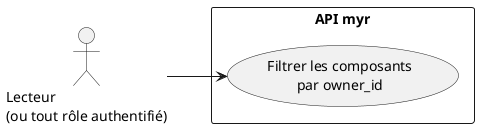
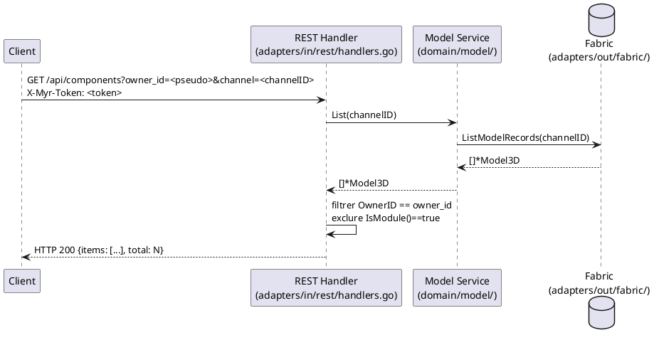

# Vérifier les possessions

## Diagramme d'acteurs

## Contexte

UCA06 permet à un client de consulter les Composants dont un `owner_id` donné est propriétaire, via `GET /api/components?owner_id=<id>`. La propriété est déterminée par le champ `Model3D.OwnerID`.

**Il n'existe pas de notion de « mes possessions » dérivée automatiquement de la session.** Le paramètre `owner_id` est fourni tel quel par le client — le serveur ne le compare **pas** au pseudo de la session courante (`sess.Pseudo`). Un client authentifié peut donc interroger les possessions de n'importe quel `owner_id`, pas seulement les siennes ; et à la création d'un asset (`POST /api/components`), c'est aussi le client qui fournit librement le `owner_id` du champ `owner_id` du formulaire — rien ne le force à correspondre à son propre pseudo de session. C'est un écart de sécurité déjà documenté (`specs/3-Conception/Securite.md`, ligne sur `OwnerID` forgeable), pas une invention de cette spec.

Il n'y a par ailleurs **aucune vérification de wallet CA** avant cette lecture — l'accès aux données passe uniquement par la session REST (token opaque), pas par l'identité cryptographique elle-même.

Seuls les **Composants** supportent ce filtre : `GET /api/modules` ne propose pas de filtre `owner_id` (uniquement une recherche texte `q` sur nom/description).

## Pré-conditions

- Le client est authentifié (`X-Myr-Token` valide) ou l'accès public est autorisé selon la configuration du réseau
- Le client connaît l'`owner_id` (généralement son propre pseudo) à filtrer

## Scénario

### Flux nominal — Composants possédés retournés

1. Le client appelle `GET /api/components?owner_id=<pseudo>&channel=<channelID>`
2. Le handler `handleComponents` liste tous les assets du canal via le service domaine, exclut les modules (`IsModule()`)
3. Il filtre les résultats dont `OwnerID == owner_id` fourni
4. Réponse `HTTP 200` avec `{items: [...], total: N}`

### Flux nominal — Aucune possession

1. Étapes identiques, aucun asset ne correspond à l'`owner_id` fourni
2. Réponse `HTTP 200` avec `{items: [], total: 0}`

### Flux erreur — Blockchain indisponible

1. `ListModelRecords` échoue côté adapter Fabric
2. Réponse `HTTP 500` avec `{"error": "..."}`

## Post-conditions

- Le client reçoit la liste des Composants correspondant à l'`owner_id` fourni
- Aucune modification de l'état du système (opération lecture seule)

## Diagramme de séquence

## Règles métier déclenchées

Aucune règle métier dédiée à ce filtre — c'est une projection en lecture seule sur `Model3D.OwnerID`.

## Exigences non-fonctionnelles

- **ENF02** — Les requêtes Fabric doivent s'exécuter en < 2 s pour 100 assets.
- **ENF18** — L'interrogation Fabric passe exclusivement par `adapters/out/fabric/`.

## Notes d'implémentation

**Endpoint réel :** `GET /api/components?owner_id=...` → `handleComponents` (`adapters/in/rest/handlers.go`).

**⚠️ Écart de sécurité — `owner_id` non lié à la session :** ni la lecture (`GET /api/components?owner_id=`) ni l'écriture (`POST /api/components` avec `owner_id` en formulaire) ne comparent la valeur fournie à `sess.Pseudo`. Documenté également dans `specs/3-Conception/Securite.md` (« Client peut forger n'importe quel owner_id »). Une implémentation cible devrait soit ignorer le `owner_id` fourni par le client au profit de `sess.Pseudo`, soit valider explicitement leur égalité selon le cas d'usage voulu (un admin peut légitimement vouloir consulter les possessions d'un tiers).

**Pas de filtre équivalent sur les modules :** `GET /api/modules` ne connaît pas le paramètre `owner_id` — seule une recherche texte (`q`) est disponible.

**Pas de vérification de wallet :** contrairement à ce qu'un ancien design aurait pu supposer, aucune vérification de wallet CA n'intervient dans ce flux — l'accès est conditionné uniquement par la session REST (`requireAuth`/`contrib`).
