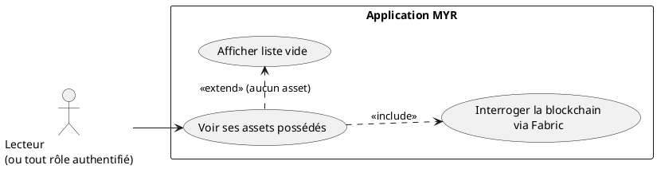
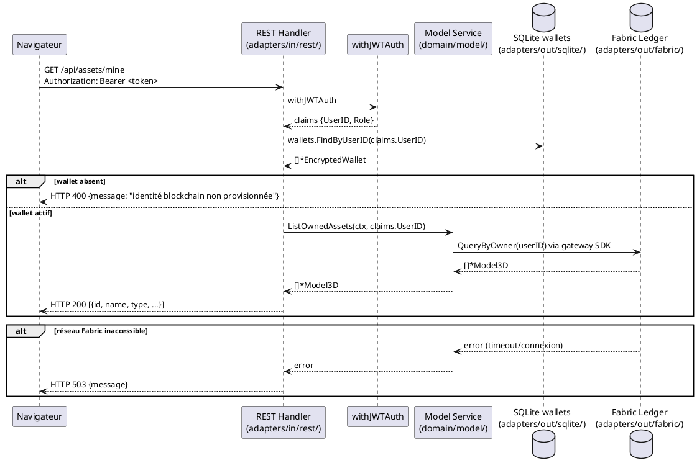

# Vérifier les possessions

## Diagramme d'acteurs

## Contexte

UCA06 permet à un utilisateur authentifié de consulter la liste des assets (composants et modules) enregistrés sur la blockchain dont il est propriétaire. La propriété est déterminée par le champ `OwnerID` (ou équivalent) dans le ledger Fabric.

Cette consultation interroge la blockchain via `adapters/out/fabric/` — elle ne peut pas fonctionner sans un Wallet Fabric CA actif (provisionné lors de la première connexion, UCA02 — RM20). L'identité blockchain de l'utilisateur est nécessaire pour signer la requête de lecture sur le ledger.

La liste comprend deux types d'entités :
- **Composants** : `Model3D` avec `Hash` renseigné
- **Modules** : `Model3D` avec `WorkspaceInstances` renseignés et `Status` non vide

## Pré-conditions

- L'utilisateur est authentifié (JWT valide)
- L'utilisateur dispose d'un Wallet Fabric CA actif (RM20 — provisionné à la première connexion)
- Le réseau Fabric est accessible

## Scénario

**Étape initiale :** L'utilisateur accède à son profil ou à la section "Mes assets"

### Flux nominal — Affichage des possessions

1. Le client appelle `GET /api/auth/me` ou un endpoint dédié (ex. `GET /api/assets/mine`) avec le JWT
2. Le handler vérifie l'authentification via `withJWTAuth`
3. Le service interroge le ledger Fabric via l'adapter `out/fabric/` avec l'identité de l'utilisateur
4. Les assets dont `OwnerID == claims.UserID` sont récupérés
5. La liste est retournée : `HTTP 200` avec `[{id, name, type, category, created_at, ...}]`
6. L'interface affiche la liste des composants et modules possédés

### Flux nominal — Aucune possession

1. Étapes 1 à 4 identiques
2. Le ledger ne retourne aucun asset pour cet utilisateur
3. `HTTP 200` avec `[]` (liste vide)
4. L'interface affiche : "Aucun asset enregistré"

### Flux erreur — Wallet absent (première connexion non complétée)

1. `wallets.FindByUserID` retourne une liste vide
2. `HTTP 400` ou `403` : "Identité blockchain non provisionnée — connectez-vous pour l'activer"

### Flux erreur — Réseau Fabric inaccessible

1. L'appel à l'adapter Fabric échoue (timeout, erreur réseau)
2. `HTTP 503` : "Réseau blockchain inaccessible, veuillez réessayer"

## Post-conditions

- L'utilisateur a une vue complète de ses possessions sur le réseau blockchain
- Aucune modification de l'état du système (opération lecture seule)

## Diagramme de séquence

## Règles métier déclenchées

- **RM20** — La consultation des possessions nécessite un Wallet actif. Si le Wallet n'existe pas (première connexion non effectuée), l'accès au ledger est impossible.
- **RM22** — Tout utilisateur authentifié (quel que soit son rôle) peut consulter ses propres possessions.

## Exigences non-fonctionnelles

- **ENF02** — Les requêtes Fabric doivent s'exécuter en < 2 s pour 100 assets.
- **ENF18** — L'interrogation Fabric passe exclusivement par `adapters/out/fabric/` — jamais directement depuis un handler REST.

## Notes d'implémentation

**Endpoint non confirmé :** L'endpoint exact (`GET /api/assets/mine` ou intégré dans `GET /api/auth/me`) n'est pas clairement défini dans le code existant. L'Expression mentionne "profil ou section Mes assets" sans préciser l'URL. À confirmer avec le product owner.

**Implémentation Fabric :** `adapters/out/fabric/` contient le client Gateway SDK v2. La requête `QueryByOwner` correspond probablement à une invocation chaincode. La structure exacte dépend du chaincode Fabric (`chaincode/model/entity.go`).

**Statut d'implémentation :**
- Endpoint `GET /api/assets/mine` (ou équivalent) : **statut inconnu** — à vérifier dans `adapters/in/rest/`
- Requête Fabric par propriétaire : **à vérifier** dans `adapters/out/fabric/`
- Vérification Wallet avant requête Fabric : **non confirmée**
