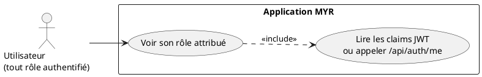
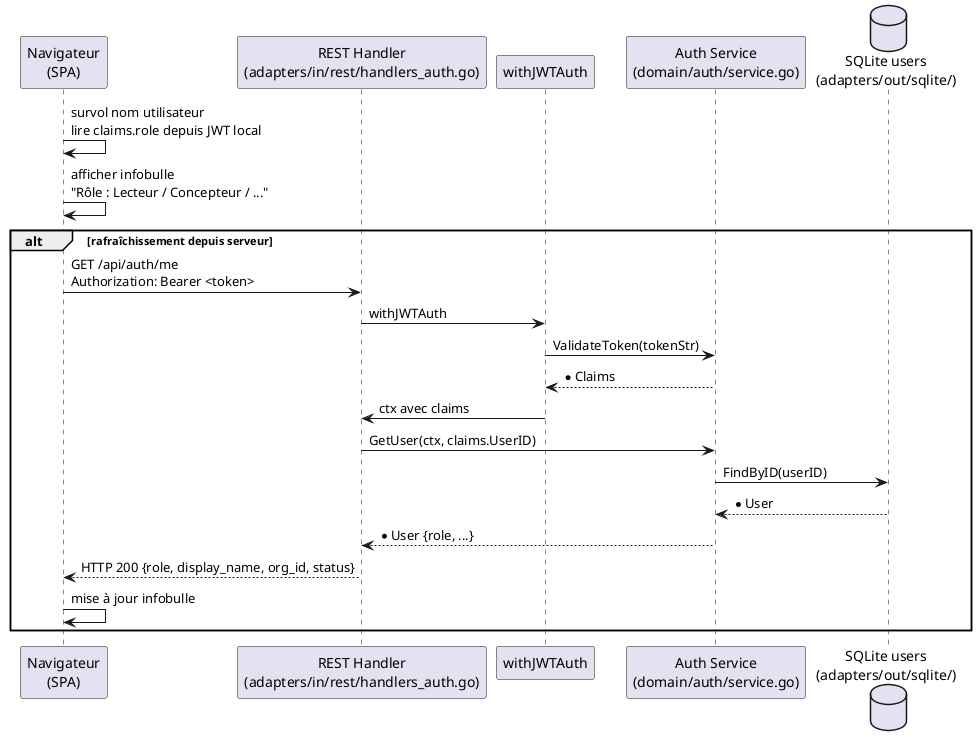

# Vérification du rôle attribué

## Diagramme d'acteurs

## Contexte

UCA07 est un use case d'information pure : l'utilisateur consulte son rôle actif pour comprendre ses droits dans le système. C'est un mécanisme de visibilité, pas d'autorisation.

Deux sources d'information sont disponibles :

1. **Côté client (immédiat)** : le payload JWT est décodable sans clé secrète (base64). Le client peut lire le champ `role` directement depuis le token stocké localement — sans requête serveur.

2. **Côté serveur (référence)** : `GET /api/auth/me` retourne `{role, ...}` avec les données fraîches de la base.

L'interface expose cette information via une infobulle au survol du nom d'utilisateur. C'est le seul point d'entrée décrit dans l'Expression.

## Pré-conditions

- L'utilisateur est authentifié (JWT valide)

## Scénario

**Étape initiale :** L'utilisateur survole son nom d'utilisateur affiché dans l'interface (MenuBar)

### Flux nominal — Affichage du rôle

1. L'interface lit le rôle depuis les claims JWT stockés localement
2. Une infobulle affiche le rôle humain lisible correspondant :
   - `reader` → "Lecteur"
   - `contributor` → "Concepteur"
   - `admin` → "Administrateur"
   - `consumer` → "Consommateur"
   - `manufacturer` → "Manufactureur"
   - `developer` → "Développeur"
3. L'infobulle disparaît au retrait de la souris

### Flux alternatif — Rafraîchissement depuis le serveur

1. Si les claims locaux sont absents ou suspects, le client appelle `GET /api/auth/me`
2. `withJWTAuth` valide le JWT
3. Le handler retourne `{role, display_name, org_id, ...}`
4. L'interface met à jour l'infobulle avec les données fraîches

## Post-conditions

- L'utilisateur connaît son rôle actuel — aucune modification de l'état du système

## Diagramme de séquence

## Règles métier déclenchées

- **RM22** — Le rôle affiché correspond exactement à la valeur en base — il est lu depuis le JWT (signé par le serveur) ou confirmé par `GET /api/auth/me`. L'utilisateur ne peut pas modifier l'affichage de son rôle.

## Exigences non-fonctionnelles

- **ENF22** — L'infobulle de survol doit fonctionner sur Chrome 120+, Firefox 120+, Safari 17+, Edge 120+.

## Notes d'implémentation

**Lecture locale des claims JWT :** Le payload JWT (partie centrale) est encodé en base64 non chiffré — lisible par le JS client sans appel serveur. Cette approche est standard et ne constitue pas une faille de sécurité (le JWT est signé, pas chiffré — il ne contient pas de données sensibles au-delà du rôle et de l'email).

**Mapping rôle → libellé :** Ce mapping (ex. `contributor` → "Concepteur") doit être défini dans le JS frontend (`ui/static/`). Il doit être mis à jour lors de l'ajout des nouveaux rôles (`consumer`, `manufacturer`, `developer`).

**Statut d'implémentation :**
- `GET /api/auth/me` : **opérationnel** (retourne le rôle)
- Infobulle de survol : à vérifier dans `ui/static/`
- Mapping rôle → libellé français : à vérifier dans le JS frontend
