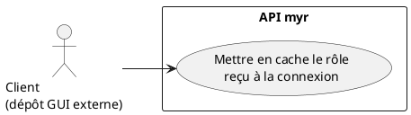
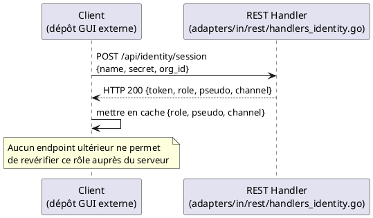

# Vérification du rôle attribué

## Diagramme d'acteurs

## Contexte

Comme pour UCA04, **il n'existe aucun endpoint permettant à un client de (re)demander son rôle courant au serveur.** Le rôle n'est communiqué qu'une seule fois : dans la réponse de `POST /api/identity/session` ou `POST /api/identity/guest` (UCA02), sous la forme `{role, pseudo, channel, ...}`. Le client doit le mettre en cache lui-même pour toute la durée de vie de sa session (jusqu'à 7 jours).

> La restitution de cette information à l'utilisateur (infobulle, libellé traduit, etc.) est un choix d'interface qui relève du dépôt GUI externe — hors périmètre de ce document. Seul le fait que le rôle soit une donnée serveur, non falsifiable côté client, fait partie de `myr`.

## Pré-conditions

- Le client s'est connecté au moins une fois (UCA02) et a reçu un `role` dans la réponse

## Scénario

### Flux nominal — Rôle connu depuis la connexion

1. Le client lit le champ `role` reçu lors de `POST /api/identity/session` ou `POST /api/identity/guest`
2. Il n'y a rien d'autre à faire — cette valeur reste valable tant que le token n'est pas expiré ou révoqué

### Flux alternatif — Vérification indirecte par tentative d'action

1. Le client tente une action nécessitant une permission donnée
2. Si `HTTP 403` est retourné, le client peut en déduire que son rôle en cache ne porte pas (ou plus) cette permission — sans que le serveur ne lui indique explicitement son rôle actuel

## Post-conditions

- Le client dispose (ou non) d'une information de rôle en cache — aucune source de vérité consultable à la demande côté serveur

## Diagramme de séquence

## Règles métier déclenchées

- **RM22** — Le rôle communiqué au client provient exclusivement du serveur (session REST) — aucun mécanisme ne permet à un client de le modifier lui-même.

## Notes d'implémentation

**Pas d'endpoint de consultation :** aucune route REST ne retourne le rôle courant en dehors de la réponse initiale de connexion. Voir aussi l'écart similaire documenté dans UCA04.

**Rôle figé, potentiellement obsolète :** le rôle mis en cache par le client ne reflète que l'état au moment de la connexion. Si un administrateur modifie le rôle de l'identité entre-temps (`myr identity set-role`, UCA08), le client n'en sera informé qu'à sa prochaine connexion — voir aussi l'écart documenté dans UCA02 sur le rôle de session actuellement figé à `"contributor"`.

**Statut d'implémentation :**
- Transmission du rôle à la connexion : **opérationnelle** (`POST /api/identity/session`, `POST /api/identity/guest`)
- Endpoint de re-consultation du rôle courant : **inexistant** — écart réel, pas une simplification de cette spec
