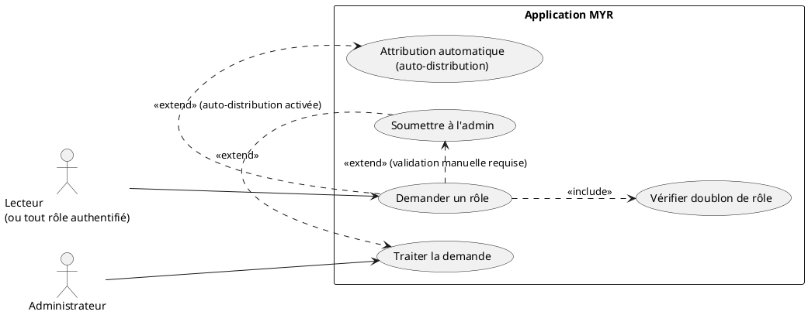
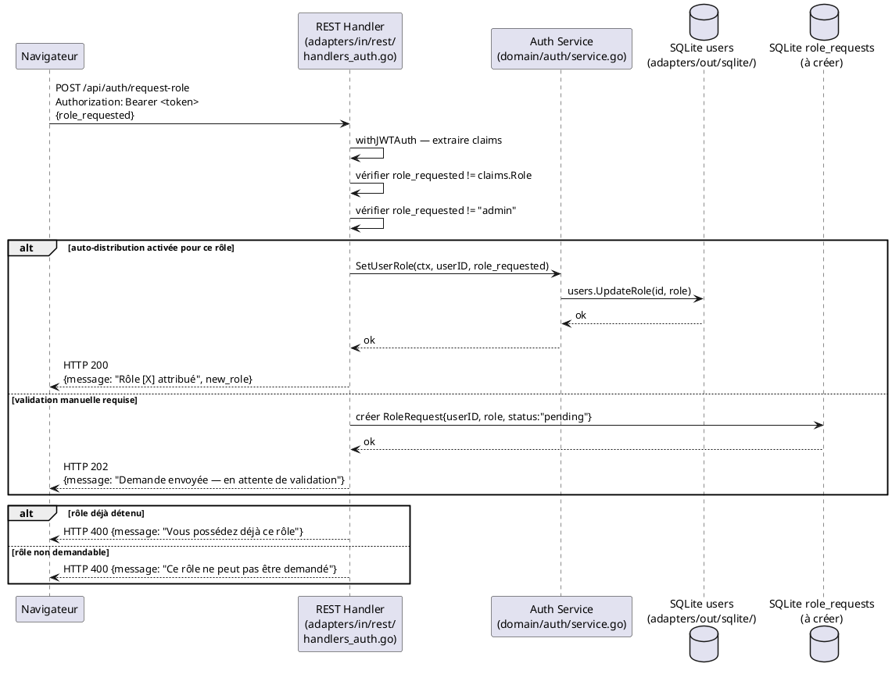

# Demander un rôle

## Diagramme d'acteurs

## Contexte

UCA08 permet à un utilisateur connecté de demander l'attribution d'un rôle supplémentaire. Le rôle par défaut à la création de compte est **Lecteur** (`reader`) — ce use case est le seul moyen d'obtenir un rôle plus élevé.

Deux modes de traitement sont possibles, configurables par réseau :

1. **Auto-distribution** : le rôle est attribué immédiatement sans intervention humaine. Adapté aux rôles peu sensibles (ex. : Consommateur).

2. **Validation manuelle** : la demande est transmise à l'administrateur qui l'approuve ou la refuse. Adapté aux rôles sensibles (ex. : Concepteur, Administrateur).

**Ce use case n'est pas implémenté** dans le code actuel. Aucun endpoint `POST /api/auth/request-role` n'existe. L'attribution de rôle se fait actuellement via `SetUserRole()` du service auth, appelable uniquement par l'administrateur.

Les rôles demandables doivent être parmi : `contributor` (Concepteur), `consumer` (Consommateur), `manufacturer` (Manufactureur), `developer` (Développeur). Le rôle `admin` ne peut pas être auto-attribué.

## Pré-conditions

- L'utilisateur est authentifié (JWT valide)
- Le rôle cible est différent du rôle déjà détenu
- Le rôle cible est différent de `admin` (non demandable)
- Le réseau cible est configuré avec une règle pour ce rôle (auto ou validation)

## Scénario

**Étape initiale :** L'utilisateur ouvre son profil et clique sur "Demander un rôle"

### Flux nominal — Attribution automatique (auto-distribution activée)

1. L'utilisateur sélectionne le rôle souhaité dans la liste disponible
2. `POST /api/auth/request-role` avec `{role_requested}`
3. Le handler vérifie l'authentification (`withJWTAuth`)
4. Le service vérifie que le rôle n'est pas déjà détenu (`claims.Role != role_requested`)
5. La configuration du réseau indique que ce rôle est en auto-distribution
6. `SetUserRole(userID, role_requested)` est appelé — mise à jour en base SQLite
7. Un nouveau JWT est généré avec le rôle mis à jour (ou le client re-appelle `/api/auth/me` pour rafraîchir)
8. `HTTP 200` avec `{"message": "Rôle [X] attribué", "new_role": "..."}`
9. L'interface affiche la confirmation et met à jour l'infobulle de rôle

### Flux alternatif — Validation manuelle par l'administrateur

1. L'utilisateur sélectionne le rôle souhaité
2. `POST /api/auth/request-role` avec `{role_requested}`
3. Le service vérifie que le rôle n'est pas déjà détenu
4. La configuration du réseau indique que ce rôle nécessite une validation admin
5. La demande est enregistrée dans une table `role_requests` (à créer)
6. `HTTP 202` avec `{"message": "Demande envoyée — en attente de validation"}`
7. L'administrateur reçoit la demande (dans son interface ou par notification)
8. L'administrateur approuve ou refuse via `POST /api/admin/role-requests/{id}/approve` (ou `/reject`)
9. Si approuvé : `SetUserRole()` est appelé — le rôle est mis à jour
10. L'utilisateur est notifié (message dans l'interface ou rechargement)

### Flux erreur — Rôle déjà attribué

1. `claims.Role == role_requested`
2. `HTTP 400` avec `{"message": "Vous possédez déjà ce rôle"}`

### Flux erreur — Rôle non demandable

1. Le rôle demandé est `admin` ou n'existe pas dans la liste des rôles disponibles
2. `HTTP 400` avec `{"message": "Ce rôle ne peut pas être demandé"}`

## Post-conditions

- **Auto-distribution** : le rôle est mis à jour en base, le JWT suivant contiendra le nouveau rôle
- **Validation manuelle** : une demande de rôle est en attente dans le système
- **Dans tous les cas** : le rôle courant est conservé jusqu'à la décision finale

## Diagramme de séquence

## Règles métier déclenchées

- **RM21** — Le rôle **Lecteur** est le rôle de départ. UCA08 est le seul moyen légal pour un utilisateur d'obtenir un rôle plus élevé.
- **RM22** — Le contrôle d'accès est systématique : même après attribution d'un nouveau rôle, les droits sont vérifiés à chaque requête via le JWT.

## Exigences non-fonctionnelles

- **ENF12** — L'attribution de rôle est strictement côté serveur — le client ne peut pas s'auto-attribuer un rôle en modifiant son JWT (signature HS256).
- **ENF27** — Les demandes de rôle en attente sont stockées localement (SQLite) et ne transitent pas en clair.

## Notes d'implémentation

**Non implémenté :** Aucun endpoint `POST /api/auth/request-role` n'existe dans le code actuel. `SetUserRole()` existe dans `domain/auth/service.go` et accepte `reader`, `contributor`, `admin` — les rôles `consumer`, `manufacturer`, `developer` sont à ajouter.

**Table `role_requests` :** N'existe pas dans la migration SQLite (`adapters/out/sqlite/db.go`). À créer lors de l'implémentation.

**Configuration auto-distribution :** La configuration par réseau (auto vs validation) n'est pas modélisée dans le code actuel. Probablement à stocker dans la table `networks` ou un fichier de config réseau. À concevoir lors de l'implémentation.

**Mise à jour du JWT après attribution automatique :** Après `SetUserRole()`, le JWT existant contient toujours l'ancien rôle (il est signé). Le client doit appeler `POST /api/auth/refresh` pour obtenir un JWT avec le nouveau rôle, ou se déconnecter/reconnecter.

**Statut d'implémentation :**
- `POST /api/auth/request-role` : **non implémenté**
- `domain/auth.SetUserRole()` : **partiellement implémenté** (manque les nouveaux rôles)
- Table `role_requests` : **non créée**
- Interface admin de traitement des demandes : **non implémentée**
