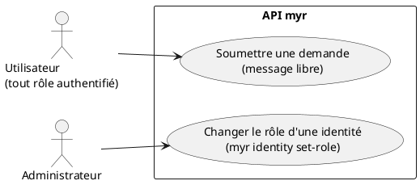
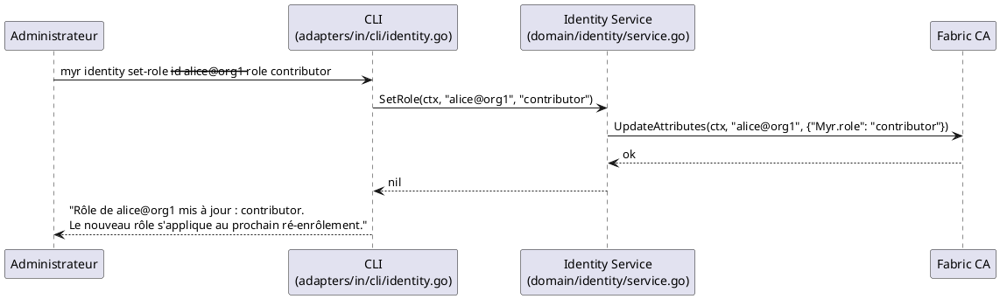

# Demander un rôle

## Diagramme d'acteurs



## Contexte

**Il n'existe aucun mécanisme en libre-service pour qu'un utilisateur change son propre rôle.** Le changement de rôle est une opération strictement administrateur :

```
myr identity set-role --id <pseudo@org> --role <nom-du-rôle>
```

Cette commande CLI modifie l'attribut `Myr.role` de l'identité auprès de la Fabric CA (`identitySvc.SetRole` → `CAPort.UpdateAttributes`). **Le nouveau rôle ne s'applique qu'au prochain ré-enrôlement de l'identité** (propriété de la Fabric CA, pas une limitation de `myr`) — l'utilisateur doit donc se reconnecter (UCA02) après le changement.

Le rôle demandé doit exister dans le catalogue RBAC (`domain/role`) — soit l'un des 4 rôles intégrés (`reader`, `contributor`, `auditor`, `admin`), soit un rôle personnalisé déjà créé par un administrateur (`myr role create`, voir UCA05).

Un utilisateur ne peut transmettre une requête d'accès qu'en texte libre : le champ `message` de `POST /api/identity/request` (UCA01) ou de `POST /api/identity/guest` (UCA02) permet d'écrire une demande, mais **il n'existe pas de champ structuré « rôle souhaité » dans `AccountRequest`** — l'administrateur doit lire le message et agir manuellement via `myr identity set-role`.

> ⚠️ En complément, le rôle de session REST étant actuellement figé à `"contributor"` à chaque connexion (voir écart documenté dans UCA02), un changement de rôle effectué via `myr identity set-role` **n'a aujourd'hui aucun effet visible sur la session REST** obtenue via `POST /api/identity/session` — seul un usage CLI direct de l'identité (hors REST) refléterait le nouveau rôle CA.

## Pré-conditions

- L'identité existe déjà auprès de la CA (UCA01 complété)
- L'administrateur dispose des droits pour exécuter `myr identity set-role` (accès CLI serveur)

## Scénario

### Flux nominal — Demande informelle puis changement manuel

1. L'utilisateur transmet sa demande de rôle par le champ `message` libre d'une requête `POST /api/identity/request` ou `POST /api/identity/guest`, ou par un canal hors `myr` (email, ticket, etc.)
2. L'administrateur consulte les demandes en attente via `GET /api/identity/requests`
3. L'administrateur exécute `myr identity set-role --id <pseudo@org> --role <nouveau-rôle>`
4. Le service appelle `CAPort.UpdateAttributes(ctx, name, {"Myr.role": newRole})`
5. Le CLI affiche : « Rôle de "pseudo@org" mis à jour : nouveau-rôle. Le nouveau rôle s'applique au prochain ré-enrôlement de l'identité. »
6. L'utilisateur doit se reconnecter (`POST /api/identity/session`) pour qu'un nouveau certificat portant l'attribut à jour soit émis — **cela ne met pas à jour le rôle de la session REST**, actuellement toujours fixé à `"contributor"` (voir écart UCA02)

### Flux erreur — Identité ou rôle invalide

1. `--id` ou `--role` manquant : cobra refuse la commande (`MarkFlagRequired`)
2. Rôle inexistant dans le catalogue RBAC : l'appel CA échoue ou le rôle reste sans effet RBAC tant qu'il n'est pas créé (`myr role create`)

## Post-conditions

- L'attribut `Myr.role` de l'identité CA est mis à jour
- Le nouveau rôle ne prend effet qu'au prochain enrôlement CA — pas immédiatement
- La session REST en cours (et toute nouvelle session créée via `POST /api/identity/session` tant que l'écart de rôle figé n'est pas corrigé) n'est pas affectée par ce changement

## Diagramme de séquence



## Règles métier déclenchées

- **RM22** — Le changement de rôle est réservé à l'administrateur ; aucun utilisateur ne peut se l'auto-attribuer.

## Exigences non-fonctionnelles

- **ENF12** — L'attribution de rôle est strictement côté serveur/CA — le client ne peut pas s'auto-attribuer un rôle (le token de session est opaque, non falsifiable).

## Notes d'implémentation

**Commande réelle :** `myr identity set-role --id <pseudo@org> --role <nom>` (`adapters/in/cli/identity.go`) → `IdentityService.SetRole` (`domain/identity/service.go`) → `CAPort.UpdateAttributes`.

**⚠️ Écart — pas de canal structuré pour la demande :** `AccountRequest` (`domain/identity/entity.go`) n'a pas de champ « rôle souhaité » — seul un champ `message` libre existe. Une future itération pourrait ajouter un champ `requested_role` et un endpoint/commande d'approbation dédiés (voir écart similaire documenté dans UCA01, absence de flux d'approbation).

**⚠️ Écart — déconnexion entre rôle CA et rôle de session REST :** tant que `handleIdentitySession` fixera le rôle de session à `"contributor"` en dur (écart documenté dans UCA02), ce use case n'aura aucun effet observable via l'API REST — seul un usage direct de l'identité CA (CLI Fabric, ou un futur code REST corrigé) en bénéficierait.

**Pas d'auto-distribution configurée par réseau :** contrairement à un système de règles par réseau (auto vs validation), il n'existe qu'un seul mécanisme aujourd'hui : l'action manuelle de l'administrateur via `myr identity set-role`.
