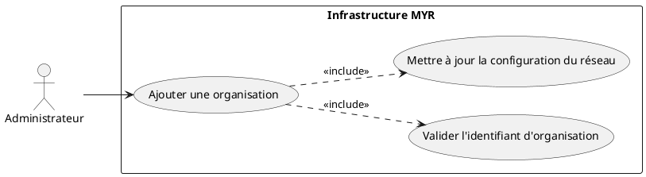
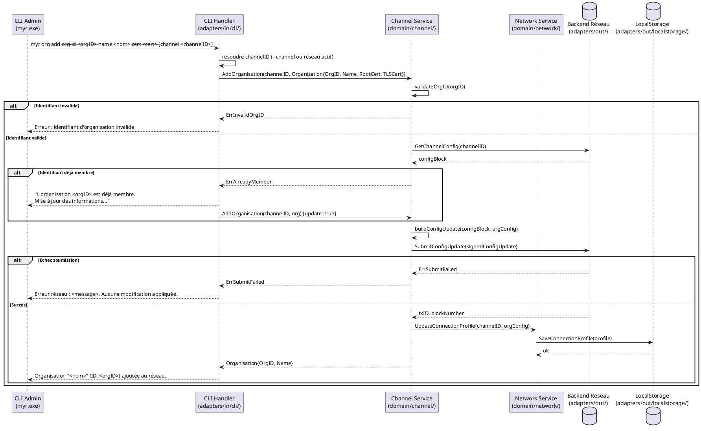

# Ajouter une organisation au réseau

## Diagramme d'acteurs

## Contexte

Un réseau MYR repose sur des **organisations** qui participent à la blockchain sous-jacente. Chaque organisation est identifiée par un **identifiant d'organisation** unique sur le réseau. La validation du format de cet identifiant est déléguée à l'adapter sortant du backend actif.

> **Note technique Fabric :** Pour HyperLedger Fabric, l'identifiant d'organisation est le **MSP ID** (Membership Service Provider ID). Le format attendu est `[a-zA-Z0-9_.-]{1,128}`. D'autres backends blockchain peuvent utiliser un format différent.

Ajouter une organisation au réseau permet à ses membres de soumettre et d'endosser des transactions. Cette opération est réservée à l'**Administrateur** du réseau. Elle est irréversible sur la blockchain (RM07) : une fois soumise, la configuration est inscrite dans un bloc de configuration.

Les rôles et droits d'accès de l'organisation sont attribués séparément, après son ajout au réseau (UCADM06, UCADM07).

Les services domaine concernés (`domain/channel/`, `domain/network/`) existent mais ne sont pas encore exposés via CLI ni REST — ce use case documente l'architecture cible.

## Pré-conditions

- L'administrateur est authentifié avec le rôle `admin` (JWT valide).
- Un réseau existe et est opérationnel (UCADM02 réalisé).
- L'identifiant d'organisation est connu et unique sur ce réseau.
- Les certificats CA de l'organisation sont disponibles (pour les backends qui les requièrent).
- Le wallet de l'administrateur est provisionné (identité valide sur le backend actif).

## Scénario

**Étape initiale :** L'administrateur exécute la commande d'ajout via le CLI admin (`myr.exe`).

### Flux nominal — Organisation ajoutée avec succès

1. L'administrateur fournit : nom de l'organisation, identifiant d'organisation, certificats CA.
2. Le CLI Handler transmet la requête au service domaine `channel`.
3. Le service valide le format de l'identifiant (selon les règles du backend actif).
4. Le service vérifie que l'identifiant n'est pas déjà membre du réseau.
5. Le service construit la transaction de mise à jour de configuration du réseau.
6. La transaction est soumise au backend via `adapters/out/`.
7. Le backend valide et inscrit le bloc de configuration.
8. Le service persiste le profil de connexion mis à jour dans `data/` via `adapters/out/localstorage/`.
9. Le CLI retourne : `Organisation "<nom>" (ID: <orgID>) ajoutée au réseau.`
10. L'organisation peut désormais créer des identités et rejoindre le réseau.

### Flux alternatif — Organisation déjà membre du réseau

1. La vérification (étape 4) détecte l'identifiant existant.
2. Le service propose une mise à jour des informations (nom).
3. L'administrateur confirme les nouvelles valeurs.
4. Une transaction de mise à jour de configuration est soumise (pas de recréation de l'organisation).
5. Le CLI retourne : `Organisation "<orgID>" mise à jour sur le réseau.`

### Flux erreur — Format identifiant invalide

1. La validation (étape 3) échoue : format non conforme au backend actif.
2. Le service retourne une erreur de validation sans soumettre de transaction.
3. Le CLI retourne : `Erreur : identifiant d'organisation invalide — format non conforme au backend <type>.`

### Flux erreur — Échec soumission réseau

1. La transaction de configuration est soumise mais échoue (politique d'endorsement non satisfaite, nœud indisponible).
2. Le service retourne l'erreur sans modifier l'état local.
3. Le CLI retourne : `Erreur réseau : <message>. Aucune modification appliquée.`

## Post-conditions

- L'organisation est inscrite dans la configuration du réseau (immuable sur blockchain, RM06).
- Le profil de connexion (`connection-profiles/`) est mis à jour avec les informations de l'organisation.
- Les membres de l'organisation peuvent désormais être enrôlés et obtenir des identités valides.
- Des rôles peuvent être attribués à l'organisation via UCADM06.

## Diagramme de séquence

## Règles métier déclenchées

| Règle | Description |
|-------|-------------|
| **RM06** | Toute transaction blockchain est immuable — une organisation ajoutée reste inscrite |
| **RM07** | Validation stricte avant soumission — une erreur de validation ne génère aucune transaction |

## Exigences non-fonctionnelles

| ID | Exigence |
|----|---------|
| **EF08** | Gérer les organisations membres d'un réseau (ajout, mise à jour) |
| **ENF05** | La configuration du réseau est mise à jour sans interruption de service |
| **ENF18** | Le domaine `channel` ne contient aucune dépendance directe au backend (vérifiée par CI) |

## Notes d'implémentation

**État actuel :** Non implémenté côté CLI/REST. Le service domaine `domain/channel/` existe mais n'est pas exposé.

**Chemin d'implémentation cible :**
1. Créer `adapters/in/cli/org.go` : commande `myr org add` avec flags `--org-id`, `--name`, `--cert`, `--channel` (optionnel).
2. Implémenter `AddOrganisation(channelID string, org Organization) error` dans `domain/channel/service.go`.
3. Définir le port out `ChannelConfigPort` dans `domain/channel/ports.go` : `SubmitConfigUpdate(...)`.
4. Implémenter `ChannelConfigPort` dans `adapters/out/fabric/` — c'est là que la validation MSP ID Fabric (`[a-zA-Z0-9_\-.]{1,128}`) est appliquée.
5. Mettre à jour le profil de connexion via `NetSvc` → `adapters/out/localstorage/`.

**Lien avec UCADM06/UCADM07 :** L'attribution de rôles est réalisée séparément via `myr org role assign` après l'ajout de l'organisation.
