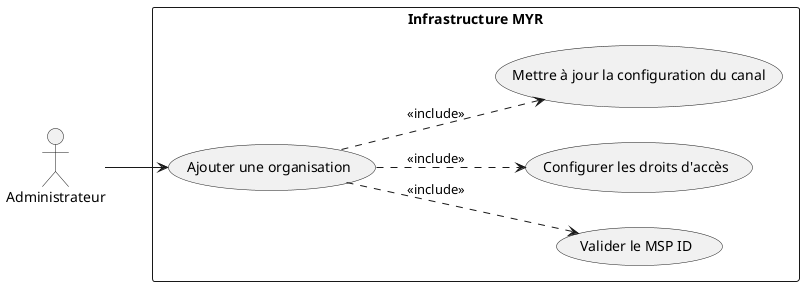
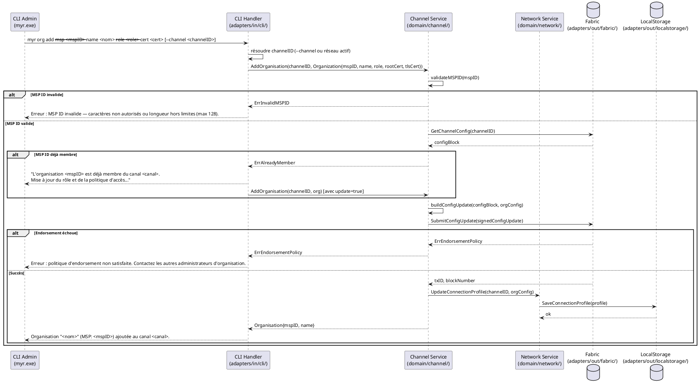

# Ajouter une organisation au réseau

## Diagramme d'acteurs

## Contexte

Un réseau Hyperledger Fabric repose sur des **organisations** (MSP — Membership Service Provider). Chaque organisation possède sa propre autorité de certification (CA) et délivre des identités à ses membres. Ajouter une organisation au réseau permet à ses utilisateurs de soumettre et d'endosser des transactions sur le canal.

Cette opération est réservée à l'**Administrateur** du réseau (rôle `admin`). Elle est irréversible sur la blockchain (RM07) : une fois soumise au canal Fabric, la configuration est inscrite dans un bloc de configuration. Il n'est pas possible de retirer une organisation en dehors d'une nouvelle transaction de configuration.

Les services domaine concernés (`domain/channel/`, `domain/network/`, `domain/identity/`) existent mais ne sont pas encore exposés via CLI ni REST — ce use case documente l'architecture cible.

## Pré-conditions

- L'administrateur est authentifié avec le rôle `admin` (JWT valide).
- Un réseau (canal Fabric) existe et est opérationnel (UCADM02 réalisé).
- Le MSP ID de la nouvelle organisation est connu et unique sur ce réseau.
- Les certificats CA de l'organisation (rootCert, tlsRootCert) sont disponibles.
- Le wallet Fabric de l'administrateur est provisonné (identité Fabric CA active).

## Scénario

**Étape initiale :** L'administrateur exécute la commande d'ajout via le CLI admin (`myr.exe`).

### Flux nominal — Organisation ajoutée avec succès

1. L'administrateur fournit : nom de l'organisation, MSP ID, rôle par défaut, certificats CA.
2. Le CLI Handler transmet la requête au service domaine `channel`.
3. Le service vérifie que le MSP ID respecte le format Fabric (`[a-zA-Z0-9_.-]{1,128}`).
4. Le service vérifie que le MSP ID n'est pas déjà membre du canal.
5. Le service construit la transaction de mise à jour de configuration du canal.
6. La transaction est soumise à Fabric via `adapters/out/fabric/`.
7. Fabric valide et inscrit le bloc de configuration dans le ledger.
8. Le service persiste le profil de connexion mis à jour dans `data/` via `adapters/out/localstorage/`.
9. Le CLI retourne : `Organisation "<nom>" (MSP: <mspID>) ajoutée au réseau.`
10. L'organisation peut désormais créer des identités via son CA et rejoindre le canal.

### Flux alternatif — MSP ID déjà membre du réseau

1. La vérification (étape 4) détecte le MSP ID existant.
2. Le service propose une mise à jour : rôle par défaut, politique d'accès.
3. L'administrateur confirme les nouvelles valeurs.
4. Une transaction de mise à jour de configuration est soumise (pas de recréation de l'organisation).
5. Le CLI retourne : `Organisation "<mspID>" mise à jour sur le réseau.`

### Flux erreur — Format MSP ID invalide

1. La validation (étape 3) échoue : caractères interdits ou longueur hors limites.
2. Le service retourne une erreur de validation sans soumettre de transaction.
3. Le CLI retourne : `Erreur : MSP ID invalide — caractères non autorisés ou longueur hors limites (max 128).`

### Flux erreur — Échec endorsement Fabric

1. La transaction de configuration est soumise mais l'endorsement échoue (politique non satisfaite, nœud orderer indisponible).
2. Le service retourne l'erreur Fabric sans modifier l'état local.
3. Le CLI retourne : `Erreur blockchain : <message Fabric>. Aucune modification appliquée.`

## Post-conditions

- L'organisation est inscrite dans le bloc de configuration du canal Fabric (immuable).
- Le profil de connexion (`connection-profiles/`) est mis à jour avec le MSP et les endpoints de l'organisation.
- Les membres de l'organisation peuvent désormais être enrôlés via le CA de l'organisation et obtenir des identités valides sur ce canal.

## Diagramme de séquence

## Règles métier déclenchées

| Règle | Description |
|-------|-------------|
| **RM07** | Toute transaction Fabric est irréversible — validation stricte avant soumission |
| **RM08** | Fabric ne supporte pas la suppression — toute organisation ajoutée reste inscrite |

## Exigences non-fonctionnelles

| ID | Exigence |
|----|---------|
| **EF08** | Gérer les organisations membres d'un réseau (ajout, mise à jour) |
| **ENF05** | La configuration du canal est mise à jour sans interruption de service |
| **ENF18** | Le domaine `channel` ne contient aucune dépendance directe à Fabric (vérifiée par CI) |

## Notes d'implémentation

**État actuel :** Non implémenté côté CLI/REST. Le service domaine `domain/channel/` existe mais n'est pas exposé.

**Chemin d'implémentation cible :**
1. Créer la commande CLI `adapters/in/cli/org.go` : `myr org add` avec flags `--msp`, `--name`, `--role`, `--cert`, `--channel` (optionnel — fallback sur réseau actif).
2. Implémenter `AddOrganisation(channelID string, org Organization) error` dans `domain/channel/service.go` — valider MSP ID, construire `ConfigUpdate`, appeler le port `out`.
3. Définir le port out `ChannelConfigPort` dans `domain/channel/ports.go` : `SubmitConfigUpdate(channelID string, update ConfigUpdate) error`.
4. Implémenter `ChannelConfigPort` dans `adapters/out/fabric/`.
5. Mettre à jour le profil de connexion dans `adapters/out/localstorage/` via `NetSvc`.

**Format MSP ID Fabric :** identique à la contrainte `validID` de `adapters/out/fabric/blockchain.go` : `[a-zA-Z0-9_\-.]{1,128}`.

**Politique d'endorsement :** La mise à jour de configuration d'un canal Fabric requiert la signature de la majorité des administrateurs d'organisation existants — l'implémentation devra gérer la collecte de signatures.
