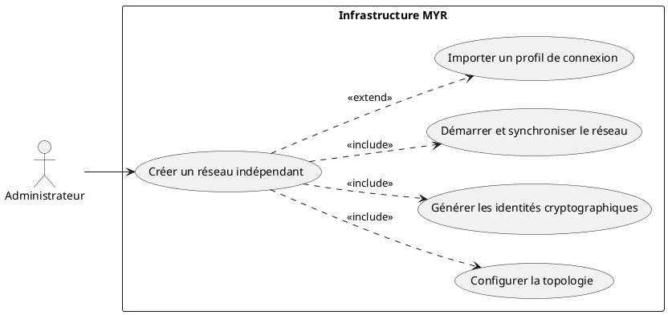
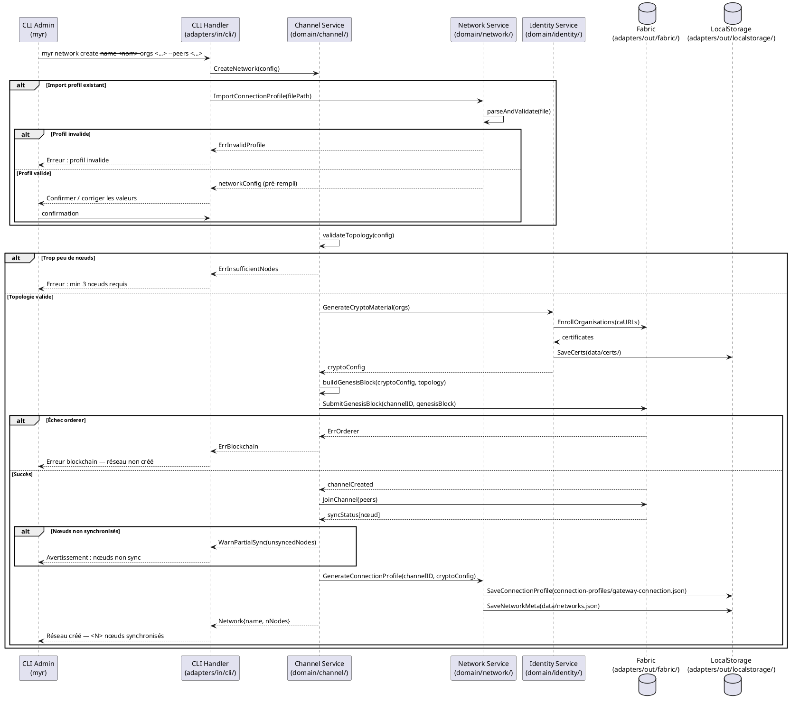

# Créer un réseau indépendant

## Diagramme d'acteurs

## Contexte

La création d'un réseau indépendant est le **prérequis absolu** de tous les autres use cases du système. Sans réseau opérationnel, aucune transaction blockchain ne peut être soumise et aucun asset ne peut être enregistré.

Un réseau Hyperledger Fabric se compose d'un **canal** (channel), d'**organisations** (MSP), de **nœuds peer** (validation des transactions) et d'un **service d'ordonnancement** (orderer — consensus Raft). Le **genesis block** est le premier bloc du canal : il encode la configuration initiale de façon immuable.

Cette opération est réservée à l'**Administrateur** disposant des droits d'infrastructure. Elle implique la coordination de plusieurs serveurs physiques ou virtuels. Le profil de connexion produit (`connection-profiles/gateway-connection.json`) est ensuite utilisé par `adapters/out/fabric/` pour toutes les interactions blockchain.

Les services domaine `domain/channel/`, `domain/network/` et `domain/identity/` existent mais ne sont pas encore exposés — ce use case documente l'architecture cible.

## Pré-conditions

- L'administrateur dispose des droits d'administration de l'infrastructure.
- Au moins 3 serveurs sont accessibles avec une adresse réseau stable (IP fixe ou DNS).
- Les ports réseau Fabric sont ouverts : 7050 (orderer), 7051 (peer), 7054 (CA).
- Les binaires Fabric (`peer`, `orderer`, `fabric-ca-server`) sont installés sur chaque nœud.
- L'outil CLI admin (`myr`) est installé sur le serveur et configuré avec les credentials d'infrastructure.

## Scénario

**Étape initiale :** L'administrateur lance la commande de création de réseau via le CLI admin.

### Flux nominal — Réseau créé manuellement

1. L'administrateur déclare les organisations participantes (noms, MSP IDs, adresses CA).
2. Il configure la topologie : adresses des nœuds peer et orderer, politique de consensus (Raft), règles d'accès du canal.
3. Le CLI Handler transmet au `Channel Service` (`domain/channel/`).
4. Le service délègue la génération des identités cryptographiques au `Identity Service` (`domain/identity/`) via Fabric CA.
5. Les certificats générés (admin, peer, orderer, TLS) sont stockés dans `data/certs/`.
6. Le service construit les artefacts de configuration : `configtx.yaml`, genesis block.
7. Le genesis block est soumis au service d'ordonnancement via `adapters/out/fabric/`.
8. Les nœuds peer rejoignent le canal (`peer channel join`).
9. Le service vérifie la synchronisation de tous les nœuds (height du ledger identique).
10. Le profil de connexion (`gateway-connection.json`) est généré et sauvegardé dans `connection-profiles/`.
11. Le CLI retourne : `Réseau "<nom>" créé avec succès. <N> nœuds synchronisés.`

### Flux alternatif — Import d'un profil de connexion existant

1. L'administrateur fournit un fichier de profil existant (`--profile <chemin>.json` ou `.yaml`).
2. Le `Network Service` (`domain/network/`) parse le fichier et extrait : organisations, nœuds, politiques, certificats.
3. Les champs sont validés (format MSP ID, URLs accessibles, certificats valides).
4. L'administrateur confirme ou corrige les valeurs pré-remplies.
5. Le réseau est initialisé à partir du profil importé (étapes 6–10 du flux nominal).
6. Le CLI retourne : `Réseau initialisé depuis le profil importé. <N> nœuds synchronisés.`

### Flux erreur — Nombre de nœuds insuffisant

1. L'administrateur déclare moins de 3 nœuds.
2. Le service valide la topologie et détecte l'insuffisance.
3. Le CLI retourne : `Erreur : au moins 3 nœuds sont requis pour un réseau résilient (consensus Raft).`

### Flux erreur — Nœud inaccessible

1. Pendant la vérification de synchronisation (étape 9), un ou plusieurs nœuds ne répondent pas.
2. Le service marque le nœud comme indisponible et retourne une erreur partielle.
3. Le CLI retourne : `Avertissement : <N> nœud(s) non synchronisé(s). Réseau partiellement opérationnel.`
4. L'administrateur peut relancer la synchronisation manuellement (commande `myr network sync`).

### Flux erreur — Profil de connexion invalide (flux alternatif)

1. Le fichier importé ne respecte pas le schéma JSON/YAML Fabric.
2. Le parser retourne les erreurs de validation avec les chemins JSON concernés.
3. Le CLI retourne : `Erreur : profil invalide — <champ> manquant ou incorrect.`

## Post-conditions

- Le canal Fabric est opérationnel avec le genesis block inscrit dans le ledger de chaque nœud.
- Les organisations déclarées disposent d'identités valides et peuvent soumettre des transactions.
- Le fichier `connection-profiles/gateway-connection.json` est généré et référencé par `adapters/out/fabric/`.
- Les certificats sont stockés dans `data/certs/`.
- Les métadonnées du réseau (organisations, nœuds) sont persistées dans `data/networks.json`.

## Diagramme de séquence

## Règles métier déclenchées

| Règle | Description |
|-------|-------------|
| **RM07** | Toute transaction Fabric est irréversible — le genesis block est immuable une fois soumis |
| **RM08** | Fabric ne supporte pas la suppression — un canal créé ne peut pas être supprimé |

## Exigences non-fonctionnelles

| ID | Exigence |
|----|---------|
| **EF07** | L'administrateur peut créer un réseau blockchain indépendant |
| **EF09** | La création du réseau requiert un minimum de 3 nœuds pour garantir la résilience |
| **ENF18** | Le domaine `channel` ne contient aucune dépendance directe à Fabric (vérifié par CI) |

## Notes d'implémentation

**État actuel :** Non implémenté côté CLI. Les services domaine `domain/channel/`, `domain/network/`, `domain/identity/` existent mais ne sont pas exposés.

**Chemin d'implémentation cible :**
1. Créer `adapters/in/cli/network.go` : commandes `myr network create`, `myr network import`, `myr network sync`.
2. Implémenter `CreateNetwork()` dans `domain/channel/service.go`.
3. Implémenter `GenerateCryptoMaterial()` dans `domain/identity/service.go` — appel Fabric CA via `adapters/out/fabric/`.
4. Implémenter `GenerateConnectionProfile()` dans `domain/network/service.go` — produit `gateway-connection.json`.
5. Persister dans `data/` via `adapters/out/localstorage/`.

**Format profil de connexion :** Le fichier `connection-profiles/gateway-connection.json` existant dans le repo sert de référence de schéma.

**Résilience Raft :** Le consensus Raft requiert un quorum `(N/2)+1`. Avec 3 orderers, 1 peut tomber sans perte de service. L'implémentation doit refuser toute topologie avec moins de 3 nœuds orderer.
