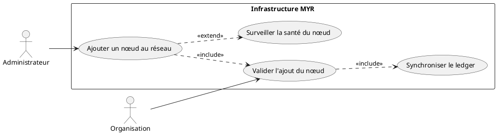
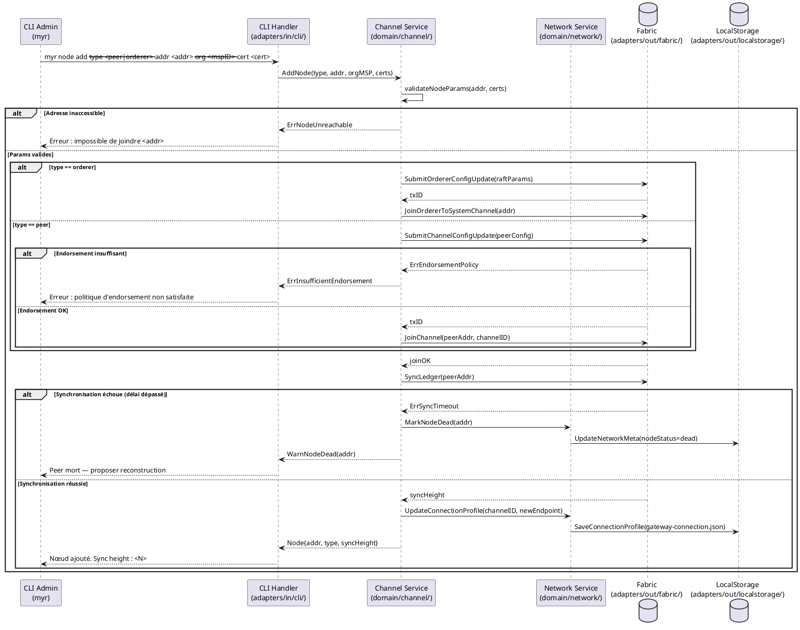

# Ajouter un nœud à un réseau existant

## Diagramme d'acteurs

## Contexte

Un réseau Fabric opérationnel peut être étendu avec de nouveaux nœuds pour augmenter sa capacité de traitement, sa résilience et sa tolérance aux pannes. Deux types de nœuds peuvent être ajoutés :

- **Peer** : valide et exécute les transactions chaincode, maintient une copie du ledger.
- **Orderer** : participe au consensus Raft, ordonne et regroupe les transactions en blocs.

L'ajout d'un nœud est une opération d'infrastructure réservée à l'**Administrateur**. Elle nécessite une validation par les organisations membres selon la politique d'endorsement du canal (pour un peer) ou une mise à jour de configuration du service d'ordonnancement (pour un orderer).

Un peer déconnecté trop longtemps devient inutilisable (ledger désynchronisé au-delà du seuil de rattrapage) et doit être reconstruit.

## Pré-conditions

- L'administrateur dispose d'un accès SSH au serveur et exécute la commande CLI localement (`myr node add`) — pas d'authentification REST pour cette opération.
- Un réseau opérationnel existe (UCADM02 réalisé).
- Le serveur cible est accessible avec une IP fixe publique (port 7051 pour peer, port 7050 pour orderer).
- L'organisation propriétaire du nœud est déjà membre du réseau (UCADM01 réalisé).
- Le wallet Fabric de l'administrateur est provisionné.

## Scénario

**Étape initiale :** L'administrateur exécute la commande d'ajout de nœud via le CLI admin.

### Flux nominal — Peer ajouté avec succès

1. L'administrateur fournit : type `peer`, adresse du nœud, organisation propriétaire, certificats TLS.
2. Le CLI Handler transmet au `Channel Service` (`domain/channel/`).
3. Le service valide les paramètres (adresse accessible, certificats valides, format correct).
4. Le service soumet une demande d'ajout au canal Fabric.
5. Les organisations existantes valident l'ajout via la politique d'endorsement du canal.
6. Le peer est configuré pour rejoindre le canal (`peer channel join`).
7. Le ledger existant est synchronisé sur le nouveau peer (rattrapage des blocs depuis le genesis).
8. Le peer est déclaré actif et commence à participer aux transactions.
9. Le profil de connexion est mis à jour avec le nouvel endpoint peer.
10. Le CLI retourne : `Peer <adresse> ajouté au réseau. Synchronisation terminée à hauteur <N>.`

### Flux alternatif — Nœud de type orderer

1. L'administrateur spécifie le type `orderer`.
2. Il fournit les paramètres spécifiques : paramètres Raft (election timeout, heartbeat), block cutting parameters.
3. Le service construit la transaction de mise à jour de configuration du service d'ordonnancement.
4. La transaction est soumise et validée par le consensus Raft existant.
5. Le nœud orderer rejoint le canal système et se synchronise.
6. Le CLI retourne : `Nœud orderer <adresse> ajouté au réseau. Raft cluster : <N> membres.`

### Flux erreur — Peer déconnecté temporairement (délai dans les limites)

1. Le peer se déconnecte après son ajout.
2. Le service de surveillance détecte l'indisponibilité.
3. À la reconnexion (dans le délai maximum configurable), le peer lance un rattrapage automatique des blocs manquants.
4. Le CLI retourne : `Peer <adresse> reconnecté. Rattrapage de <N> blocs en cours.`

### Flux erreur — Peer déconnecté trop longtemps

1. Le délai maximum de déconnexion est dépassé (seuil configurable, ex : 48h).
2. Le service marque le peer comme mort dans les métadonnées réseau.
3. Le peer est retiré des endpoints actifs du profil de connexion.
4. À la reconnexion, le CLI propose : `Peer mort depuis <durée>. Reconstruire le peer ? (o/N)`.
5. Si confirmé : procédure de reconstruction (regénération des certificats + resynchronisation complète du ledger).

### Flux erreur — Adresse ou port inaccessible

1. La validation (étape 3) ne peut pas atteindre le serveur cible.
2. Le service retourne une erreur de connectivité sans soumettre de transaction.
3. Le CLI retourne : `Erreur : impossible de joindre <adresse>:<port>. Vérifier firewall et disponibilité réseau.`

## Post-conditions

- Le nouveau nœud est inscrit dans la configuration du canal Fabric.
- Le ledger est synchronisé sur le nouveau nœud (même height que les pairs existants).
- Le profil de connexion (`connection-profiles/gateway-connection.json`) est mis à jour avec le nouvel endpoint.
- Le nœud participe activement au consensus et aux transactions.

## Diagramme de séquence

## Règles métier déclenchées

| Règle | Description |
|-------|-------------|
| **RM07** | Toute transaction Fabric est irréversible — l'ajout d'un nœud est permanent dans la configuration |
| **RM08** | Fabric ne supporte pas la suppression — un nœud mort est marqué tel quel, non supprimé |

## Exigences non-fonctionnelles

| ID | Exigence |
|----|---------|
| **EF08** | Un nœud peut être ajouté sans interruption du service réseau existant |
| **EF09** | La synchronisation du ledger doit être vérifiée avant de déclarer le nœud actif |
| **ENF18** | Le domaine `channel` ne contient aucune dépendance directe à Fabric (vérifié par CI) |

## Notes d'implémentation

**État actuel :** Non implémenté côté CLI. Le service domaine `domain/channel/` existe mais n'est pas exposé.

**Chemin d'implémentation cible :**
1. Créer `adapters/in/cli/node.go` : commande `myr node add` avec flags `--type`, `--addr`, `--org`, `--cert`.
2. Implémenter `AddNode()` dans `domain/channel/service.go`.
3. Implémenter `SubmitChannelConfigUpdate()` et `JoinChannel()` dans `adapters/out/fabric/`.
4. Implémenter la surveillance de santé (heartbeat) — optionnel v1 mais recommandé.
5. Persister l'état du nœud (alive/dead) dans `data/networks.json`.

**Seuil de déconnexion :** La valeur par défaut (ex : 48h) doit être configurable dans `config/`. Au-delà de ce seuil, le ledger du peer est trop désynchronisé pour un rattrapage automatique sur les nœuds Fabric standards.

**Reconstruction d'un peer mort :** implique la regénération des certificats via Fabric CA (`domain/identity/`) et la resynchronisation complète depuis le genesis block — opération longue pour les réseaux anciens.
