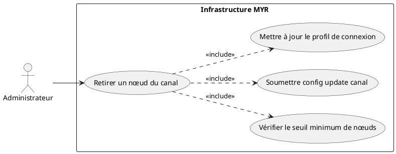
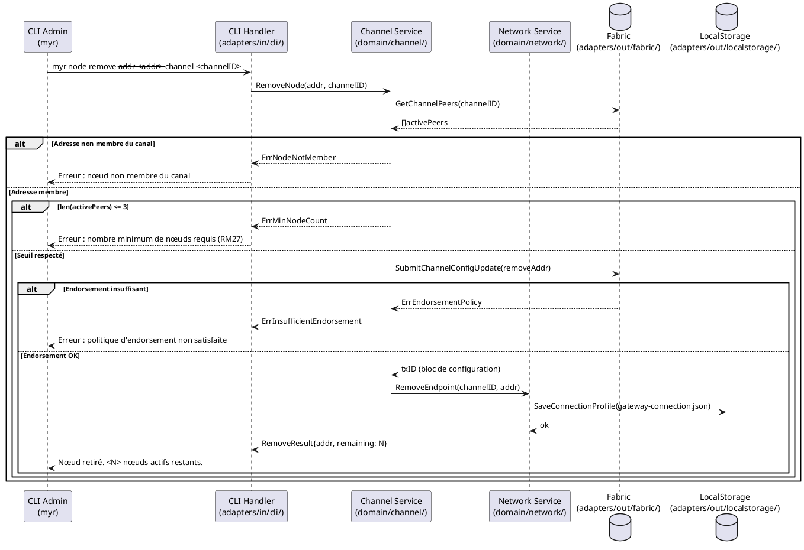

# Retirer un nœud d'un réseau existant

## Diagramme d'acteurs

## Contexte

Un administrateur peut retirer administrativement un nœud (peer) d'un réseau Fabric. Les cas d'usage typiques sont :

- Remplacement d'un serveur physique
- Réorganisation de la topologie réseau
- Élimination d'un nœud définitivement hors service (distinct du retrait automatique d'un peer mort — UCADM03)

L'opération soumet une **channel config update** via le SDK Fabric Gateway v2 : le retrait est enregistré dans un nouveau bloc de configuration du ledger. Aucune donnée historique du peer n'est effacée (RM06 : immuabilité des transactions).

Le seuil minimum de 3 nœuds actifs est imposé par RM27 pour garantir la résilience Raft (ENF06).

## Pré-conditions

- L'administrateur dispose d'un accès SSH au serveur et exécute la commande CLI localement (`myr node remove`) — pas d'authentification REST pour cette opération.
- Un réseau opérationnel existe (UCADM02 réalisé).
- Le nœud à retirer est membre actif du canal cible.
- Au moins 4 nœuds actifs sur le canal (pour rester ≥ 3 après retrait — RM27).
- Le wallet Fabric de l'administrateur est provisionné.

## Scénario

**Étape initiale :** L'administrateur exécute la commande de retrait via le CLI admin.

### Flux nominal — Peer retiré avec succès

1. L'administrateur fournit : adresse du nœud (`--addr`), canal cible (`--channel`).
2. Le CLI Handler transmet au `Channel Service` (`domain/channel/`).
3. Le service interroge Fabric pour obtenir la liste des nœuds actifs du canal.
4. Le service vérifie que l'adresse est membre actif du canal.
5. Le service vérifie que le retrait ne passerait pas sous 3 nœuds actifs (RM27).
6. Le service construit la transaction de mise à jour de configuration du canal (retrait du peer).
7. La transaction est soumise via `adapters/out/fabric/`.
8. Les organisations existantes valident la mise à jour selon la politique d'endorsement du canal.
9. Le peer est retiré de la configuration active du canal (inscrit dans un bloc de configuration).
10. Le service retire l'endpoint du profil de connexion via `Network Service`.
11. Le profil mis à jour est persisté via `adapters/out/localstorage/`.
12. Le CLI retourne : `Nœud <adresse> retiré du canal <canal>. <N> nœuds actifs restants.`

### Flux erreur — Nombre de nœuds insuffisant

1. La vérification (étape 5) détecte que le canal dispose de 3 nœuds actifs ou moins.
2. Aucune transaction n'est soumise.
3. Le CLI retourne : `Erreur : le réseau doit conserver au moins 3 nœuds actifs. Retrait impossible (actuellement <N> nœuds actifs).`

### Flux erreur — Nœud non membre du canal

1. La vérification (étape 4) ne trouve pas l'adresse dans la liste des peers actifs du canal.
2. Aucune transaction n'est soumise.
3. Le CLI retourne : `Erreur : <adresse> n'est pas membre actif du canal <canal>.`

### Flux erreur — Endorsement insuffisant

1. La politique d'endorsement du canal requiert plusieurs signatures d'administrateurs d'organisation.
2. L'administrateur ne peut pas satisfaire seul la politique.
3. Le service retourne `ErrEndorsementPolicy`.
4. Le CLI retourne : `Erreur : politique d'endorsement non satisfaite. Contacter les autres administrateurs d'organisation.`

## Post-conditions

- Le nœud est retiré de la configuration du canal Fabric (bloc de configuration inscrit dans le ledger).
- Le profil de connexion est mis à jour (endpoint supprimé).
- Le nœud retiré conserve son ledger local intact — ses données historiques ne sont pas détruites.
- Si le nœud retiré était le `GatewayPeer` du `NetworkProfile`, l'admin doit désigner un nouveau gateway manuellement.

## Diagramme de séquence

## Règles métier déclenchées

| Règle | Description |
|-------|-------------|
| **RM06** | Les transactions blockchain sont immuables — le retrait est enregistré comme config update, non comme suppression |
| **RM07** | Validation préalable obligatoire avant soumission (vérification seuil + appartenance canal) |
| **RM27** | Retrait refusé si le canal passerait sous 3 nœuds actifs |

## Exigences non-fonctionnelles

| ID | Exigence |
|----|---------|
| **EF57** | Un nœud peut être retiré administrativement d'un réseau existant |
| **ENF06** | Le réseau reste opérationnel si un nœud sur trois est indisponible — le seuil de 3 nœuds est garanti par RM27 |
| **ENF18** | Le domaine `channel` ne contient aucune dépendance directe à Fabric |

## Notes d'implémentation

**État actuel :** Non implémenté. Le service domaine `domain/channel/` existe mais ne dispose pas de `RemoveNode()`.

**Chemin d'implémentation cible :**
1. Ajouter `RemoveNode(addr, channelID string) error` dans `domain/channel/service.go`.
2. Ajouter `RemoveEndpoint(channelID, addr string) error` dans `domain/network/service.go`.
3. Implémenter `SubmitChannelConfigUpdate(removeAddr)` dans `adapters/out/fabric/` (réutilise le mécanisme d'UCADM03).
4. Créer la commande `myr node remove` dans `adapters/in/cli/node.go`.

**Gateway peer :** Si le peer retiré était le `GatewayPeer` du `NetworkProfile` actif, le retrait doit déclencher un avertissement explicite invitant l'admin à reconfigurer le gateway.

**Seuil configurable :** RM27 impose 3 nœuds minimum. Ce seuil peut être rendu configurable dans `config/` à terme (ex : réseaux à 5 nœuds exigeant un seuil plus élevé).
