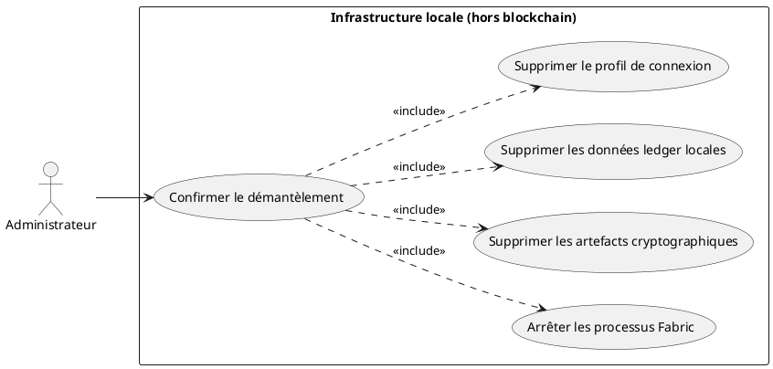
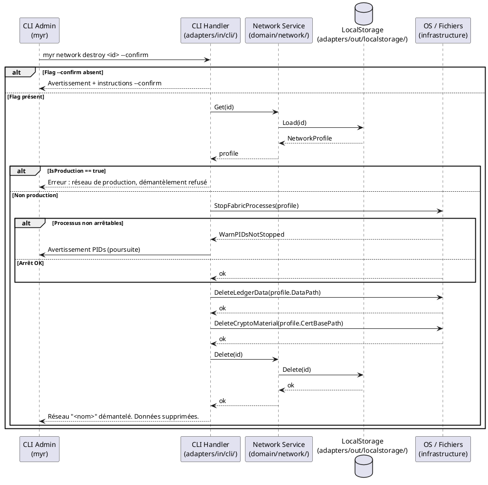

# Démanteler un réseau (dev/test uniquement)

## Diagramme d'acteurs



## Contexte

Lors des phases de développement et de test, l'administrateur crée des réseaux Fabric pour valider les use cases UCADM02 et UCADM03 (création réseau, ajout nœuds). Ces réseaux de test doivent pouvoir être entièrement démantelés pour repartir d'un état vierge et recommencer la validation.

**Cette opération est hors périmètre blockchain.** Elle n'appelle aucune API Fabric SDK — elle opère au niveau de l'infrastructure système : arrêt de processus, suppression de fichiers. Elle ne viole pas RM06 (immuabilité des transactions) car aucune transaction n'est soumise. Le ledger existant est simplement détruit avec l'infrastructure (RM28).

La commande est exposée **uniquement via le CLI admin** (`myr`). Elle n'est jamais disponible via l'API REST. Elle requiert un flag `--confirm` explicite et refuse d'agir sur un réseau marqué `IsProduction: true`.

## Pré-conditions

- L'administrateur est authentifié en tant qu'admin système (accès local à la machine).
- Le réseau cible est identifiable par son ID dans le `NetworkStore`.
- Le réseau cible n'est pas marqué `IsProduction: true`.
- Flag `--confirm` fourni explicitement dans la commande.

## Scénario

**Étape initiale :** L'administrateur exécute `myr network destroy <id> --confirm`.

### Flux nominal — Réseau démantelé avec succès

1. L'administrateur fournit l'ID du réseau et le flag `--confirm`.
2. Le CLI Handler charge le `NetworkProfile` depuis `Network Service`.
3. Le service vérifie que `IsProduction == false`.
4. Le CLI Handler orchestre la séquence d'infrastructure (hors domaine) :
   a. Arrêt des processus Fabric (peer, orderer, CA) — signaux OS.
   b. Suppression des données ledger locales (répertoire configurable, ex : `/var/hyperledger/production/`).
   c. Suppression des artefacts cryptographiques (répertoire `data/certs/<networkID>/`).
5. Le CLI Handler appelle `Network Service.Delete(id)` pour supprimer le profil local.
6. Le CLI retourne : `Réseau "<nom>" démantelé. Toutes les données locales ont été supprimées.`

### Flux erreur — Flag --confirm absent

1. L'administrateur exécute la commande sans `--confirm`.
2. Le CLI Handler détecte l'absence du flag et refuse d'agir.
3. Le CLI retourne :
   ```
   ATTENTION : Cette opération est irréversible.
   Elle supprimera toutes les données locales du réseau "<nom>".
   Utilisez --confirm pour confirmer : myr network destroy <id> --confirm
   ```

### Flux erreur — Réseau marqué en production

1. Le `NetworkProfile` chargé a `IsProduction: true`.
2. Le service refuse l'opération.
3. Le CLI retourne : `Erreur : "<nom>" est marqué comme réseau de production. Démantèlement refusé.`

### Flux erreur — Processus Fabric non arrêtables

1. Un ou plusieurs processus Fabric ne répondent pas au signal d'arrêt (timeout dépassé).
2. Le CLI Handler journalise les PIDs concernés et poursuit.
3. Message partiel : `Avertissement : processus <pid> (peer) non arrêté. Poursuite de la suppression des données.`
4. La suppression des fichiers et le retrait du profil sont exécutés malgré l'échec d'arrêt.

## Post-conditions

- Les processus Fabric sont arrêtés sur la machine locale (ou signalés si non arrêtables).
- Les données ledger locales sont supprimées.
- Les artefacts cryptographiques sont supprimés.
- Le profil de connexion est retiré du `NetworkStore`.
- Opération irréversible — aucune restauration possible.

## Diagramme de séquence



## Règles métier déclenchées

| Règle | Description |
|-------|-------------|
| **RM28** | Démantèlement réseau = opération d'infrastructure locale uniquement. Aucune transaction Fabric soumise. RM06 et RM08 ne s'appliquent pas. Confirmation explicite obligatoire. |

## Exigences non-fonctionnelles

| ID | Exigence |
|----|---------|
| **EF58** | L'administrateur peut démanteler un réseau de test via le CLI (jamais via REST) |
| **ENF18** | Le domaine `network` ne contient aucune opération d'infrastructure OS — les arrêts de processus et suppressions de fichiers sont dans le CLI Handler |

## Notes d'implémentation

**État actuel :** Non implémenté. `NetworkService.Delete(id)` existe dans le port mais n'est pas exposé. Les opérations d'infrastructure (arrêt processus, suppression fichiers) n'existent pas.

**Chemin d'implémentation cible :**
1. Ajouter le champ `IsProduction bool` à `NetworkProfile` dans `domain/network/`.
2. Créer la commande `myr network destroy` dans `adapters/in/cli/network.go` avec flag `--confirm`.
3. Implémenter les opérations d'infrastructure dans le CLI Handler (pas dans le domaine) :
   - Arrêt processus : commandes OS (`kill`, `docker stop`, ou équivalent selon déploiement).
   - Suppression ledger : `os.RemoveAll(profile.DataPath)`.
   - Suppression crypto : `os.RemoveAll(filepath.Join("data/certs", profile.ID))`.
4. Appeler `NetworkService.Delete(id)` en dernier (retrait du profil local).

**Isolation domaine :** Les opérations OS (arrêt processus, suppression fichiers) ne doivent PAS entrer dans `domain/network/` — elles restent dans le CLI Handler conformément à ENF18. Le service domaine ne fait que supprimer le profil local.

**Répertoire ledger configurable :** Le chemin des données ledger Fabric doit être configurable (`MYR_FABRIC_DATA_PATH` ou dans `config/`) car il varie selon le mode de déploiement (Docker, bare-metal, dev local).

**Scope limité :** Cette commande n'est disponible que dans `myr-cli` (binaire admin). Elle ne doit jamais être exposée dans `myr-app` (serveur HTTP).
