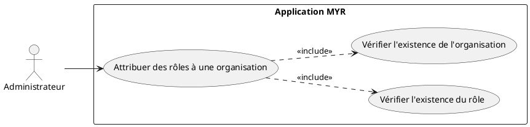
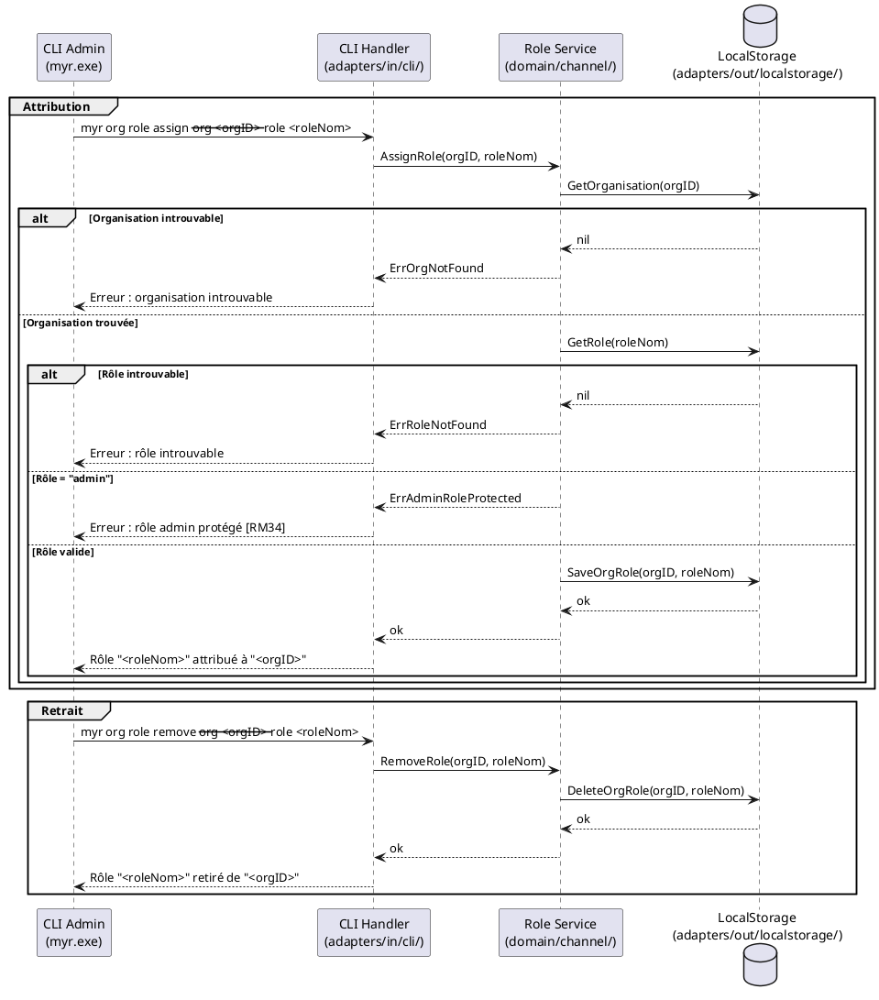

# Attribuer des rôles à une organisation

## Diagramme d'acteurs

## Contexte

Après qu'une organisation a été ajoutée au réseau (UCADM01), l'administrateur peut lui attribuer un ou plusieurs rôles. Un **rôle** est un ensemble nommé de droits d'accès défini séparément (UCADM07). L'attribution d'un rôle à une organisation confère à tous ses membres les droits correspondants (RM37).

L'attribution est stockée **localement** dans l'application MYR via `adapters/out/localstorage/`. Elle n'impacte pas la configuration blockchain — elle est réversible à tout moment.

Le rôle `admin` est natif et protégé : il ne peut pas être attribué à d'autres organisations via cette interface (RM34).

## Pré-conditions

- L'administrateur est authentifié avec le rôle `admin` (JWT valide).
- L'organisation cible existe sur le réseau (UCADM01 réalisé).
- Au moins un rôle disponible (autre que `admin`) existe (UCADM07 réalisé).

## Scénario

**Étape initiale :** L'administrateur exécute la commande d'attribution via le CLI admin (`myr.exe`).

### Flux nominal — Rôle attribué avec succès

1. L'administrateur fournit l'identifiant d'organisation et le nom du rôle à attribuer.
2. Le CLI Handler appelle le `Role Service` (`domain/channel/`).
3. Le service vérifie que l'organisation existe sur le réseau.
4. Le service vérifie que le rôle existe et n'est pas le rôle `admin`.
5. Le service crée la liaison organisation ↔ rôle et la persiste localement.
6. Le CLI retourne : `Rôle "<roleNom>" attribué à l'organisation "<orgID>".`

### Flux alternatif — Retrait d'un rôle

1. L'administrateur exécute `myr org role remove --org <orgID> --role <roleNom>`.
2. Le service vérifie que la liaison existe.
3. La liaison est supprimée du stockage local.
4. Le CLI retourne : `Rôle "<roleNom>" retiré de l'organisation "<orgID>".`

### Flux erreur — Organisation introuvable

1. L'identifiant fourni ne correspond à aucune organisation connue du système.
2. Le service retourne `ErrOrgNotFound`.
3. Le CLI retourne : `Erreur : organisation "<orgID>" introuvable sur le réseau.`

### Flux erreur — Rôle introuvable

1. Le nom de rôle fourni n'existe pas dans le système.
2. Le service retourne `ErrRoleNotFound`.
3. Le CLI retourne : `Erreur : rôle "<roleNom>" introuvable. Créez-le avec "myr role create".`

### Flux erreur — Tentative d'attribution du rôle admin

1. L'administrateur tente d'attribuer le rôle `admin` à une organisation.
2. Le service refuse l'opération (RM34).
3. Le CLI retourne : `Erreur : le rôle "admin" est protégé et ne peut pas être attribué via cette commande.`

## Post-conditions

- **Attribution :** La liaison organisation ↔ rôle est persistée localement. Les droits associés au rôle sont effectifs pour l'organisation (RM37).
- **Retrait :** La liaison est supprimée, les droits correspondants sont révoqués.

## Diagramme de séquence

## Règles métier déclenchées

| Règle | Description |
|-------|-------------|
| **RM34** | Le rôle `admin` est protégé — il ne peut pas être attribué à une organisation tierce |
| **RM37** | Une organisation peut posséder plusieurs rôles — ses droits effectifs sont l'union des droits de ses rôles |

## Exigences non-fonctionnelles

| ID | Exigence |
|----|---------|
| **EF10** | Gérer les droits d'accès des organisations sur le réseau |
| **ENF18** | Le domaine `channel` ne contient aucune dépendance directe au backend (vérifiée par CI) |

## Notes d'implémentation

**État actuel :** Non implémenté. Entité `Role` et service `RoleService` à créer dans `domain/channel/`.

**Chemin d'implémentation cible :**
1. Ajouter les entités `Role`, `OrgRole` dans `domain/channel/entity.go`.
2. Étendre `ChannelService` dans `domain/channel/port_in.go` : méthodes `AssignRole(orgID, roleName string) error`, `RemoveRole(orgID, roleName string) error`, `GetOrgRoles(orgID string) ([]*Role, error)`.
3. Définir `RoleStore` dans `domain/channel/ports.go` : port sortant vers localstorage.
4. Implémenter `RoleStore` dans `adapters/out/localstorage/role_store.go` (JSON — `data/roles.json`).
5. Créer `adapters/in/cli/org.go` : sous-commandes `myr org role assign` et `myr org role remove`.
