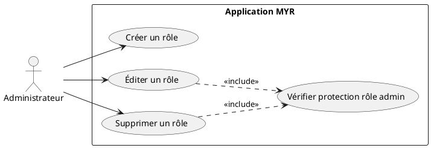
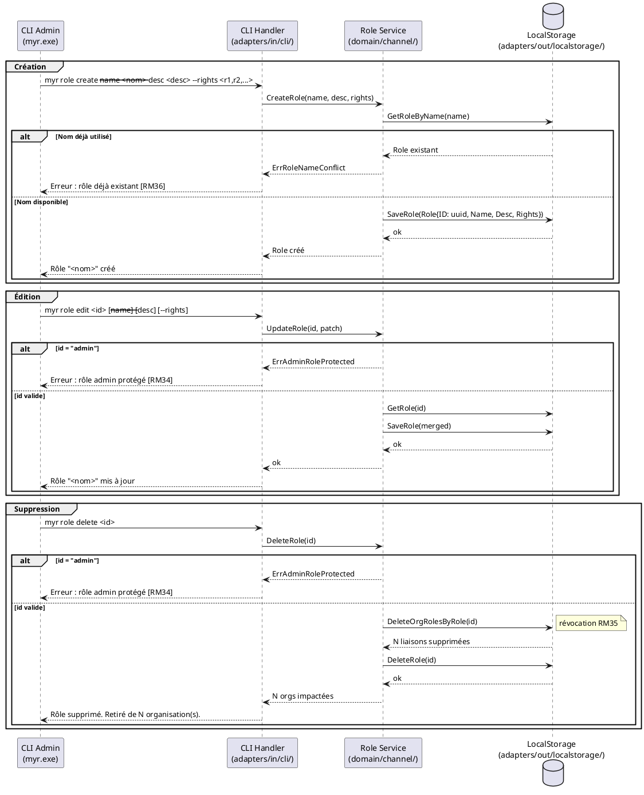

# Gérer les rôles

## Diagramme d'acteurs

## Contexte

L'administrateur gère les **rôles** disponibles dans le système MYR. Un rôle est une entité locale (non blockchain) représentée par un nom unique, une description et une liste de droits d'accès. Les rôles sont ensuite attribués aux organisations (UCADM06).

Le rôle `admin` est natif au système : il est initialisé automatiquement au démarrage du service et ne peut pas être modifié ni supprimé (RM34). Son `ID` est la valeur constante `"admin"`.

La suppression d'un rôle entraîne automatiquement sa révocation pour toutes les organisations qui le possédaient (RM35) — impact immédiat sur les droits en vigueur.

## Pré-conditions

- L'administrateur est authentifié avec le rôle `admin` (JWT valide).

## Scénario

**Étape initiale :** L'administrateur exécute une commande de gestion de rôle via le CLI admin (`myr.exe`).

### Flux nominal — Rôle créé

1. L'administrateur fournit : nom, description, liste des droits accordés.
2. Le `Role Service` vérifie l'unicité du nom (RM36).
3. Le rôle est créé avec un ID généré et persisté localement via `adapters/out/localstorage/`.
4. Le CLI retourne : `Rôle "<nom>" créé avec les droits : <liste>.`

### Flux nominal — Rôle édité

1. L'administrateur fournit l'identifiant du rôle et les champs à modifier.
2. Le service vérifie que l'ID n'est pas `"admin"` (RM34).
3. Les champs fournis sont mis à jour (merge — seuls les champs explicitement fournis sont écrasés).
4. Le rôle persisté est remplacé, les droits effectifs des organisations possédant ce rôle sont immédiatement mis à jour.
5. Le CLI retourne : `Rôle "<nom>" mis à jour.`

### Flux nominal — Rôle supprimé

1. L'administrateur fournit l'identifiant du rôle à supprimer.
2. Le service vérifie que l'ID n'est pas `"admin"` (RM34).
3. Toutes les liaisons `OrgRole` référençant ce rôle sont supprimées (RM35).
4. Le rôle est supprimé du stockage.
5. Le CLI retourne : `Rôle "<nom>" supprimé. Retiré de <N> organisation(s).`

### Flux erreur — Nom de rôle déjà utilisé (création)

1. Le nom fourni correspond à un rôle existant.
2. Le service retourne `ErrRoleNameConflict` (RM36).
3. Le CLI retourne : `Erreur : un rôle avec le nom "<nom>" existe déjà.`

### Flux erreur — Tentative de modification du rôle admin

1. L'administrateur tente d'éditer ou de supprimer le rôle d'ID `"admin"`.
2. Le service retourne `ErrAdminRoleProtected` (RM34).
3. Le CLI retourne : `Erreur : le rôle "admin" est protégé et ne peut pas être modifié ni supprimé.`

## Post-conditions

- **Création :** Le nouveau rôle est disponible pour attribution (UCADM06).
- **Édition :** Les organisations possédant ce rôle ont leurs droits mis à jour immédiatement.
- **Suppression :** Le rôle est dissocié de toutes les organisations (RM35) et supprimé du stockage local.

## Diagramme de séquence

## Règles métier déclenchées

| Règle | Description |
|-------|-------------|
| **RM34** | Le rôle `admin` est protégé — ID constant `"admin"`, ne peut être modifié ni supprimé |
| **RM35** | La suppression d'un rôle révoque automatiquement ses droits sur toutes les organisations |
| **RM36** | Le nom d'un rôle est unique dans le système |

## Exigences non-fonctionnelles

| ID | Exigence |
|----|---------|
| **EF10** | Gérer les droits d'accès des organisations sur le réseau |
| **ENF18** | Le domaine `channel` ne contient aucune dépendance directe au backend (vérifiée par CI) |

## Notes d'implémentation

**État actuel :** Non implémenté.

**Chemin d'implémentation cible :**
1. Ajouter l'entité `Role` dans `domain/channel/entity.go` : `ID string`, `Name string`, `Description string`, `Rights []string`.
2. Ajouter `RoleService` dans `domain/channel/port_in.go` : `CreateRole`, `UpdateRole`, `DeleteRole`, `ListRoles`, `GetRole`.
3. Implémenter dans `domain/channel/service.go` — protection admin via `if id == "admin" { return ErrAdminRoleProtected }`.
4. Implémenter `RoleStore` dans `adapters/out/localstorage/role_store.go` (JSON — fichier `data/roles.json`).
5. Créer `adapters/in/cli/role.go` : commandes `myr role list`, `myr role create`, `myr role edit <id>`, `myr role delete <id>`.

**Initialisation du rôle admin :** Le rôle `admin` est créé (ou vérifié) lors de l'appel à `NewService(...)` dans `domain/channel/service.go`. Si absent du store, il est inséré automatiquement avec `ID: "admin"`, `Rights: ["*"]`.
