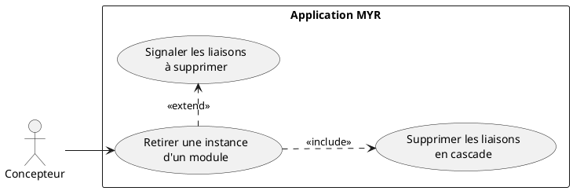
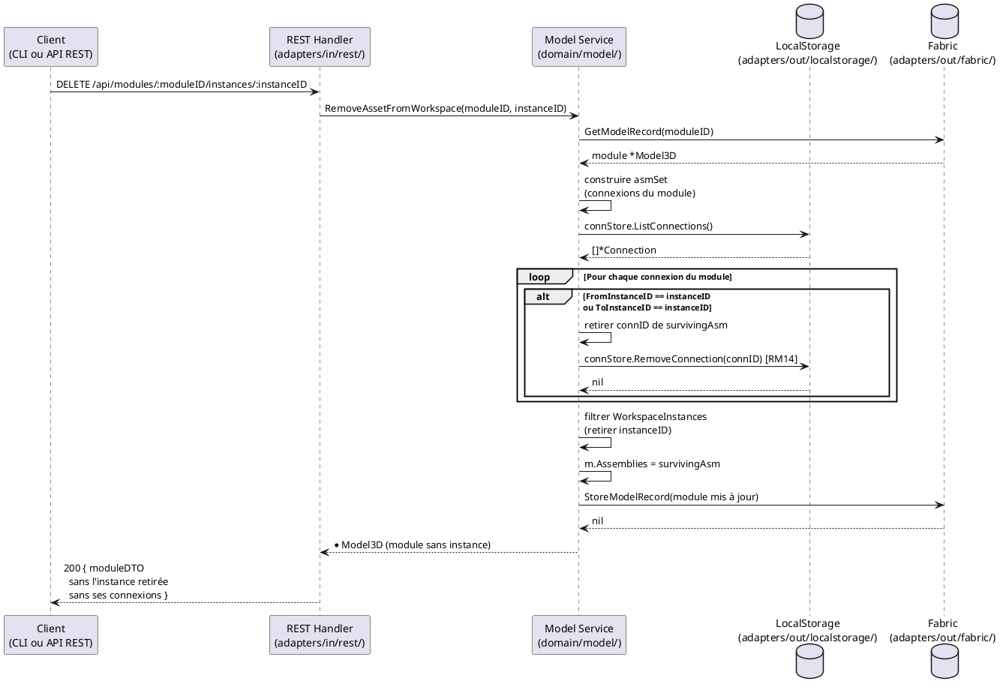

# Retirer une instance de composant d'un Module

## Diagramme d'acteurs



## Contexte

Le retrait d'un composant d'un module supprime une **instance spécifique** (`WorkspaceInstance`) du module en cours de composition. Un composant peut être présent plusieurs fois dans un même module sous des instances indépendantes (RM15) — le retrait ne concerne qu'une instance identifiée par son `instanceID`.

**L'opération est locale :** aucune transaction blockchain n'est émise. Le composant reste disponible sur le réseau et peut être rajouté à tout moment.

**Cascade obligatoire (RM14) :** Toutes les connexions (`Connection`) qui impliquent cette instance (`FromInstanceID` ou `ToInstanceID` correspondant) sont supprimées automatiquement par la logique domaine, sans étape de confirmation intermédiaire — c'est une action directe.

**Identification par instance :** La route utilise `instanceID` (ID de `WorkspaceInstance`), pas `assetID`. Cela permet de retirer une instance spécifique d'un composant présent plusieurs fois dans un module sans affecter les autres instances du même composant.

## Pré-conditions

- L'identité agit avec le rôle **Concepteur** (`contributor`)
- Un module cible existe, en état `draft`
- Au moins un composant (instance) est présent dans ce module
- L'`instanceID` à retirer est connu (`GET /api/modules/:id/instances` ou `myr module get`)

## Scénario

**Étape initiale :** `DELETE /api/modules/:moduleID/instances/:instanceID` est appelée (ou l'équivalent CLI `myr model instance remove`), sans étape de confirmation interactive

### Flux nominal — Retrait sans liaisons actives

1. `RemoveAssetFromWorkspace(moduleID, instanceID)` :
   a. Récupère le module depuis la blockchain
   b. Construit l'ensemble des assemblages du module (`asmSet`)
   c. Parcourt `connStore.ListConnections()` — aucune connexion avec cet `instanceID`
   d. Filtre `WorkspaceInstances` en retirant l'instance cible
   e. Sauvegarde le module mis à jour (`blockchain.StoreModelRecord`)
2. La réponse `200 OK` retourne le module mis à jour

### Flux nominal — Retrait avec liaisons en cascade

1. `RemoveAssetFromWorkspace(moduleID, instanceID)` :
   a. Pour chaque connexion du module avec `FromInstanceID == instanceID` ou `ToInstanceID == instanceID` :
      - Retire la connexion de `m.Assemblies`
      - Supprime la connexion via `connStore.RemoveConnection(c.ID)` (RM14)
   b. Filtre `WorkspaceInstances` pour retirer l'instance
   c. Sauvegarde le module (`blockchain.StoreModelRecord`)
2. La réponse retourne le module sans l'instance et sans ses connexions

### Flux erreur — Module non trouvé

1. `blockchain.GetModelRecord(moduleID)` retourne une erreur (module supprimé ou Fabric indisponible)
2. `RemoveAssetFromWorkspace` retourne l'erreur
3. Le handler retourne HTTP 500

### Flux erreur — Instance introuvable dans le module

1. `RemoveAssetFromWorkspace` ne trouve pas `instanceID` dans `WorkspaceInstances`
2. Le module est sauvegardé sans modification (comportement silencieux actuel)
3. La réponse retourne le module inchangé — **à améliorer** : retourner HTTP 404 si l'instance est introuvable

## Post-conditions

- L'instance n'est plus présente dans `WorkspaceInstances` du module
- Toutes les `Connection` impliquant cette instance ont été supprimées du `ConnectionStore` (RM14)
- Les `Assemblies` du module ne contiennent plus les IDs des connexions supprimées
- Le composant reste disponible sur la blockchain et peut être rajouté
- **Aucune transaction blockchain n'est émise** — Fabric ne supporte pas la suppression d'asset (RM08)
- L'état `draft` du module est conservé ou restauré si l'opération modifie un module soumis (RM19 — à implémenter)

## Diagramme de séquence



## Règles métier déclenchées

| Règle | Description | État code |
|-------|-------------|-----------|
| **RM14** | Suppression en cascade : retrait d'asset → toutes ses connexions supprimées | Implémenté (`RemoveAssetFromWorkspace`) |
| **RM15** | Instances indépendantes : le retrait d'une instance n'affecte pas les autres instances du même composant | Implémenté (filtrage par `instanceID`, pas par `assetID`) |
| **RM08** | Fabric ne supporte pas la suppression — seul le retrait de l'instance locale est effectué | Implémenté (pas d'appel `RemoveModelRecord`) |

## Exigences non-fonctionnelles

- **ENF12** — Rôle `contributor` vérifié côté serveur
- **ENF18** — Aucune dépendance Fabric dans la logique de suppression d'instance (locale uniquement)
- Temps de réponse `DELETE /api/modules/:id/instances/:instanceID` : `< 300 ms`

## Notes d'implémentation

**Route REST :** `DELETE /api/modules/:moduleID/instances/:instanceID` — traitée dans `handleModule()` par le bloc :
```go
if idx := strings.Index(rest, "/instances/"); idx != -1 {
    // ...
    case http.MethodDelete:
        p, err := h.svcFor(r).RemoveAssetFromWorkspace(productID, instanceID)
```

**Logique de cascade dans `RemoveAssetFromWorkspace` (service.go lignes 563–601) :**
- Filtre les connexions du module (`asmSet`) pour ne traiter que celles appartenant au module courant
- Évite de supprimer des connexions d'autres modules (clé de sécurité : intersection avec `m.Assemblies`)
- L'ordre : supprimer les connexions AVANT de filtrer les instances (pour éviter la cohérence partielle)

**Liaisons impactées avant retrait :** un appelant qui souhaite connaître les liaisons qui seront supprimées peut les lister au préalable via `GET /api/modules/:id/assemblies` (ou `myr model link list`) — ce n'est pas une étape imposée par le service, qui exécute le retrait et la cascade en une seule action directe.

**RM19 non implémenté (E5) :** Si le module est en état `submitted`, le retrait d'une instance devrait être bloqué ou déclencher un fork. Ce comportement est absent du code actuel — à couvrir par les tests.

**Double instance du même composant (RM15) :** Si le composant A est présent deux fois (instances `inst-1` et `inst-2`), retirer `inst-1` ne supprime que les connexions de `inst-1`. Les connexions de `inst-2` sont conservées. Cette indépendance est garantie par l'identification par `instanceID` et non par `assetID`.

**Commande CLI équivalente :** `myr model instance remove <moduleID> <instanceID>` (voir `DC_CLI_Model.md` § 3.5), appelant `ModelService.RemoveAssetFromWorkspace(moduleID, instanceID)` — la même méthode que le handler `DELETE /api/modules/:moduleID/instances/:instanceID`. La cascade de suppression des connexions (RM14) et l'indépendance des instances (RM15) sont gérées identiquement par le service, quel que soit le canal. Conformément à DC-CLIM-03, aucune confirmation interactive n'est demandée : l'identifiant de l'instance est fourni explicitement, l'appelant est censé avoir vérifié au préalable les liaisons impactées via `myr model link list`.
