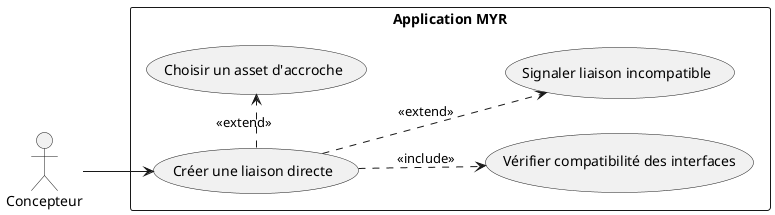
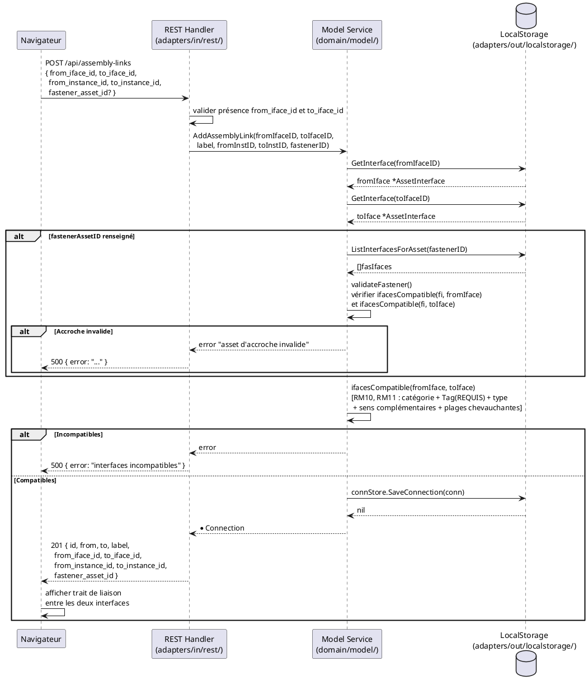

# Liaison entre interfaces

## Diagramme d'acteurs



## Contexte

La liaison est l'opération centrale de l'Atelier. Elle relie deux interfaces physiques (`AssetInterface`) de deux assets distincts présents dans l'Atelier, créant une `Connection` persistée dans le `ConnectionStore` local.

Une liaison peut être **directe** (`FastenerAssetID` vide) ou **via un asset d'accroche** (`FastenerAssetID` renseigné — voir UCAM07). La vérification de compatibilité (RM10) est systématique et automatique à la création.

**Invariant RM09 :** Une interface physique ne peut participer qu'à une seule liaison. Toute tentative de réutiliser un `FromIfaceID` ou `ToIfaceID` déjà engagé dans une connexion existante est refusée.

**Écart connu (E2) :** Le critère `Tag` de RM11 est absent de la struct `AssetInterface` dans le code. La vérification `ifacesCompatible()` dans `domain/model/service.go` ne contrôle pas le tag. Ce champ doit être ajouté à `AssetInterface` et intégré dans la fonction de compatibilité.

## Pré-conditions

- L'utilisateur est authentifié avec le rôle **Concepteur** (`contributor`)
- Un module est ouvert dans l'Atelier (état `draft`)
- Au moins deux assets sont présents dans l'Atelier avec des interfaces définies
- Les interfaces à relier ne sont pas déjà engagées dans une liaison existante (RM09)

## Scénario

**Étape initiale :** L'utilisateur sélectionne une interface source d'un composant dans l'Atelier

### Flux nominal A — Liaison directe

1. L'utilisateur glisse l'interface source vers une interface compatible d'un autre composant
2. Dès la sélection de l'interface source, toutes les interfaces incompatibles se grisent automatiquement (feedback visuel préventif)
3. L'utilisateur dépose sur l'interface cible compatible
4. Le navigateur envoie `POST /api/assembly-links` avec `{ from_iface_id, to_iface_id, label, from_instance_id, to_instance_id }`
5. Le handler appelle `service.AddAssemblyLink(fromIfaceID, toIfaceID, label, fromInstanceID, toInstanceID, "")`
6. Le service récupère les deux interfaces via `ifaceStore.GetInterface()`
7. Le service vérifie la compatibilité via `ifacesCompatible(fromIface, toIface)` (RM10, RM11)
8. La `Connection` est créée avec `FastenerAssetID` vide et persistée dans `connStore`
9. La réponse `201 Created` retourne le DTO de la connexion créée
10. L'Atelier affiche la liaison comme un trait entre les deux interfaces

### Flux nominal B — Liaison via asset d'accroche

1. Étapes 1 à 3 identiques au flux A
4. Le navigateur envoie `POST /api/assembly-links` avec `fastener_asset_id` renseigné
5. Le service valide l'accroche via `validateFastener()` : l'asset d'accroche doit avoir au moins une interface compatible avec chacun des deux endpoints
6. La `Connection` est créée avec `FastenerAssetID` renseigné
7. L'Atelier représente la liaison avec l'asset d'accroche visible (voir UCAM07)

### Flux alternatif — Liaison via slot virtuel (UCAM03)

1. L'utilisateur glisse un slot virtuel (`Virtual=true`) vers une interface physique d'un autre composant
2. Le navigateur envoie `POST /api/virtual-connect` avec `{ virtual_iface_id, physical_iface_id, ... }`
3. Le service appelle `ConnectVirtualToPhysical()` : matérialise le slot virtuel en interface physique complémentaire, puis crée la liaison
4. Un nouveau slot virtuel est recréé sur l'asset source (RM13 — `EnsureVirtualSlot`)

### Flux — Liaison devenue incompatible après modification

1. Une interface impliquée dans une liaison existante est modifiée via `PATCH /api/interfaces/:id`
2. Le service `UpdateInterface()` recalcule la compatibilité pour toutes les connexions utilisant cette interface
3. Si `!ifacesCompatible(fromIface, toIface)` → `Connection.Incompatible = true`, persisté via `connStore.UpdateConnection()`
4. La liaison reste présente dans l'Atelier, représentée en rouge (RM12)
5. L'utilisateur peut la supprimer manuellement — le système ne la supprime jamais automatiquement

### Flux erreur — Interface déjà utilisée (RM09)

1. L'utilisateur tente de créer une liaison avec une interface déjà engagée
2. Dans l'UI : l'interface est grisée dès la sélection d'une interface source (prévention)
3. En cas de tentative forcée via API : `AddAssemblyLink` ne vérifie pas RM09 directement dans le code actuel — **à implémenter** : vérifier dans `AddAssemblyLink` que `fromIfaceID` et `toIfaceID` ne sont pas déjà présents dans une connexion existante
4. Message d'erreur attendu : `"Cette interface est déjà utilisée dans une liaison"`

### Flux erreur — Interfaces incompatibles

1. `ifacesCompatible(a, b)` retourne `false` (catégorie différente, type différent, sens non complémentaires, plages sans chevauchement)
2. Le service retourne une erreur
3. Le handler renvoie HTTP 500 (à améliorer : retourner HTTP 422 avec message métier explicite)
4. L'UI affiche un message d'erreur

### Flux erreur — Asset d'accroche invalide

1. `validateFastener()` retourne une erreur : l'accroche n'a pas d'interface compatible avec l'un des endpoints
2. Le handler renvoie HTTP 500 avec le message de l'erreur
3. La liaison n'est pas créée

## Post-conditions

- Une `Connection` est enregistrée dans `ConnectionStore` avec `FromIfaceID`, `ToIfaceID`, `FastenerAssetID` (optionnel)
- Les interfaces engagées dans la liaison sont marquées comme utilisées (grisées dans l'UI)
- Une liaison incompatible après modification reste présente avec `Incompatible: true` (jamais supprimée automatiquement — RM12)
- L'état du module reste `draft` — aucune transaction blockchain n'est émise

## Diagramme de séquence



## Règles métier déclenchées

| Règle | Description | État code |
|-------|-------------|-----------|
| **RM09** | Interface à usage unique — `FromIfaceID`/`ToIfaceID` déjà utilisé → liaison refusée | A implémenter dans `AddAssemblyLink` |
| **RM10** | Vérification de compatibilité automatique à toute création de liaison | Implémenté (`ifacesCompatible`) |
| **RM11** | 5 critères : catégorie + **Tag** (REQUIS, absent du code) + type + sens complémentaires + plages chevauchantes | Partiel — Tag manquant |
| **RM12** | Liaison incompatible → `Incompatible: true`, visible en rouge, jamais supprimée auto | Implémenté (`UpdateInterface`) |
| **RM13** | Slot virtuel garanti après matérialisation (flux UCAM03) | Implémenté (`EnsureVirtualSlot`) |

## Exigences non-fonctionnelles

- **ENF12** — Vérification de compatibilité obligatoire côté serveur (pas seulement côté UI)
- **ENF18** — Aucune dépendance Fabric dans `domain/model/service.go` — les connexions sont locales
- Temps de réponse `POST /api/assembly-links` : `< 200 ms` (opération purement locale)

## Notes d'implémentation

**Champ Tag manquant (E2) :** Ajouter dans `domain/model/entity.go` :
```go
type AssetInterface struct {
    // ... champs existants ...
    Tag string `json:"tag,omitempty"` // ex: "Câble", "Vis", "Connecteur"
}
```

Puis modifier `ifacesCompatible()` dans `service.go` pour vérifier `a.Tag == b.Tag` quand les deux champs sont non vides.

**RM09 manquant :** Ajouter dans `AddAssemblyLink()` une vérification des connexions existantes avant création :
```go
conns, _ := s.connStore.ListConnections()
for _, c := range conns {
    if c.FromIfaceID == fromIfaceID || c.ToIfaceID == fromIfaceID ||
       c.FromIfaceID == toIfaceID   || c.ToIfaceID == toIfaceID {
        return nil, fmt.Errorf("cette interface est déjà utilisée dans une liaison")
    }
}
```

**Route REST concernée :** `POST /api/assembly-links` → `handleAssemblyLinks()` dans `handlers.go`

**Route virtuel→physique :** `POST /api/virtual-connect` → `handleVirtualConnect()` dans `handlers.go`
