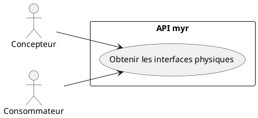
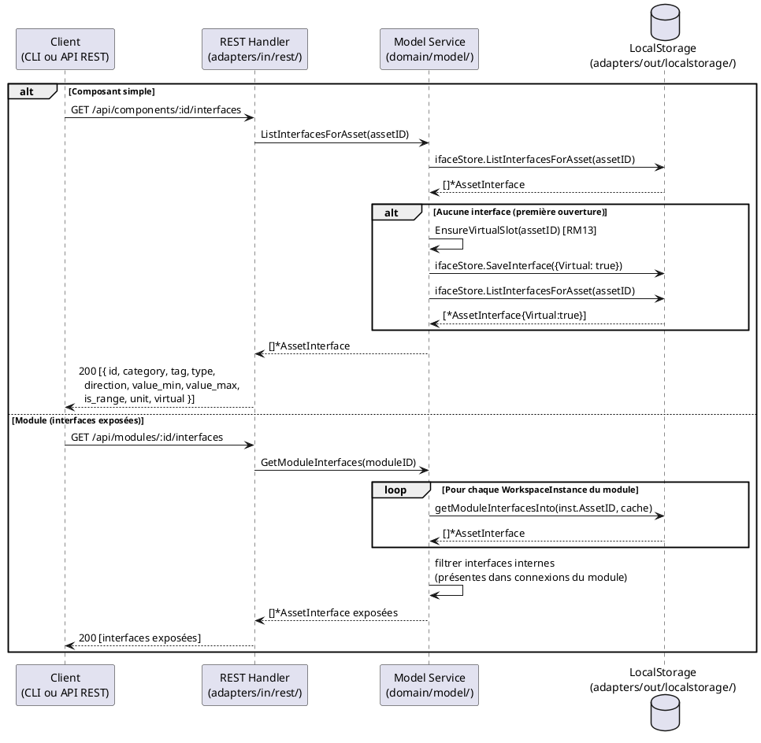

# Visualiser les interfaces physiques de composants

## Diagramme d'acteurs

## Contexte

Chaque composant ou module expose ses interfaces physiques (`AssetInterface`) comme points de connexion. Cette lecture est le prérequis de toute opération de liaison (UCAM01) ou de création d'interface (UCAM03) côté client.

Les interfaces sont persistées dans l'`InterfaceStore` local tant que l'asset qui les porte est en brouillon (ADR-02, `specs/3-Conception/Conception_intro.md`) — récupérées via `GET /api/components/:id/interfaces` ou `GET /api/modules/:id/interfaces`. Elles ne rejoignent la blockchain (`Model3D.Interfaces`) qu'à la soumission de l'asset.

Pour un module, les interfaces exposées sont calculées dynamiquement : seules les interfaces des sous-composants **non reliées en interne** sont exposées (`GetModuleInterfaces` — calcul récursif avec cache).

Un slot virtuel (`Virtual: true`) est toujours présent sur chaque asset (RM13), permettant au client de proposer la création d'une nouvelle interface (voir UCAM03).

> La représentation visuelle (icônes, grisage, tooltip) relève du dépôt GUI externe — hors périmètre de ce document. Le contrat REST ci-dessous ainsi que son équivalent CLI (`myr model interface list`, voir Notes d'implémentation) font partie de `myr`.

## Pré-conditions

- L'utilisateur est authentifié (rôle **Lecteur** minimum)
- Un composant ou module est identifié (ID connu du client)
- L'`InterfaceStore` est configuré côté serveur

## Scénario

### Flux nominal — Interfaces d'un composant simple

1. Le client appelle `GET /api/components/:id/interfaces`
2. Le handler appelle `service.ListInterfacesForAsset(assetID)`, qui lit le brouillon local (`InterfaceStore`) si l'asset n'est pas encore soumis, sinon `Model3D.Interfaces` via `blockchain.GetModelRecord()`
3. Si aucune interface n'existe encore, `EnsureVirtualSlot(assetID)` crée un slot virtuel (RM13) et le persiste localement (brouillon)
4. La liste des interfaces est retournée : chaque interface contient `{ id, asset_id, name, category, tag, type, direction, value_min, value_max, is_range, unit, virtual }`

### Flux nominal — Interfaces d'un module

1. Le client appelle `GET /api/modules/:id/interfaces`
2. Le handler appelle `service.GetModuleInterfaces(id)` — calcul récursif
3. Le service parcourt les `WorkspaceInstances` du module et collecte les interfaces de chaque sous-composant
4. Seules les interfaces non présentes dans une connexion interne au module sont retournées (interfaces "exposées")
5. Un slot virtuel propre au module est garanti si aucune interface directe n'existe

### Flux erreur — InterfaceStore non configuré

1. Le service `ListInterfacesForAsset()` retourne `nil, nil` (pas d'erreur — juste une liste vide)

### Flux erreur — Asset introuvable

1. `GET /api/components/:id/interfaces` pour un ID inexistant
2. Le handler retourne HTTP 404 ou une liste vide selon l'état du store

## Post-conditions

- Les interfaces physiques du composant ou module sont retournées au client
- Le slot virtuel (`Virtual: true`) est toujours présent (RM13)
- L'état du système est inchangé (lecture seule)

## Diagramme de séquence

## Règles métier déclenchées

| Règle | Description | État code |
|-------|-------------|-----------|
| **RM13** | Slot virtuel garanti : si aucune interface définie, un slot `Virtual: true` est créé automatiquement | Implémenté (`EnsureVirtualSlot`) |
| **RM11** | Les 6 attributs d'interface (`Category`, `Tag`, `Type`, `Direction`, `ValueMin/Max`, `Unit`) doivent être affichés | Partiel — `Tag` absent du modèle code (E2) |

## Exigences non-fonctionnelles

- **ENF12** — Lecture authentifiée côté serveur (rôle `reader` minimum)
- Temps de réponse `GET /api/components/:id/interfaces` : `< 200 ms` (opération locale)

## Notes d'implémentation

**Champ Tag manquant (E2) :** La struct `AssetInterface` dans `domain/model/entity.go` ne contient pas de champ `Tag`. Selon la spec §6.4 et RM11, ce champ est obligatoire. L'ajouter avant toute implémentation de l'UI d'affichage pour éviter une migration de données ultérieure.

**Routes REST concernées :**
- `GET /api/components/:id/interfaces` → `handleComponentInterfaces()` — retourne `ListInterfacesForAsset`
- `GET /api/modules/:id/interfaces` → sous-route dans `handleModule()` — retourne `GetModuleInterfaces`

**Interfaces exposées d'un module :** Le calcul est récursif dans `getModuleInterfacesInto()`. Un cache `map[string][]*AssetInterface` évite les appels blockchain redondants. Les interfaces internes (présentes dans `m.Assemblies` comme `FromIfaceID` ou `ToIfaceID`) sont exclues du résultat.

**Statut d'utilisation d'une interface :** une interface est "utilisée" si son `id` apparaît dans `connection.from_iface_id` ou `connection.to_iface_id` d'une connexion non incompatible — c'est un croisement que le client peut effectuer localement à partir des réponses de `GET .../interfaces` et `GET /api/connections`, sans appel serveur supplémentaire.

**Vocabulaire de référence :** Les catégories, types et unités disponibles sont chargés via `GET /api/refs` — `handleRefs()` → `GetRefs()`. Ce vocabulaire est extensible par l'administrateur.

**Commande CLI équivalente (cible) :** `myr model interface list <assetID>` (voir `specs/3-Conception/DC_CLI_Model.md` § 3.3). Elle appelle `ModelService.ListInterfacesForAsset(assetID)` — ou `ModelService.GetModuleInterfaces(id)` si l'ID désigne un module, la commande détectant le type via `Get`/`GetModule` — soit les mêmes méthodes de service que respectivement `GET /api/components/:id/interfaces` et `GET /api/modules/:id/interfaces`. Le comportement (slot virtuel garanti RM13, calcul récursif des interfaces exposées d'un module) est strictement identique ; seul le canal de sortie change : une ligne par interface (`id`, `category`, `type`, `direction`, valeur/plage, `unit`, `virtual`) en texte terminal plutôt qu'un tableau JSON.
