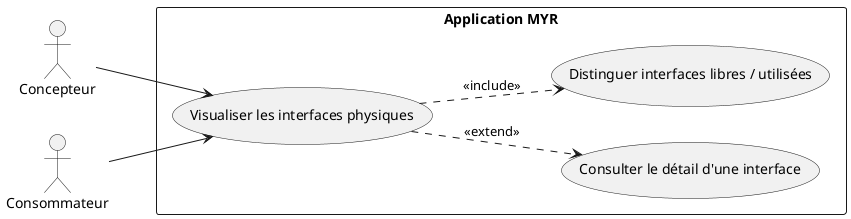
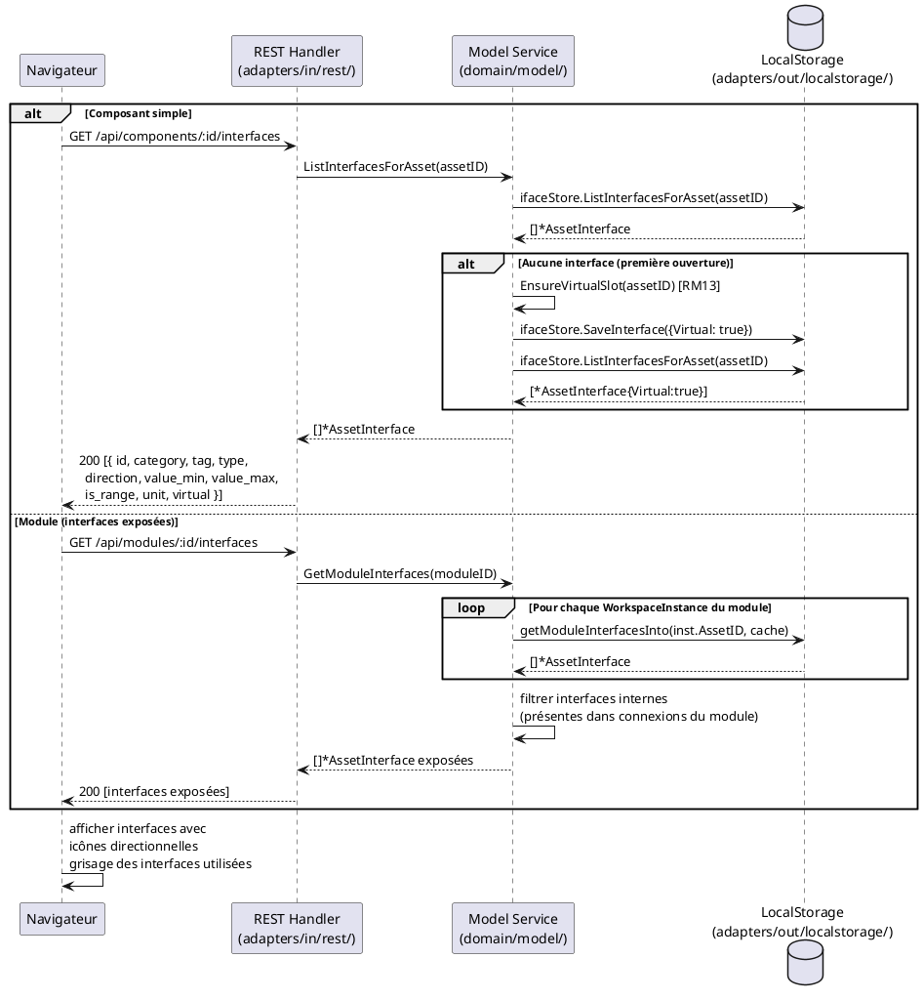

# Visualiser les interfaces physiques de composants

## Diagramme d'acteurs

## Contexte

Chaque composant ou module présent dans l'Atelier expose ses interfaces physiques (`AssetInterface`) comme points de connexion cliquables. La visualisation est le prérequis de toute opération de liaison (UCAM01) ou de création d'interface (UCAM03).

Les interfaces sont persistées dans l'`InterfaceStore` local (non sur la blockchain) et récupérées via `GET /api/components/:id/interfaces` ou `GET /api/modules/:id/interfaces`.

Pour un module, les interfaces exposées sont calculées dynamiquement : seules les interfaces des sous-composants **non reliées en interne** sont exposées (`GetModuleInterfaces` — calcul récursif avec cache).

Un slot virtuel (`Virtual: true`) est toujours présent sur chaque asset (RM13), représenté visuellement par une icône "+" permettant de créer une nouvelle interface (voir UCAM03).

## Pré-conditions

- L'utilisateur est authentifié (rôle **Lecteur** minimum)
- Au moins un composant est sélectionné dans l'Atelier ou dans l'Explorer UI
- L'`InterfaceStore` est configuré côté serveur (mode GUI)

## Scénario

**Étape initiale :** L'utilisateur sélectionne un composant dans l'Atelier ou clique sur un asset dans l'Explorer UI

### Flux nominal — Affichage des interfaces d'un composant simple

1. Le navigateur envoie `GET /api/components/:id/interfaces`
2. Le handler appelle `service.ListInterfacesForAsset(assetID)`
3. Si aucune interface n'existe encore, `EnsureVirtualSlot(assetID)` crée un slot virtuel (RM13)
4. La liste des interfaces est retournée : chaque interface contient `{ id, asset_id, name, category, tag, type, direction, value_min, value_max, is_range, unit, virtual }`
5. L'UI affiche chaque interface avec son icône et son sens (entrée/sortie/bidirectionnel)
6. Les interfaces déjà engagées dans une liaison sont grisées (libres vs utilisées)
7. Le slot virtuel (`virtual: true`) est représenté par une icône "+" distincte

### Flux nominal — Affichage des interfaces d'un module

1. Le navigateur envoie `GET /api/modules/:id/interfaces`
2. Le handler appelle `service.GetModuleInterfaces(id)` — calcul récursif
3. Le service parcourt les `WorkspaceInstances` du module et collecte les interfaces de chaque sous-composant
4. Seules les interfaces non présentes dans une connexion interne au module sont retournées (interfaces "exposées")
5. Un slot virtuel propre au module est garanti si aucune interface directe n'existe
6. L'UI affiche les interfaces exposées du module

### Flux alternatif — Survol d'une interface (tooltip)

1. L'utilisateur survole une interface dans l'UI
2. Un tooltip affiche les détails complets :
   - **Catégorie** (ex: `ELEC`, `MECA`, `HYD`)
   - **Tag** (ex: `Câble`, `Vis`) — REQUIS dans le modèle cible, absent du code actuel (E2)
   - **Type** (ex: `USB-C`, `Vis M3`)
   - **Sens** (`in` / `out` / `bidir`)
   - **Valeur** : fixe (`value_min`) ou plage (`value_min` – `value_max`)
   - **Unité** (ex: `V`, `mm`, `bar`)

### Flux erreur — InterfaceStore non configuré

1. Le service `ListInterfacesForAsset()` retourne `nil, nil` (pas d'erreur — juste une liste vide)
2. L'UI affiche un composant sans interfaces (sauf si `EnsureVirtualSlot` peut créer le slot)

### Flux erreur — Asset introuvable

1. `GET /api/components/:id/interfaces` pour un ID inexistant
2. Le handler retourne HTTP 404 ou une liste vide selon l'état du store
3. L'UI affiche "Aucune interface définie"

## Post-conditions

- Les interfaces physiques du composant ou module sont affichées dans l'Atelier
- Les interfaces libres et utilisées sont visuellement distinguées
- Le slot virtuel (`Virtual: true`) est toujours présent (RM13)
- L'état du système est inchangé (lecture seule)

## Diagramme de séquence

## Règles métier déclenchées

| Règle | Description | État code |
|-------|-------------|-----------|
| **RM13** | Slot virtuel garanti : si aucune interface définie, un slot `Virtual: true` est créé automatiquement | Implémenté (`EnsureVirtualSlot`) |
| **RM11** | Les 6 attributs d'interface (`Category`, `Tag`, `Type`, `Direction`, `ValueMin/Max`, `Unit`) doivent être affichés | Partiel — `Tag` absent du modèle code (E2) |

## Exigences non-fonctionnelles

- **ENF22** — L'affichage des interfaces doit être fonctionnel sur Chrome 120+, Firefox 120+, Safari 17+, Edge 120+
- **ENF12** — Lecture authentifiée côté serveur (rôle `reader` minimum)
- Temps de réponse `GET /api/components/:id/interfaces` : `< 200 ms` (opération locale)

## Notes d'implémentation

**Champ Tag manquant (E2) :** La struct `AssetInterface` dans `domain/model/entity.go` ne contient pas de champ `Tag`. Selon la spec §6.4 et RM11, ce champ est obligatoire. L'ajouter avant toute implémentation de l'UI d'affichage pour éviter une migration de données ultérieure.

**Routes REST concernées :**
- `GET /api/components/:id/interfaces` → `handleComponentInterfaces()` — retourne `ListInterfacesForAsset`
- `GET /api/modules/:id/interfaces` → sous-route dans `handleModule()` — retourne `GetModuleInterfaces`

**Interfaces exposées d'un module :** Le calcul est récursif dans `getModuleInterfacesInto()`. Un cache `map[string][]*AssetInterface` évite les appels blockchain redondants. Les interfaces internes (présentes dans `m.Assemblies` comme `FromIfaceID` ou `ToIfaceID`) sont exclues du résultat.

**Grisage des interfaces utilisées :** La logique côté client consiste à croiser la liste des interfaces avec la liste des connexions actives. Une interface est "utilisée" si son `id` apparaît dans `connection.from_iface_id` ou `connection.to_iface_id` d'une connexion non incompatible.

**Vocabulaire de référence :** Les catégories, types et unités disponibles sont chargés via `GET /api/refs` — `handleRefs()` → `GetRefs()`. Ce vocabulaire est extensible par l'administrateur.
