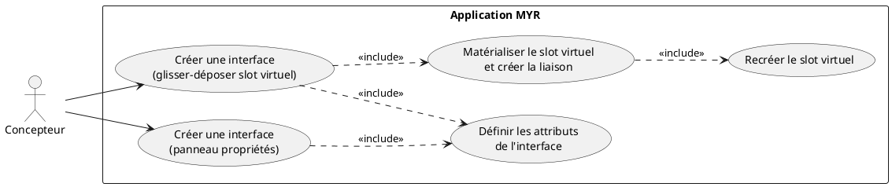
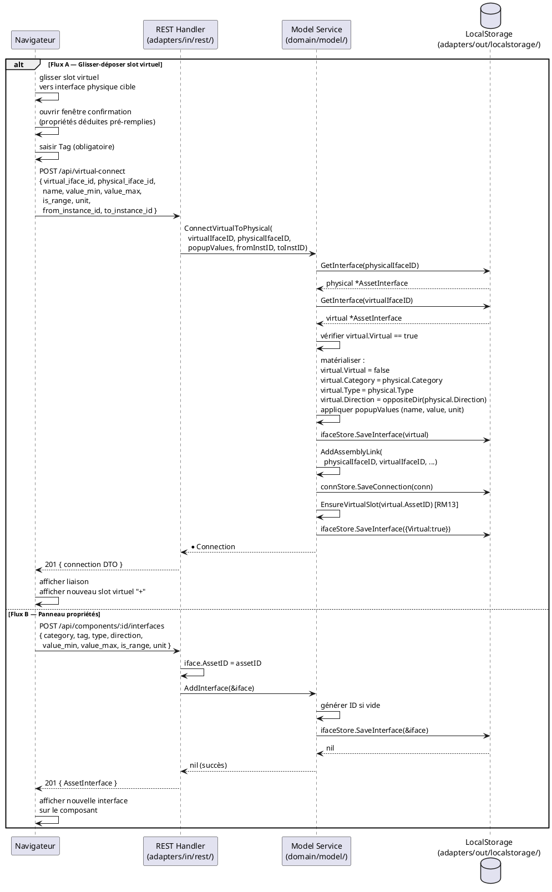

# Créer une interface sur un composant

## Diagramme d'acteurs

## Contexte

Chaque composant dans l'Atelier possède toujours au moins un slot virtuel (`AssetInterface.Virtual = true`) représenté par une icône "+". Ce slot est le point d'entrée pour créer une nouvelle interface physique.

L'utilisateur peut créer une interface de deux façons :

- **Flux A — Glisser-déposer** : glisser le slot virtuel d'un composant vers une interface physique d'un autre composant. Le système appelle `ConnectVirtualToPhysical()` qui matérialise le slot virtuel en interface complémentaire ET crée la liaison en une seule opération.
- **Flux B — Panneau propriétés** : saisir manuellement tous les attributs de la nouvelle interface via `POST /api/components/:id/interfaces`. La liaison n'est pas créée automatiquement dans ce flux.

**Invariant RM13 :** Dès qu'un slot virtuel est matérialisé (Flux A), un nouveau slot virtuel est immédiatement recréé sur le même asset (`EnsureVirtualSlot`). Un asset a toujours au moins un slot virtuel disponible.

**Champ Tag (E2) :** Le tag est un attribut obligatoire selon RM11. Il est absent de la struct `AssetInterface` dans le code actuel. Dans les deux flux, le tag doit être sélectionné ou créé par l'utilisateur (non déduit automatiquement depuis l'interface cible).

## Pré-conditions

- L'utilisateur est authentifié avec le rôle **Concepteur** (`contributor`)
- Au moins un composant est présent dans l'Atelier avec un slot virtuel (`Virtual: true`)
- Pour le Flux A : un autre composant avec au moins une interface physique est présent dans l'Atelier
- Pour le Flux B : le composant cible est identifié

## Scénario

### Flux A — Glisser-déposer depuis le slot virtuel

**Étape initiale :** L'utilisateur fait glisser le slot virtuel (`Virtual=true`) d'un composant vers une interface physique d'un autre composant

1. Le système détecte le dépôt sur une interface physique cible
2. Vérification préliminaire : la catégorie de la cible doit être compatible (même catégorie possible)
3. Une fenêtre de confirmation s'ouvre avec les propriétés déduites de l'interface cible, pré-remplies :
   - **Catégorie** : identique à la cible
   - **Sens (Direction)** : inversé (`out` → `in` ; `in` → `out` ; `bidir` → `bidir`)
   - **Type** : identique à la cible
   - **Valeur/Unité** : inférée depuis la cible
4. Le champ **Tag** est vide — l'utilisateur doit sélectionner un tag depuis la liste filtrée ou en créer un nouveau (REQUIS)
5. L'utilisateur valide (avec ou sans ajustements des valeurs)
6. Le navigateur envoie `POST /api/virtual-connect` avec `{ virtual_iface_id, physical_iface_id, name, value_min, value_max, is_range, unit, from_instance_id, to_instance_id }`
7. Le service `ConnectVirtualToPhysical()` :
   a. Récupère les deux interfaces (`GetInterface`)
   b. Vérifie que `virtualIfaceID` est bien `Virtual: true`
   c. Matérialise l'interface virtuelle : applique catégorie, type, direction inversée de la physique ; affecte les valeurs de la popup
   d. Sauvegarde l'interface matérialisée (`ifaceStore.SaveInterface`)
   e. Crée la liaison `AddAssemblyLink(physicalIfaceID, virtualIfaceID, ...)`
   f. Recrée un slot virtuel sur l'asset source (`EnsureVirtualSlot`) — RM13
8. La réponse `201 Created` retourne le DTO de la connexion créée
9. L'Atelier affiche la liaison et le nouveau slot virtuel "+"

### Flux B — Via le panneau propriétés

**Étape initiale :** L'utilisateur ouvre le panneau de propriétés d'un composant et clique "Ajouter une interface"

1. Un formulaire s'affiche avec les champs : catégorie, sens, tag, type, valeur/plage, unité
2. L'utilisateur renseigne tous les attributs
3. Le navigateur envoie `POST /api/components/:id/interfaces` avec le corps JSON de l'interface
4. Le handler appelle `service.AddInterface(&iface)` — génère un ID si absent
5. L'interface est persistée dans `ifaceStore.SaveInterface()`
6. La réponse `201 Created` retourne l'interface créée
7. L'interface physique apparaît sur le composant dans l'Atelier

### Flux alternatif A2 — Ajustement des valeurs dans la fenêtre de confirmation

1. L'utilisateur modifie une ou plusieurs valeurs pré-remplies (ex: affiner la plage de valeur)
2. La validation se poursuit avec les valeurs ajustées
3. Résultat identique au Flux A nominal

### Flux erreur — Dépôt sur interface incompatible (catégorie différente)

1. Le système détecte une catégorie différente entre le slot virtuel et l'interface cible
2. Le dépôt est refusé visuellement (l'interface cible reste grisée, pas de fenêtre de confirmation)
3. Aucune interface n'est créée

### Flux erreur — Interface virtuelle introuvable

1. `ConnectVirtualToPhysical()` appelle `GetInterface(virtualIfaceID)` → erreur
2. Le handler retourne HTTP 500 avec le message d'erreur
3. L'UI affiche un message d'erreur

### Flux erreur — Interface non virtuelle passée comme slot virtuel

1. `ConnectVirtualToPhysical()` détecte que `virtual.Virtual == false`
2. Retourne `fmt.Errorf("l'interface %s n'est pas virtuelle", virtualIfaceID)`
3. Le handler retourne HTTP 500

## Post-conditions

**Flux A :**
- L'interface virtuelle est matérialisée en interface physique (attributs renseignés, `Virtual: false`)
- Une `Connection` est créée entre l'interface physique cible et l'interface nouvellement créée
- Un nouveau slot virtuel (`Virtual: true`) est recréé sur le composant source (RM13)

**Flux B :**
- Une nouvelle interface physique est enregistrée sur le composant dans l'Atelier (état local)
- Aucune liaison n'est créée automatiquement
- Aucune transaction blockchain n'est émise (état `draft` local)

## Diagramme de séquence

## Règles métier déclenchées

| Règle | Description | État code |
|-------|-------------|-----------|
| **RM13** | Slot virtuel garanti : après matérialisation (Flux A), `EnsureVirtualSlot` recrée immédiatement un slot | Implémenté dans `ConnectVirtualToPhysical` |
| **RM11** | Le **Tag** est un critère de compatibilité obligatoire — doit être renseigné à la création | A implémenter (champ `Tag` absent E2) |
| **RM10** | La liaison créée par Flux A passe par `AddAssemblyLink` qui vérifie `ifacesCompatible` | Implémenté |
| **RM09** | L'interface nouvellement créée (Flux A) ne peut pas être réutilisée dans une autre liaison | A implémenter (RM09 absent du code) |

## Exigences non-fonctionnelles

- **ENF12** — Création d'interface réservée au rôle `contributor` côté serveur
- **ENF18** — `domain/model/service.go` ne doit pas importer Fabric ou SQLite
- Temps de réponse `POST /api/virtual-connect` : `< 300 ms` (opérations locales enchaînées)

## Notes d'implémentation

**`ConnectVirtualToPhysical` dans `service.go` :** La logique complète est implémentée (lignes 772–847). Le service :
1. Vérifie que `virtualIfaceID` est virtuel
2. Matérialise l'interface en lui appliquant catégorie/type/direction opposée de la physique
3. Applique les valeurs de la popup (avec fallback sur les valeurs du physique)
4. Sauvegarde l'interface matérialisée
5. Crée la liaison (`AddAssemblyLink` avec from=physique, to=virtuel — ordre inversé intentionnel)
6. Appelle `EnsureVirtualSlot` pour maintenir RM13

**Tag non déduit automatiquement :** Contrairement à catégorie, type et direction, le Tag ne peut pas être déduit de l'interface cible (il représente une qualification sémantique libre). La fenêtre de confirmation doit proposer une liste des tags existants filtrés par type (depuis `GET /api/refs`) et permettre la création d'un nouveau tag.

**Flux B — route :** `POST /api/components/:id/interfaces` → `handleComponentInterfaces()` case `MethodPost`. Le handler extrait `assetID` du path et appelle `service.AddInterface()`. Aucune vérification de compatibilité n'est faite dans ce flux (l'interface est ajoutée sans liaison).

**EnsureVirtualSlot — idempotence :** La fonction vérifie d'abord si un slot `Virtual: true` existe déjà sur l'asset avant d'en créer un nouveau. Elle est donc idempotente et peut être appelée à tout moment sans risque de duplication.
