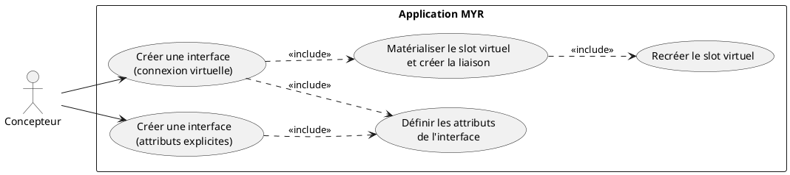
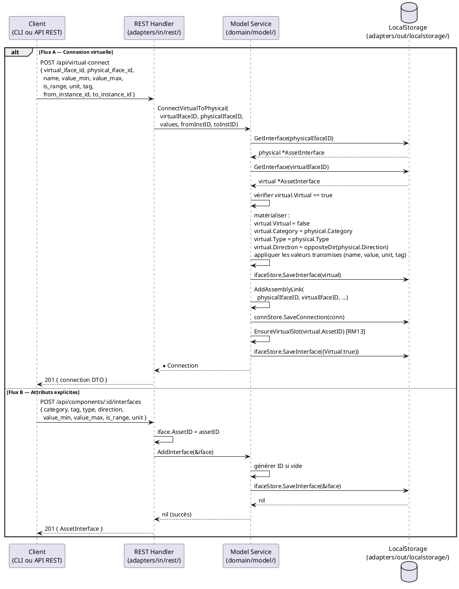

# Créer une interface sur un composant

## Diagramme d'acteurs

## Contexte

Chaque composant possède toujours au moins un slot virtuel (`AssetInterface.Virtual = true`), point d'entrée pour créer une nouvelle interface physique.

Une interface peut être créée de deux façons :

- **Flux A — Connexion virtuelle** : relier le slot virtuel d'un composant à une interface physique d'un autre composant. Le système appelle `ConnectVirtualToPhysical()` qui matérialise le slot virtuel en interface complémentaire ET crée la liaison en une seule opération.
- **Flux B — Attributs explicites** : transmettre manuellement tous les attributs de la nouvelle interface via `POST /api/components/:id/interfaces`. La liaison n'est pas créée automatiquement dans ce flux.

**Invariant RM13 :** Dès qu'un slot virtuel est matérialisé (Flux A), un nouveau slot virtuel est immédiatement recréé sur le même asset (`EnsureVirtualSlot`). Un asset a toujours au moins un slot virtuel disponible.

**Champ Tag (E2) :** Le tag est un attribut obligatoire selon RM11. Il est absent de la struct `AssetInterface` dans le code actuel. Dans les deux flux, le tag doit être transmis explicitement (non déduit automatiquement depuis l'interface cible).

## Pré-conditions

- L'identité agit avec le rôle **Concepteur** (`contributor`)
- Au moins un composant existe avec un slot virtuel (`Virtual: true`)
- Pour le Flux A : un autre composant avec au moins une interface physique est identifié
- Pour le Flux B : le composant cible est identifié

## Scénario

### Flux A — Connexion virtuelle (déduction automatique)

**Étape initiale :** `POST /api/virtual-connect` est appelée (ou l'équivalent CLI `myr model link connect-virtual`) avec l'identifiant du slot virtuel et celui de l'interface physique cible

1. Le service vérifie que la catégorie de la cible est compatible
2. Le service déduit les propriétés de la nouvelle interface à partir de la cible :
   - **Catégorie** : identique à la cible
   - **Sens (Direction)** : inversé (`out` → `in` ; `in` → `out` ; `bidir` → `bidir`)
   - **Type** : identique à la cible
   - **Valeur/Unité** : inférée depuis la cible
3. Le **Tag** doit être transmis explicitement (`--tag`/`tag`, REQUIS) — jamais déduit
4. Le client transmet `{ virtual_iface_id, physical_iface_id, name, value_min, value_max, is_range, unit, from_instance_id, to_instance_id }`
5. Le service `ConnectVirtualToPhysical()` :
   a. Récupère les deux interfaces (`GetInterface`) — brouillon local tant que les composants concernés ne sont pas soumis (ADR-02)
   b. Vérifie que `virtualIfaceID` est bien `Virtual: true`
   c. Matérialise l'interface virtuelle : applique catégorie, type, direction inversée de la physique ; affecte les valeurs transmises
   d. Sauvegarde l'interface matérialisée (`ifaceStore.SaveInterface`) — reste en brouillon, aucune transaction Fabric ici
   e. Crée la liaison `AddAssemblyLink(physicalIfaceID, virtualIfaceID, ...)`
   f. Recrée un slot virtuel sur l'asset source (`EnsureVirtualSlot`) — RM13, également en brouillon local
6. La réponse `201 Created` retourne le DTO de la connexion créée

### Flux B — Attributs explicites

**Étape initiale :** `POST /api/components/:id/interfaces` est appelée (ou l'équivalent CLI `myr model interface add`) avec tous les attributs de l'interface

1. Le client transmet catégorie, sens, tag, type, valeur/plage, unité
2. Le handler appelle `service.AddInterface(&iface)` — génère un ID si absent
3. L'interface est persistée en brouillon local dans `ifaceStore.SaveInterface()` (ADR-02) — aucune transaction Fabric tant que le composant n'est pas soumis
4. La réponse `201 Created` retourne l'interface créée

### Flux alternatif A2 — Ajustement des valeurs déduites

1. Une ou plusieurs valeurs déduites (Flux A) sont surchargées par des valeurs explicites avant validation (ex : affiner la plage de valeur)
2. La validation se poursuit avec les valeurs ajustées
3. Résultat identique au Flux A nominal

### Flux erreur — Connexion sur interface incompatible (catégorie différente)

1. Le service détecte une catégorie différente entre le slot virtuel et l'interface cible
2. La requête est refusée
3. Aucune interface n'est créée

### Flux erreur — Interface virtuelle introuvable

1. `ConnectVirtualToPhysical()` appelle `GetInterface(virtualIfaceID)` → erreur
2. Le handler retourne HTTP 500 avec le message d'erreur

### Flux erreur — Interface non virtuelle passée comme slot virtuel

1. `ConnectVirtualToPhysical()` détecte que `virtual.Virtual == false`
2. Retourne `fmt.Errorf("l'interface %s n'est pas virtuelle", virtualIfaceID)`
3. Le handler retourne HTTP 500

## Post-conditions

**Flux A :**
- L'interface virtuelle est matérialisée en interface physique (attributs renseignés, `Virtual: false`)
- Une `Connection` est créée entre l'interface physique cible et l'interface nouvellement créée
- Un nouveau slot virtuel (`Virtual: true`) est recréé sur le composant source (RM13)

**Flux B :**
- Une nouvelle interface physique est enregistrée en brouillon local sur le composant (état `draft` — ADR-02)
- Aucune liaison n'est créée automatiquement
- Aucune transaction blockchain n'est émise — l'interface rejoindra Fabric à la soumission du composant

## Diagramme de séquence

## Règles métier déclenchées

| Règle | Description | État code |
|-------|-------------|-----------|
| **RM13** | Slot virtuel garanti : après matérialisation (Flux A), `EnsureVirtualSlot` recrée immédiatement un slot | Implémenté dans `ConnectVirtualToPhysical` |
| **RM11** | Le **Tag** est un critère de compatibilité obligatoire — doit être renseigné à la création | A implémenter (champ `Tag` absent E2) |
| **RM10** | La liaison créée par Flux A passe par `AddAssemblyLink` qui vérifie `ifacesCompatible` | Implémenté |
| **RM09** | L'interface nouvellement créée (Flux A) ne peut pas être réutilisée dans une autre liaison | A implémenter (RM09 absent du code) |

## Exigences non-fonctionnelles

- **ENF12** — Création d'interface réservée au rôle `contributor` côté serveur
- **ENF18** — `domain/model/service.go` ne doit pas importer Fabric ou SQLite
- Temps de réponse `POST /api/virtual-connect` : `< 300 ms` (opérations locales enchaînées, tant que les composants concernés sont en brouillon)

## Notes d'implémentation

**`ConnectVirtualToPhysical` dans `service.go` :** La logique complète est implémentée (lignes 772–847). Le service :
1. Vérifie que `virtualIfaceID` est virtuel
2. Matérialise l'interface en lui appliquant catégorie/type/direction opposée de la physique
3. Applique les valeurs transmises (avec fallback sur les valeurs du physique)
4. Sauvegarde l'interface matérialisée en brouillon local (`ifaceStore.SaveInterface()`)
5. Crée la liaison (`AddAssemblyLink` avec from=physique, to=virtuel — ordre inversé intentionnel)
6. Appelle `EnsureVirtualSlot` pour maintenir RM13

**Tag non déduit automatiquement :** Contrairement à catégorie, type et direction, le Tag ne peut pas être déduit de l'interface cible (il représente une qualification sémantique libre). Le client doit le transmettre explicitement, en le choisissant parmi le vocabulaire existant (`GET /api/refs`) ou en le créant.

**Flux B — route :** `POST /api/components/:id/interfaces` → `handleComponentInterfaces()` case `MethodPost`. Le handler extrait `assetID` du path et appelle `service.AddInterface()`. Aucune vérification de compatibilité n'est faite dans ce flux (l'interface est ajoutée sans liaison).

**EnsureVirtualSlot — idempotence :** La fonction vérifie d'abord si un slot `Virtual: true` existe déjà sur l'asset avant d'en créer un nouveau. Elle est donc idempotente et peut être appelée à tout moment sans risque de duplication.

**Commande CLI équivalente (cible) :** Le Flux B (attributs explicites) correspond à `myr model interface add <assetID> --category --type --direction [--value-min --value-max --unit] --tag <tag> [--name <label>]` (voir `DC_CLI_Model.md` § 3.2), qui appelle `ModelService.AddInterface(&iface)` — la même méthode que le handler `POST /api/components/:id/interfaces`. Le Flux A (connexion virtuelle / matérialisation + liaison en une opération) correspond à `myr model link connect-virtual --virtual-iface <id> --physical-iface <id> --tag <tag>`, appelant `ModelService.ConnectVirtualToPhysical()` — la même méthode que le handler `POST /api/virtual-connect`, avec le même maintien du slot virtuel (RM13). Le comportement (règles métier, erreurs) est strictement identique quel que soit le canal ; seul le format de sortie change (texte terminal vs JSON HTTP). Le champ Tag (E2) reste à transmettre explicitement dans les deux cas, puisqu'il n'est pas déductible automatiquement.
