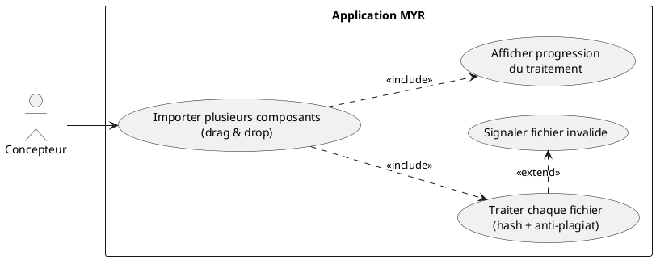
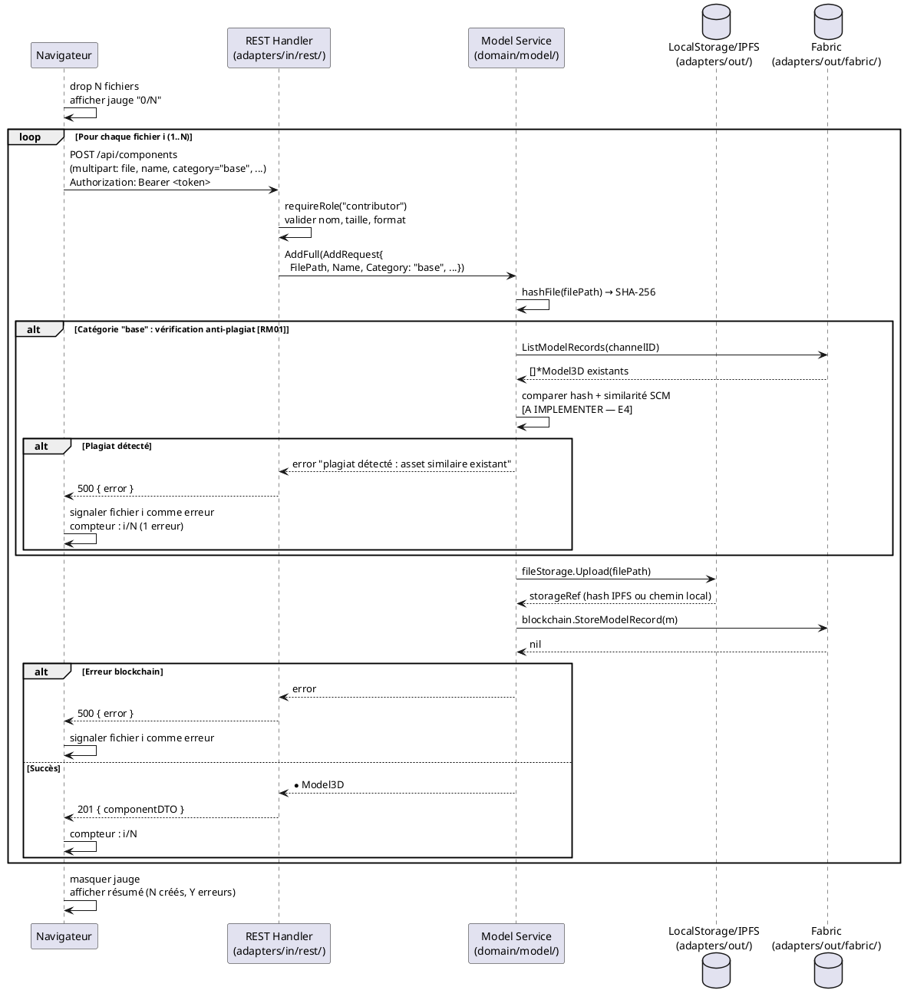

# Création de plusieurs composants

## Diagramme d'acteurs



## Contexte

L'import multiple permet au Concepteur de déposer simultanément plusieurs fichiers 3D/CAO sur l'interface pour créer plusieurs composants en une seule opération. Chaque fichier est traité séquentiellement ou en parallèle côté serveur, avec feedback de progression côté client.

Pour chaque fichier, la séquence est identique à la création unitaire (`POST /api/components` multipart) mais répétée N fois. Le feedback de progression ("X / N assets traités") est géré côté client (JavaScript) en suivant les réponses de chaque requête individuelle.

**Vérification anti-plagiat (RM01) :** Pour tout asset de catégorie `base`, la vérification SHA-256 est effectuée. La comparaison avec les assets existants du réseau (similarité SCM > 50%) est définie par RM01 mais partiellement implémentée dans le code (E4 — comparaison absente). Ce use case documente le comportement cible.

**Note :** Il n'existe pas de route REST dédiée "import multiple" — le client effectue N requêtes `POST /api/components` successives et gère lui-même la progression.

## Pré-conditions

- L'utilisateur est authentifié avec le rôle **Concepteur** (`contributor`)
- L'utilisateur dispose d'un ou plusieurs fichiers 3D/CAO valides (STL, OBJ, STEP, etc.)
- La blockchain (ou le store JSON local) est accessible

## Scénario

**Étape initiale :** L'utilisateur glisse-dépose plusieurs fichiers 3D sur la zone de dépôt de l'interface

### Flux nominal — Import multiple réussi

1. Le navigateur reçoit les N fichiers via l'événement `drop`
2. Une jauge de chargement apparaît immédiatement avec le compteur "0 / N assets traités"
3. Pour chaque fichier (traitement séquentiel ou en parallèle selon l'implémentation JS) :
   a. Le navigateur envoie `POST /api/components` en multipart avec le fichier et les métadonnées
   b. Côté serveur, `createAsset()` :
      - Calcule le SHA-256 du fichier
      - Pour catégorie `base` : vérifie l'unicité (comparaison avec assets existants — RM01)
      - Uploade le fichier vers `FileStoragePort` (IPFS ou local)
      - Crée l'entrée `Model3D` et appelle `blockchain.StoreModelRecord()`
   c. La réponse `201 Created` est reçue par le navigateur
   d. Le compteur se met à jour : "X / N assets traités"
4. À la fin de tous les traitements, la jauge disparaît
5. Les composants créés sont disponibles dans la bibliothèque et l'Explorer UI

### Flux erreur — Fichier invalide ou plagiat détecté

1. Pour un fichier donné, `createAsset()` retourne une erreur :
   - Hash déjà présent sur le réseau (plagiat SHA-256)
   - Similarité SCM > 50% avec un asset existant (RM01 — à implémenter)
   - Fichier illisible ou format non supporté
   - Erreur blockchain à la soumission
2. Le navigateur reçoit HTTP 500 (ou autre code d'erreur) pour ce fichier
3. Le fichier concerné est signalé dans l'UI avec le motif d'erreur
4. Le compteur continue : "X / N assets traités (Y erreurs)"
5. Les autres fichiers continuent d'être traités — les erreurs ne bloquent pas le reste

### Flux alternatif — Un seul fichier (import unitaire)

1. L'utilisateur dépose un seul fichier
2. La jauge affiche "0 / 1 assets traités" puis "1 / 1 assets traités"
3. Comportement identique au flux nominal pour ce fichier unique

## Post-conditions

- Les composants valides sont créés et enregistrés sur la blockchain
- Les fichiers en erreur sont signalés avec leur motif
- La jauge de progression a disparu
- Les nouveaux composants sont visibles dans l'Explorer UI

## Diagramme de séquence



## Règles métier déclenchées

| Règle | Description | État code |
|-------|-------------|-----------|
| **RM01** | Anti-plagiat SHA-256 + SCM > 50% obligatoire pour catégorie `base` | Partiel — hash calculé, comparaison absente (E4) |
| **RM04** | UUID généré par le système, jamais par le client | Implémenté (`generateID()` dans service) |
| **RM07** | Validation complète avant soumission blockchain | Implémenté (hash + licence + parent) |

## Exigences non-fonctionnelles

- **ENF01** — Temps de traitement : objectif `< 5 s` par fichier pour les opérations locales
- **ENF12** — Rôle `contributor` vérifié côté serveur pour chaque requête
- **ENF30** — En cas d'échec blockchain, l'état local n'est pas corrompu (rollback implicite — aucun record local avant succès Fabric)
- La progression visuelle est gérée côté client — pas de WebSocket ni de polling serveur requis

## Notes d'implémentation

**Route REST :** Pas de route dédiée "import multiple". La logique est entièrement côté client JavaScript : N appels successifs à `POST /api/components`.

**Gestion de la jauge :** Implémentation JS recommandée :
```javascript
let processed = 0;
const total = files.length;
for (const file of files) {
    try {
        await uploadFile(file);
    } catch (e) {
        markError(file, e.message);
    }
    processed++;
    updateProgressBar(processed, total);
}
hideProgressBar();
```

**Anti-plagiat (E4) :** Pour corriger l'écart RM01 dans `domain/model/service.go`, la fonction `AddFull()` devrait, pour `CategoryBase`, appeler `blockchain.ListModelRecords()` et comparer le hash SHA-256 avec ceux des assets existants. La comparaison SCM (similarité structurelle > 50%) nécessite un service domaine dédié.

**Taille fichier :** Le handler `createAsset()` limite le multipart à 32 Mo (`ParseMultipartForm(32 << 20)`). Les fichiers volumineux doivent être signalés avant envoi.

**Miniature :** Si un `thumbnail` (data URL base64 Three.js) est inclus dans le formulaire, il est persisté dans le `ThumbnailStore`. Si un lien `links[0]` est fourni sans fichier, l'og:image est tentée via `fetchOGImage()`.
