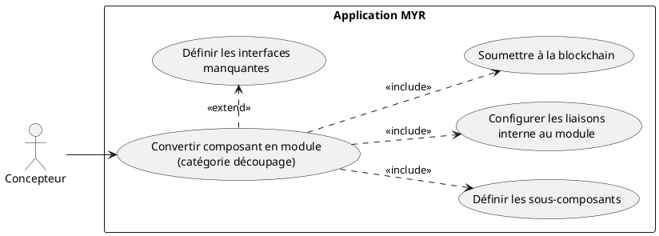
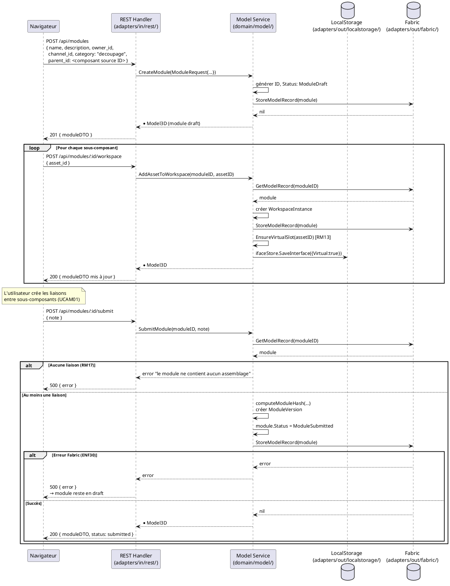

# Transformation d'un composant en module

## Diagramme d'acteurs



## Contexte

La transformation d'un composant en module correspond à la catégorie `decoupage` dans la taxonomie des assets (RM02). C'est la seule opération qui change la nature d'un asset : d'un composant simple (avec `Hash` renseigné) vers un assemblage (avec `WorkspaceInstances` renseigné).

Le résultat est un `Model3D` avec `Status: ModuleDraft`, `WorkspaceInstances` peuplé des sous-composants, et `Assemblies` contenant les liaisons internes. La soumission blockchain (`SubmitModule`) crée une `ModuleVersion` immuable.

**Écart connu (E1) :** La catégorie `decoupage` est définie dans les specs (RM02, §6.3) mais est absente de `domain/model/entity.go`. La constante `CategoryDecoupage` doit être ajoutée. C'est une précondition à l'implémentation de ce use case.

**Lien avec UCMOD :** Ce use case est un cas particulier de la création de module. Il part d'un composant existant plutôt que de créer un module de zéro. Le flux final (ajout de sous-composants, liaisons, soumission) est identique à UCMOD01.

## Pré-conditions

- L'utilisateur est authentifié avec le rôle **Concepteur** (`contributor`)
- L'utilisateur est propriétaire du composant à convertir (`OwnerID` correspond)
- Le composant existe sur la blockchain (`blockchain.GetModelRecord()` retourne l'asset)
- La catégorie `decoupage` est disponible dans le catalogue (E1 à corriger)

## Scénario

**Étape initiale :** L'utilisateur sélectionne un composant existant dans l'Explorer UI et choisit "Convertir en module"

### Flux nominal — Conversion réussie

1. L'utilisateur choisit "Convertir en module" sur un composant existant
2. Le système crée un nouveau module en état `draft` via `CreateModule()` avec :
   - `Name`, `Description`, `OwnerID`, `ChannelID` hérités du composant source
   - `Category: "decoupage"` (à implémenter — E1)
   - `ParentID` du composant source (RM05 : tout asset non-`base` exige un `ParentID`)
3. Le module s'ouvre dans l'Atelier — l'espace de travail est vide
4. L'utilisateur ajoute les sous-composants constitutifs via `POST /api/modules/:id/workspace`
5. Pour chaque sous-composant ajouté, `AddAssetToWorkspace()` :
   - Crée une `WorkspaceInstance` dans le module
   - Appelle `EnsureVirtualSlot(assetID)` pour garantir le slot virtuel (RM13)
6. L'utilisateur crée les liaisons internes entre les sous-composants (UCAM01)
7. L'utilisateur clique "Soumettre" → `POST /api/modules/:id/submit`
8. `SubmitModule()` vérifie qu'au moins une liaison est présente (`len(Assemblies) > 0` — RM17)
9. Une `ModuleVersion` immuable est créée (hash + horodatage — RM18) et ancrée sur la blockchain
10. Le module passe en état `submitted`

### Flux alternatif — Composant sans interfaces définies

1. Le composant sélectionné n'a aucune interface définie
2. Le système avertit : "Ce composant n'a pas d'interfaces — le module résultant ne pourra pas être lié à d'autres composants"
3. L'utilisateur choisit de définir les interfaces avant de poursuivre (voir UCAM03)
4. Une fois les interfaces définies, la transformation en module est relancée normalement

### Flux erreur — Catégorie `decoupage` absente (E1)

1. La constante `CategoryDecoupage` n'est pas définie dans `entity.go`
2. Le formulaire de création ne propose pas cette catégorie
3. **Comportement bloquant** — la correction de E1 est un prérequis à ce use case

### Flux erreur — Soumission sans liaison (RM17)

1. L'utilisateur tente de soumettre un module sans aucune liaison interne
2. `SubmitModule()` retourne `fmt.Errorf("le module ne contient aucun assemblage")`
3. Le handler retourne HTTP 500
4. L'UI affiche : "Impossible de soumettre — le module doit contenir au moins une liaison"

### Flux erreur — Erreur blockchain à la soumission

1. `blockchain.StoreModelRecord()` échoue (Fabric indisponible, endorsement refusé)
2. L'état local du module reste `draft` — le module n'est pas perdu (ENF30)
3. L'UI affiche un message d'erreur et propose de réessayer

## Post-conditions

- Le composant est transformé en module contenant ses sous-composants
- Le module est en état `submitted` sur la blockchain avec une `ModuleVersion` immuable (RM18)
- Les interfaces exposées du module sont les interfaces libres (non reliées en interne) de ses sous-composants
- Le composant source reste sur la blockchain (Fabric ne supporte pas la suppression — RM08)

## Diagramme de séquence



## Règles métier déclenchées

| Règle | Description | État code |
|-------|-------------|-----------|
| **RM02** | Catégorie `decoupage` obligatoire pour cette transformation | A implémenter (E1) |
| **RM05** | `ParentID` obligatoire pour tout asset non-`base` | Implémenté dans `AddFull` (vérification licence) — à étendre pour `decoupage` |
| **RM07** | Validation complète avant soumission blockchain | Implémenté (`SubmitModule` vérifie `len(Assemblies)`) |
| **RM08** | Fabric ne supporte pas la suppression — le composant source reste | Implémenté (`ErrNotSupported`) |
| **RM13** | Slot virtuel garanti pour chaque sous-composant ajouté | Implémenté (`EnsureVirtualSlot` dans `AddAssetToWorkspace`) |
| **RM17** | Au moins une liaison requise pour soumettre | Implémenté (`SubmitModule` vérifie `len(Assemblies) > 0`) |
| **RM18** | `ModuleVersion` immuable créée à la soumission | Implémenté (hash SHA-256 + horodatage) |

## Exigences non-fonctionnelles

- **ENF12** — Rôle `contributor` vérifié côté serveur pour toutes les opérations d'écriture
- **ENF18** — Aucune dépendance Fabric dans le service domaine
- **ENF30** — En cas d'échec blockchain à la soumission, le module reste en état `draft` local

## Notes d'implémentation

**Écart E1 — Ajout de la catégorie `decoupage` :**
```go
// domain/model/entity.go
const (
    // ... catégories existantes ...
    CategoryDecoupage Category = "decoupage"
)
```

**Différence avec `CreateModule` de UCMOD :** La transformation par découpage doit créer le module avec `ParentID = <ID du composant source>` et `Category = "decoupage"`. La route `POST /api/modules` doit accepter ces champs supplémentaires (déjà supportés via le DTO si `AddFull` est appelé au lieu de `CreateModule`).

**Alternative d'implémentation :** Plutôt que de créer un nouveau `Model3D` de type module, il serait possible de muter le composant existant en ajoutant `WorkspaceInstances` et `Status: ModuleDraft`. Cette approche est plus cohérente avec la sémantique "découpage" (même identité) mais viole RM07 (les transactions Fabric sont immuables — modifier un asset existant crée en réalité un nouveau record). Le choix d'implémentation doit être précisé par le product owner.

**`SubmitModule` vérifie RM17 :** La vérification `len(m.Assemblies) == 0 → erreur` est implémentée dans `service.go` ligne 498. Aucune modification nécessaire pour ce flux.

**RM19 — Fork obligatoire (manquant, E5) :** Une fois soumis, le module ne devrait plus être modifiable directement. Ce comportement n'est pas encore contraint dans le code. À documenter dans UCMOD pour traitement.
