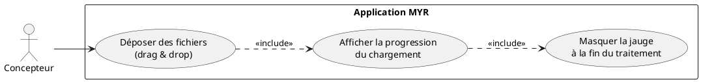
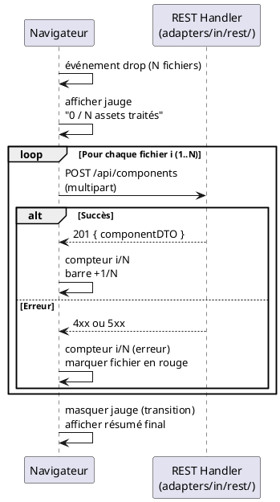

# Icône de chargement

## Diagramme d'acteurs



## Contexte

Ce use case décrit uniquement le **comportement visuel de progression** lors d'un import de fichier(s). Il est étroitement couplé à UCAM04 (Création de plusieurs composants) et s'applique également à tout import unitaire de fichier 3D.

La jauge de chargement est un composant UI pur (JavaScript/CSS) — aucun endpoint REST dédié. Elle reflète l'avancement des N requêtes `POST /api/components` successives, chacune résolvant sa promesse à la réception de la réponse serveur.

Ce use case n'implique pas de logique métier propre. Il documente le comportement attendu de l'interface pour assurer la cohérence UX lors d'opérations longues.

## Pré-conditions

- L'utilisateur a initié un dépôt d'un ou plusieurs fichiers sur la zone de drop de l'interface
- La zone de drop est accessible depuis l'Asset UI ou l'Atelier

## Scénario

**Étape initiale :** L'utilisateur dépose un ou plusieurs fichiers sur la zone de drop

### Flux nominal — Chargement en cours

1. L'événement `drop` est capturé par le JS côté navigateur
2. La jauge de chargement apparaît **immédiatement**, avant même le premier envoi réseau
3. Le compteur affiche "0 / N assets traités"
4. Pour chaque fichier envoyé au serveur :
   a. La requête `POST /api/components` est émise
   b. À la réception de la réponse (succès ou erreur), le compteur s'incrémente
   c. La barre de progression se remplit proportionnellement
5. Quand tous les fichiers sont traités : la jauge disparaît avec une transition douce
6. Les assets créés sont disponibles dans la vue (rechargement automatique ou ajout incrémental)

### Flux alternatif — Fichier unique

1. La jauge apparaît avec "0 / 1 assets traités"
2. Après traitement, "1 / 1 assets traités"
3. La jauge disparaît

### Flux alternatif — Certains fichiers en erreur

1. Les erreurs sont comptabilisées séparément : "N traités (Y erreurs)"
2. La jauge reste visible jusqu'à la fin de tous les traitements (même les erreurs)
3. Un résumé des erreurs est affiché après fermeture de la jauge

## Post-conditions

- Tous les fichiers ont été traités (succès ou erreur)
- La jauge n'est plus visible
- L'utilisateur a été informé du résultat (nombre créés, nombre en erreur)

## Diagramme de séquence



## Règles métier déclenchées

Aucune règle métier directe — ce use case est purement UI. Les règles métier sont déclenchées par les requêtes `POST /api/components` sous-jacentes (RM01, RM04, RM07 — voir UCAM04).

## Exigences non-fonctionnelles

- **ENF22** — Comportement cohérent sur Chrome 120+, Firefox 120+, Safari 17+, Edge 120+
- La jauge doit apparaître **avant** le premier appel réseau pour rassurer l'utilisateur
- Pas de blocage de l'UI pendant le traitement (requêtes asynchrones, pas de `await` bloquant le thread principal)
- Temps d'affichage de la jauge : `< 50 ms` après le drop (pur CSS/JS)

## Notes d'implémentation

**Implémentation JS recommandée dans `ui/static/` :**

```javascript
async function handleDrop(files) {
    const total = files.length;
    let processed = 0;
    let errors = 0;

    showProgress(0, total);

    const uploads = Array.from(files).map(async (file) => {
        try {
            await uploadComponent(file);
        } catch (e) {
            errors++;
            markFileError(file.name, e.message);
        } finally {
            processed++;
            updateProgress(processed, total, errors);
        }
    });

    await Promise.allSettled(uploads);
    hideProgress();
    showSummary(total - errors, errors);
}
```

**`Promise.allSettled` vs séquentiel :** Utiliser `Promise.allSettled` pour traiter les fichiers en parallèle (meilleure performance) plutôt que `for...of await` séquentiel. Le serveur peut gérer plusieurs requêtes simultanées.

**Structure HTML recommandée :**
```html
<div id="upload-progress" class="hidden">
    <div class="progress-bar">
        <div class="progress-fill"></div>
    </div>
    <span class="progress-label">0 / 0 assets traités</span>
</div>
```

**Conformité mémoire CSS :** Ne jamais mettre `display:flex` en style inline sur les overlays de modale (écrase la classe `.hidden`) — voir règle projet dans MEMORY.md.
