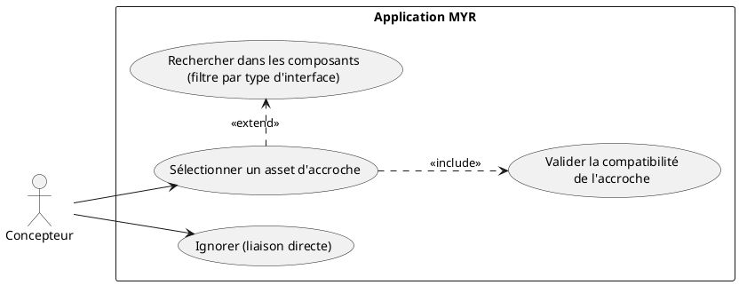
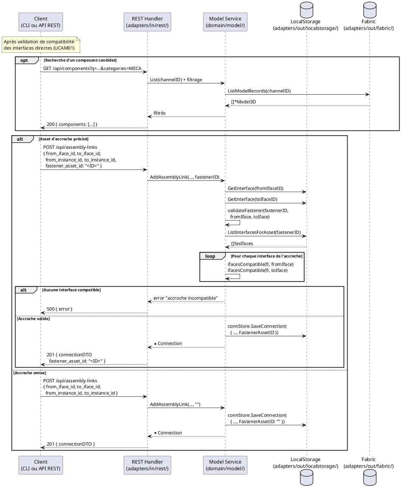

# Choisir un asset d'accroche (Fastener)

## Diagramme d'acteurs

## Contexte

Lors de la création d'une liaison entre deux interfaces (UCAM01), un **asset d'accroche** peut optionnellement être désigné : un composant existant sur le réseau qui sert d'intermédiaire physique entre les deux interfaces (vis, câble, connecteur, raccord, etc.).

L'asset d'accroche est référencé par son identifiant `FastenerAssetID` dans la `Connection`. Sa présence est purement optionnelle — si le flag est omis, `FastenerAssetID` reste vide et la liaison est directe.

**Validation de l'accroche (RM10) :** Avant d'accepter l'asset d'accroche, le service vérifie via `validateFastener()` que cet asset possède au moins une interface compatible avec chacun des deux endpoints de la liaison. Cette vérification est distincte et complémentaire de la vérification de compatibilité des interfaces directes.

**Note :** L'asset d'accroche est un composant existant sur la blockchain — il n'est pas ajouté au module comme instance, uniquement référencé par ID dans la connexion.

## Pré-conditions

- Une liaison est en cours de création (UCAM01)
- La compatibilité des deux interfaces directes a été vérifiée et validée
- Des composants utilisables comme accroche existent sur le réseau

## Scénario

**Étape initiale :** `POST /api/assembly-links` est appelée avec `fastener_asset_id` renseigné (ou l'équivalent CLI `myr model link add --fastener <assetID>`)

### Flux nominal — Asset d'accroche précisé

1. Les composants pouvant servir d'accroche sont identifiés via `GET /api/components?categories=...`, filtrés par catégorie d'interface (ex : composants MECA si la liaison est mécanique)
2. Le client transmet `fastener_asset_id` dans la requête `POST /api/assembly-links`
3. Le service `AddAssemblyLink()` appelle `validateFastener(fastenerID, fromIface, toIface)` :
   a. `ListInterfacesForAsset(fastenerID)` retourne les interfaces de l'accroche — brouillon local tant que l'accroche n'est pas soumise (ADR-02)
   b. Pour chaque interface de l'accroche : vérification `ifacesCompatible(fi, fromIface)` et `ifacesCompatible(fi, toIface)`
   c. Au moins une interface doit être compatible avec chaque endpoint
4. La `Connection` est créée avec `FastenerAssetID` renseigné

### Flux nominal — Liaison directe (accroche omise)

1. Le flag `fastener_asset_id` est omis (ou vide) dans la requête `POST /api/assembly-links`
2. La `Connection` est créée avec `FastenerAssetID: ""` — liaison directe

### Flux alternatif — Recherche par texte

1. Un terme de recherche est transmis via `GET /api/components?q=<terme>&categories=<cat>`
2. La liste des composants correspondants est retournée

### Flux erreur — Accroche incompatible avec l'un des endpoints

1. `validateFastener()` ne trouve aucune interface de l'accroche compatible avec `fromIface` ou `toIface`
2. Le service retourne `fmt.Errorf("aucune interface de l'accroche n'est compatible avec l'interface source/cible")`
3. Le handler retourne HTTP 500 avec le message d'erreur

### Flux erreur — Accroche sans interface définie

1. `ListInterfacesForAsset(fastenerID)` retourne une liste vide
2. `validateFastener()` retourne `fmt.Errorf("l'asset d'accroche n'a aucune interface définie")`

## Post-conditions

**Avec accroche :**
- La `Connection` est persistée avec `FastenerAssetID` renseigné
- L'asset d'accroche est associé à la liaison, consultable via `connectionDTO.fastener_asset_id`
- L'asset d'accroche reste sur la blockchain — il n'est pas retiré s'il est utilisé comme accroche

**Sans accroche (liaison directe) :**
- La `Connection` est persistée avec `FastenerAssetID: ""`

## Diagramme de séquence

## Règles métier déclenchées

| Règle | Description | État code |
|-------|-------------|-----------|
| **RM10** | Vérification de compatibilité automatique — s'applique aussi à l'accroche | Implémenté (`validateFastener`) |
| **RM11** | 5 critères de compatibilité — appliqués entre l'accroche et chaque endpoint | Partiel (Tag manquant E2) |
| **RM09** | L'asset d'accroche lui-même n'est pas soumis à la règle d'usage unique — seules les interfaces directes le sont | Non applicable à l'accroche |

## Exigences non-fonctionnelles

- **ENF12** — Vérification côté serveur obligatoire (la validation de l'accroche ne peut jamais être uniquement côté client)
- **ENF18** — `validateFastener()` dans le domaine — pas d'import Fabric direct
- Temps de réponse : `< 300 ms` pour la validation + création de liaison avec accroche (interfaces en brouillon local tant qu'aucun des assets n'est soumis)

## Notes d'implémentation

**`validateFastener()` dans `service.go` (lignes 180–207) :** La logique est implémentée. Elle récupère les interfaces de l'accroche et vérifie la compatibilité bilatérale. La fonction retourne une erreur si l'accroche n'a pas d'interface compatible avec `fromIface` OU avec `toIface`.

**Filtre de la liste des accroches candidates :** La catégorie à filtrer pour la liste des accroches potentielles peut être déduite des interfaces en cours de liaison. Par exemple :
- Liaison MECA → composants avec interfaces MECA (vis, clips, rivets)
- Liaison ELEC → composants avec interfaces ELEC (câbles, connecteurs, nappes)
- Liaison HYD → composants avec interfaces HYD (raccords, tuyaux)

**Compatibilité de l'accroche avec Tag (E2) :** Quand le champ `Tag` sera ajouté à `AssetInterface`, `validateFastener()` bénéficiera automatiquement de la vérification étendue via `ifacesCompatible()` sans modification supplémentaire.

**Commande CLI équivalente :** Il n'existe pas de commande CLI séparée pour l'asset d'accroche — c'est le flag optionnel `--fastener <assetID>` de `myr model link add` (voir `DC_CLI_Model.md` § 3.4). La commande appelle `ModelService.AddAssemblyLink(..., fastenerAssetID)`, la même méthode que le handler `POST /api/assembly-links` avec `fastener_asset_id` renseigné — `validateFastener()` s'exécute identiquement (RM10, RM11 partielle — Tag manquant E2). Omettre le flag équivaut à omettre `fastener_asset_id` (liaison directe, `FastenerAssetID` vide). La recherche par texte (`GET /api/components?q=...`) n'a pas d'équivalent CLI dédié : l'identifiant de l'asset d'accroche se retrouve via `myr model list` ou `myr model get` avant d'appeler `link add`.
