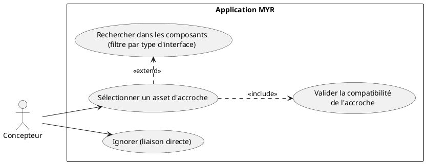
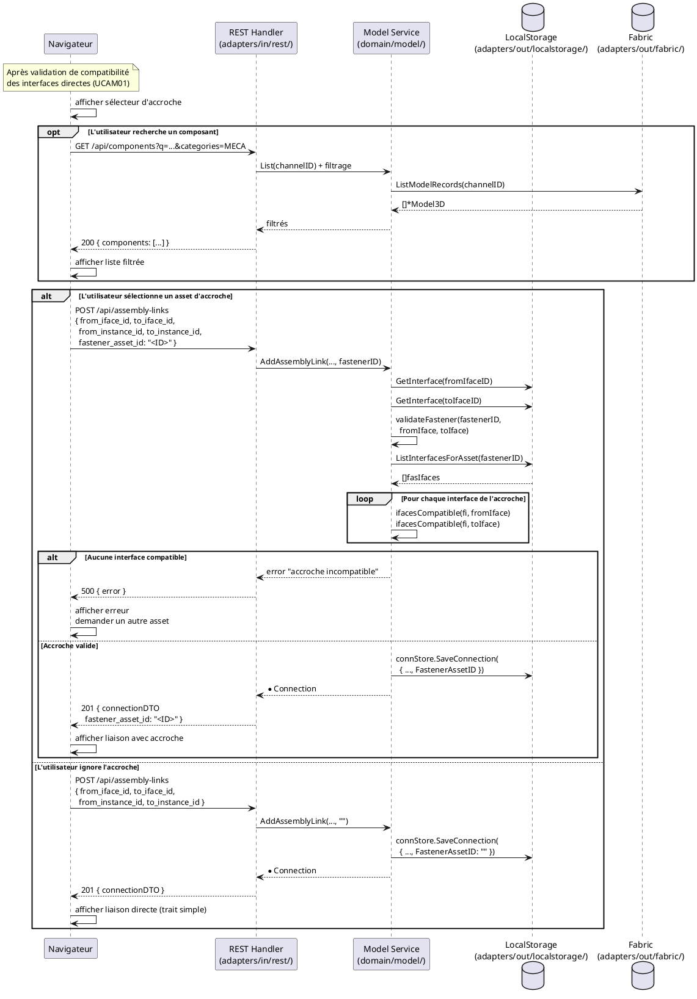

# Choisir un asset d'accroche (Fastener)

## Diagramme d'acteurs

## Contexte

Lors de la création d'une liaison entre deux interfaces (UCAM01), le système propose optionnellement de désigner un **asset d'accroche** : un composant existant sur le réseau qui sert d'intermédiaire physique entre les deux interfaces (vis, câble, connecteur, raccord, etc.).

L'asset d'accroche est référencé par son identifiant `FastenerAssetID` dans la `Connection`. Sa présence est purement optionnelle — si l'utilisateur ignore cette étape, `FastenerAssetID` reste vide et la liaison est directe.

**Validation de l'accroche (RM10) :** Avant d'accepter l'asset d'accroche, le service vérifie via `validateFastener()` que cet asset possède au moins une interface compatible avec chacun des deux endpoints de la liaison. Cette vérification est distincte et complémentaire de la vérification de compatibilité des interfaces directes.

**Note :** L'asset d'accroche est un composant existant sur la blockchain — il n'est pas ajouté à l'Atelier comme instance, uniquement référencé par ID dans la connexion.

## Pré-conditions

- L'utilisateur est en cours de création d'une liaison (UCAM01)
- La compatibilité des deux interfaces directes a été vérifiée et validée
- Des composants utilisables comme accroche existent sur le réseau

## Scénario

**Étape initiale :** Le système affiche le sélecteur d'asset d'accroche après validation de la compatibilité des interfaces directes

### Flux nominal — Asset d'accroche sélectionné

1. Le système affiche la liste des composants pouvant servir d'accroche
   - Filtrée par catégorie d'interface (ex : composants MECA si la liaison est mécanique)
   - Source : `GET /api/components?categories=...` avec les catégories appropriées
2. L'utilisateur sélectionne le composant d'accroche (ex : vis M3, câble USB-C)
3. Le navigateur inclut `fastener_asset_id` dans la requête `POST /api/assembly-links`
4. Le service `AddAssemblyLink()` appelle `validateFastener(fastenerID, fromIface, toIface)` :
   a. `ListInterfacesForAsset(fastenerID)` retourne les interfaces de l'accroche
   b. Pour chaque interface de l'accroche : vérification `ifacesCompatible(fi, fromIface)` et `ifacesCompatible(fi, toIface)`
   c. Au moins une interface doit être compatible avec chaque endpoint
5. La `Connection` est créée avec `FastenerAssetID` renseigné
6. La liaison est représentée dans l'Atelier avec l'asset d'accroche visible entre les deux interfaces

### Flux nominal — Liaison directe (accroche ignorée)

1. L'utilisateur clique "Ignorer" ou ferme le sélecteur
2. Le navigateur envoie `POST /api/assembly-links` sans `fastener_asset_id` (ou vide)
3. La `Connection` est créée avec `FastenerAssetID: ""` — liaison directe
4. La liaison est représentée par un trait simple

### Flux alternatif — Recherche par texte dans le sélecteur

1. L'utilisateur saisit un terme de recherche dans le sélecteur
2. Le navigateur envoie `GET /api/components?q=<terme>&categories=<cat>` en temps réel
3. La liste se met à jour pour afficher les composants correspondants

### Flux erreur — Accroche incompatible avec l'un des endpoints

1. `validateFastener()` ne trouve aucune interface de l'accroche compatible avec `fromIface` ou `toIface`
2. Le service retourne `fmt.Errorf("aucune interface de l'accroche n'est compatible avec l'interface source/cible")`
3. Le handler retourne HTTP 500 avec le message d'erreur
4. L'UI affiche : "L'asset sélectionné ne peut pas servir d'accroche pour cette liaison"

### Flux erreur — Accroche sans interface définie

1. `ListInterfacesForAsset(fastenerID)` retourne une liste vide
2. `validateFastener()` retourne `fmt.Errorf("l'asset d'accroche n'a aucune interface définie")`
3. L'UI affiche un message d'erreur approprié

## Post-conditions

**Avec accroche :**
- La `Connection` est persistée avec `FastenerAssetID` renseigné
- L'asset d'accroche apparaît visuellement sur la liaison dans l'Atelier
- L'asset d'accroche reste sur la blockchain — il n'est pas retiré s'il est utilisé comme accroche

**Sans accroche (liaison directe) :**
- La `Connection` est persistée avec `FastenerAssetID: ""`
- La liaison est représentée par un trait simple entre les deux interfaces

## Diagramme de séquence

## Règles métier déclenchées

| Règle | Description | État code |
|-------|-------------|-----------|
| **RM10** | Vérification de compatibilité automatique — s'applique aussi à l'accroche | Implémenté (`validateFastener`) |
| **RM11** | 5 critères de compatibilité — appliqués entre l'accroche et chaque endpoint | Partiel (Tag manquant E2) |
| **RM09** | L'asset d'accroche lui-même n'est pas soumis à la règle d'usage unique — seules les interfaces directes le sont | Non applicable à l'accroche |

## Exigences non-fonctionnelles

- **ENF12** — Vérification côté serveur obligatoire (la validation de l'accroche ne peut pas être uniquement côté client)
- **ENF18** — `validateFastener()` dans le domaine — pas d'import Fabric direct
- Temps de réponse : `< 300 ms` pour la validation + création de liaison avec accroche

## Notes d'implémentation

**`validateFastener()` dans `service.go` (lignes 180–207) :** La logique est implémentée. Elle récupère les interfaces de l'accroche et vérifie la compatibilité bilatérale. La fonction retourne une erreur si l'accroche n'a pas d'interface compatible avec `fromIface` OU avec `toIface`.

**Filtre de la liste des accroches :** La catégorie à filtrer pour la liste des accroches potentielles peut être déduite des interfaces en cours de liaison. Par exemple :
- Liaison MECA → proposer composants avec interfaces MECA (vis, clips, rivets)
- Liaison ELEC → proposer composants avec interfaces ELEC (câbles, connecteurs, nappes)
- Liaison HYD → proposer composants avec interfaces HYD (raccords, tuyaux)

**Représentation visuelle :** L'asset d'accroche dans une liaison est représenté dans le DTO `connectionDTO.fastener_asset_id`. Côté UI, si ce champ est non vide, afficher un nœud intermédiaire sur le trait de liaison avec le nom du composant d'accroche (nécessite un appel `GET /api/components/:id` pour récupérer le nom).

**Compatibilité de l'accroche avec Tag (E2) :** Quand le champ `Tag` sera ajouté à `AssetInterface`, `validateFastener()` bénéficiera automatiquement de la vérification étendue via `ifacesCompatible()` sans modification supplémentaire.
