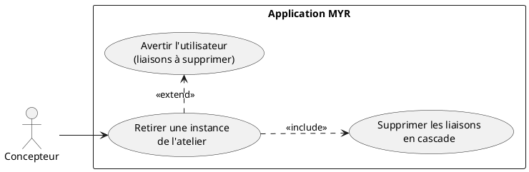
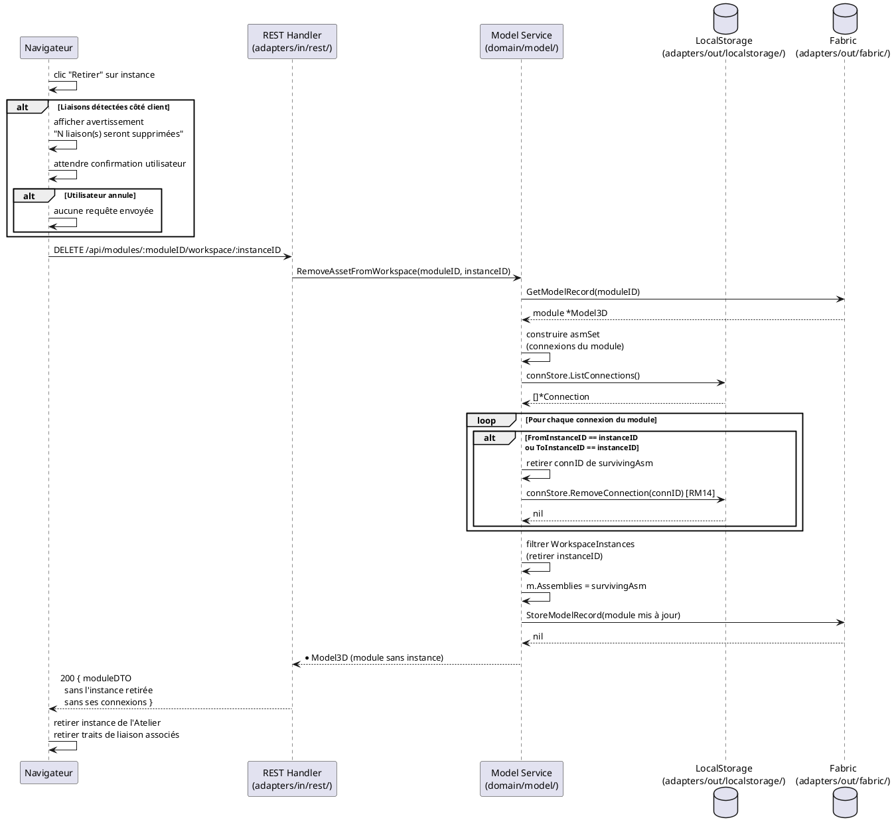

# Retirer un composant de l'atelier

## Diagramme d'acteurs



## Contexte

Le retrait d'un composant de l'Atelier supprime une **instance spécifique** (`WorkspaceInstance`) du module en cours de composition. Un composant peut être présent plusieurs fois dans l'Atelier sous des instances indépendantes (RM15) — le retrait ne concerne qu'une instance identifiée par son `instanceID`.

**L'opération est locale :** aucune transaction blockchain n'est émise. Le composant reste disponible sur le réseau et peut être rajouté à tout moment.

**Cascade obligatoire (RM14) :** Toutes les connexions (`Connection`) qui impliquent cette instance (`FromInstanceID` ou `ToInstanceID` correspondant) sont supprimées automatiquement sans confirmation supplémentaire par la logique domaine. L'UI doit prévenir l'utilisateur et demander confirmation avant d'envoyer la requête.

**Identification par instance :** La route utilise `instanceID` (ID de `WorkspaceInstance`), pas `assetID`. Cela permet de retirer une instance spécifique d'un composant présent plusieurs fois dans l'Atelier sans affecter les autres instances du même composant.

## Pré-conditions

- L'utilisateur est authentifié avec le rôle **Concepteur** (`contributor`)
- Un module est ouvert dans l'Atelier en état `draft`
- Au moins un composant (instance) est présent dans l'Atelier
- L'`instanceID` à retirer est connu

## Scénario

**Étape initiale :** L'utilisateur sélectionne un composant dans l'Atelier et choisit "Retirer"

### Flux nominal — Retrait sans liaisons actives

1. L'utilisateur sélectionne l'instance et clique "Retirer"
2. L'UI vérifie côté client si des liaisons impliquent cette instance (depuis la liste des connexions en mémoire)
3. Aucune liaison active → l'UI envoie directement la requête sans demander confirmation
4. Le navigateur envoie `DELETE /api/modules/:moduleID/workspace/:instanceID`
5. `RemoveAssetFromWorkspace(moduleID, instanceID)` :
   a. Récupère le module depuis la blockchain
   b. Construit l'ensemble des assemblages du module (`asmSet`)
   c. Parcourt `connStore.ListConnections()` — aucune connexion avec cet `instanceID`
   d. Filtre `WorkspaceInstances` en retirant l'instance cible
   e. Sauvegarde le module mis à jour (`blockchain.StoreModelRecord`)
6. La réponse `200 OK` retourne le module mis à jour
7. L'instance disparaît de l'Atelier

### Flux nominal — Retrait avec liaisons en cascade

1. L'utilisateur sélectionne l'instance et clique "Retirer"
2. L'UI détecte des liaisons impliquant cette instance
3. Un avertissement liste les liaisons qui seront supprimées : "Ce composant est impliqué dans N liaison(s). Confirmer la suppression ?"
4. L'utilisateur confirme
5. Le navigateur envoie `DELETE /api/modules/:moduleID/workspace/:instanceID`
6. `RemoveAssetFromWorkspace(moduleID, instanceID)` :
   a. Pour chaque connexion du module avec `FromInstanceID == instanceID` ou `ToInstanceID == instanceID` :
      - Retire la connexion de `m.Assemblies`
      - Supprime la connexion via `connStore.RemoveConnection(c.ID)` (RM14)
   b. Filtre `WorkspaceInstances` pour retirer l'instance
   c. Sauvegarde le module (`blockchain.StoreModelRecord`)
7. La réponse retourne le module sans l'instance et sans ses connexions
8. L'instance et toutes ses liaisons disparaissent de l'Atelier

### Flux erreur — Refus de confirmation

1. L'utilisateur annule à l'étape de confirmation
2. Aucune requête n'est envoyée au serveur
3. Le composant reste dans l'Atelier avec ses liaisons intactes

### Flux erreur — Module non trouvé

1. `blockchain.GetModelRecord(moduleID)` retourne une erreur (module supprimé ou Fabric indisponible)
2. `RemoveAssetFromWorkspace` retourne l'erreur
3. Le handler retourne HTTP 500
4. L'UI affiche un message d'erreur

### Flux erreur — Instance introuvable dans le module

1. `RemoveAssetFromWorkspace` ne trouve pas `instanceID` dans `WorkspaceInstances`
2. Le module est sauvegardé sans modification (comportement silencieux actuel)
3. La réponse retourne le module inchangé — **à améliorer** : retourner HTTP 404 si l'instance est introuvable

## Post-conditions

- L'instance n'est plus présente dans `WorkspaceInstances` du module
- Toutes les `Connection` impliquant cette instance ont été supprimées du `ConnectionStore` (RM14)
- Les `Assemblies` du module ne contiennent plus les IDs des connexions supprimées
- Le composant reste disponible sur la blockchain et peut être rajouté
- **Aucune transaction blockchain n'est émise** — Fabric ne supporte pas la suppression d'asset (RM08)
- L'état `draft` du module est conservé ou restauré si l'opération modifie un module soumis (RM19 — à implémenter)

## Diagramme de séquence



## Règles métier déclenchées

| Règle | Description | État code |
|-------|-------------|-----------|
| **RM14** | Suppression en cascade : retrait d'asset → toutes ses connexions supprimées | Implémenté (`RemoveAssetFromWorkspace`) |
| **RM15** | Instances indépendantes : le retrait d'une instance n'affecte pas les autres instances du même composant | Implémenté (filtrage par `instanceID`, pas par `assetID`) |
| **RM08** | Fabric ne supporte pas la suppression — seul le retrait de l'instance locale est effectué | Implémenté (pas d'appel `RemoveModelRecord`) |

## Exigences non-fonctionnelles

- **ENF12** — Rôle `contributor` vérifié côté serveur
- **ENF18** — Aucune dépendance Fabric dans la logique de suppression d'instance (locale uniquement)
- Temps de réponse `DELETE /api/modules/:id/workspace/:instanceID` : `< 300 ms`

## Notes d'implémentation

**Route REST :** `DELETE /api/modules/:moduleID/workspace/:instanceID` — traitée dans `handleModule()` par le bloc :
```go
if idx := strings.Index(rest, "/workspace/"); idx != -1 {
    // ...
    case http.MethodDelete:
        p, err := h.svcFor(r).RemoveAssetFromWorkspace(productID, instanceID)
```

**Logique de cascade dans `RemoveAssetFromWorkspace` (service.go lignes 563–601) :**
- Filtre les connexions du module (`asmSet`) pour ne traiter que celles appartenant au module courant
- Évite de supprimer des connexions d'autres modules (clé de sécurité : intersection avec `m.Assemblies`)
- L'ordre : supprimer les connexions AVANT de filtrer les instances (pour éviter la cohérence partielle)

**Avertissement UI :** L'UI doit construire la liste des liaisons impactées à partir des données en mémoire (connexions déjà chargées), sans appel supplémentaire au serveur. Le message doit lister les composants distants impliqués dans les liaisons supprimées.

**RM19 non implémenté (E5) :** Si le module est en état `submitted`, le retrait d'une instance devrait être bloqué ou déclencher un fork. Ce comportement est absent du code actuel. À documenter dans les tests et l'UI : afficher un avertissement si `module.status == "submitted"`.

**Double instance du même composant (RM15) :** Si le composant A est présent deux fois (instances `inst-1` et `inst-2`), retirer `inst-1` ne supprime que les connexions de `inst-1`. Les connexions de `inst-2` sont conservées. Cette indépendance est garantie par l'identification par `instanceID` et non par `assetID`.
