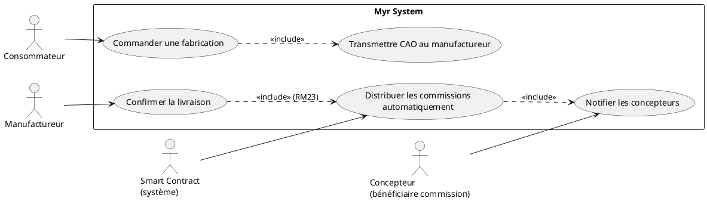
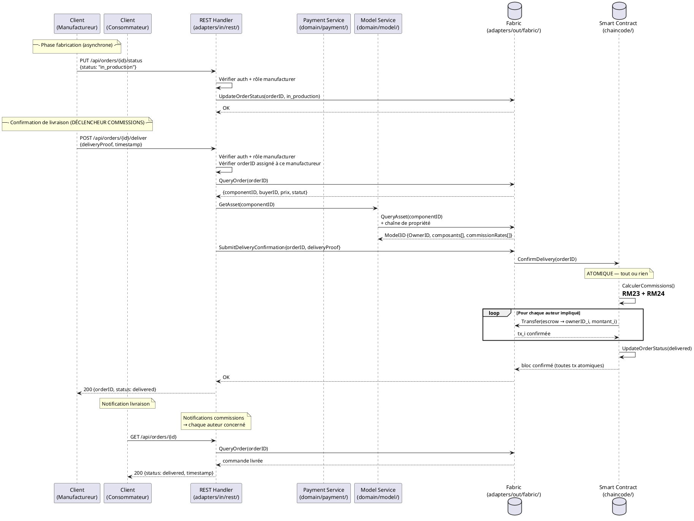

# Fabrication/Livraison d'un Composant

## Diagramme d'acteurs

## Contexte

UCAUT01 est **le déclencheur des commissions** (RM23). Quand un manufactureur confirme la livraison physique d'un composant commandé, le smart contract calcule et distribue automatiquement les commissions à tous les auteurs impliqués dans la chaîne de propriété. C'est la séquence critique du modèle économique de Myr.

La livraison confirmée → distribution des commissions est une opération **atomique** — les deux doivent réussir ou échouer ensemble.

## Pré-conditions

- Une commande de fabrication est enregistrée sur la blockchain (statut `pending`) — créée via UCPI01
- Le manufactureur est authentifié avec le rôle `manufacturer` et est assigné à cette commande
- Le fichier CAO du composant est accessible sur la blockchain
- L'adresse de livraison du consommateur est renseignée dans la commande

## Scénario

**Étape initiale :** Le système identifie un manufactureur agréé disponible pour traiter la commande

### Flux nominal — Fabrication et livraison réussies (commandes unitaires)

1. Le système transmet le fichier CAO et les spécifications du composant au manufactureur (via la blockchain)
2. Le manufactureur accuse réception et passe la commande en statut `in_production`
3. Le manufactureur produit le composant selon le fichier CAO
4. Le composant est expédié à l'adresse de livraison
5. Le manufactureur confirme la livraison sur le réseau MYR : `POST /api/orders/{id}/deliver`
6. **Le smart contract s'exécute automatiquement** :
   a. Il lit les métadonnées du composant (chaîne de propriété, taux de commission par composant)
   b. Il calcule les commissions dues à chaque auteur (RM23, RM24)
   c. Il soumet une transaction de paiement individuelle pour chaque auteur
7. La commande passe au statut `delivered`
8. Chaque auteur reçoit une notification de commission créditée
9. Le consommateur reçoit une notification de livraison confirmée

### Flux alternatif — Commande en lot (quantité > 1) avec répartition multi-manufactureurs

1. La commande a été répartie entre N manufactureurs (voir UCPI01 flux alternatif)
2. Chaque manufactureur confirme sa livraison partielle indépendamment
3. La distribution des commissions est déclenchée au fur et à mesure des livraisons partielles
4. Quand toutes les livraisons partielles sont confirmées, la commande globale passe à `delivered`

### Flux alternatif — Aucun manufactureur disponible

1. Le système ne trouve aucun manufactureur agréé disponible sur le réseau
2. Le consommateur est notifié et placé en liste d'attente
3. La commande reste en statut `pending_manufacturer` jusqu'à qu'un manufactureur soit disponible

### Flux erreur A — Fichier CAO inaccessible sur la blockchain

1. Le hash du fichier CAO ne correspond à aucun fichier disponible (IPFS ou stockage distribué)
2. Le manufactureur est notifié : "Fichier CAO inaccessible — contacter le concepteur"
3. La commande est suspendue (statut `suspended`) en attente de correction par le concepteur

### Flux erreur B — Échec de la distribution des commissions

1. La livraison est confirmée par le manufactureur
2. Le smart contract démarre la distribution mais une transaction échoue (endorsement refusé)
3. **Toutes** les transactions de commission sont annulées (atomicité — RM07)
4. La commande reste en statut `pending_commission`
5. Une alerte est émise vers l'administrateur du réseau
6. La livraison physique est confirmée côté consommateur malgré l'échec des commissions (les deux sont découplés)

### Flux erreur C — Livraison impossible (adresse invalide ou refus de livraison)

1. Le manufactureur signale une impossibilité de livraison
2. La commande passe au statut `delivery_failed`
3. Le consommateur et l'administrateur sont notifiés
4. Le remboursement (si applicable) est hors périmètre système — à gérer manuellement

## Post-conditions

- Le composant est fabriqué et livré physiquement
- La commande est enregistrée sur la blockchain avec statut `delivered`
- Chaque auteur impliqué a reçu sa commission sur son wallet blockchain (RM23, RM24)
- Chaque transaction de commission est immuablement enregistrée sur la blockchain
- Le consommateur et les auteurs ont reçu une notification

## Diagramme de séquence

## Règles métier déclenchées

| Règle | Description | Détail |
|-------|-------------|--------|
| RM23 | Commissions distribuées automatiquement à la livraison | Le smart contract distribue sans intervention humaine |
| RM24 | Répartition proportionnelle par auteur | Calculée à partir des taux définis sur chaque composant constitutif |
| RM22 | Contrôle d'accès par rôle | Seul le manufactureur assigné peut confirmer la livraison |
| RM07 | Transactions Fabric immuables | Distribution atomique — tout ou rien — avant confirmation de livraison |

## Exigences non-fonctionnelles

| ENF | Description |
|-----|-------------|
| ENF01 | Confirmation de livraison traitée en ≤ 2 s |
| ENF02 | Transactions blockchain confirmées en ≤ 5 s sous charge normale |
| ENF30 | En cas d'échec de distribution, la commande reste en statut intermédiaire pour reprise |
| ENF12 | Vérification du rôle manufactureur côté serveur — impossible de confirmer depuis un autre rôle |

## Notes d'implémentation

- **Non implémenté** : Aucun endpoint REST lié aux commandes ou à la livraison dans `adapters/in/rest/`
- **Non implémenté** : Le smart contract chaincode ne contient aucune logique de livraison ni de commission — seule l'entité `Model3D` est présente dans `chaincode/model/entity.go`
- **À créer** : Routes `PUT /api/orders/{id}/status` et `POST /api/orders/{id}/deliver` dans `adapters/in/rest/handlers_payment.go`
- **À créer** : Fonction chaincode `ConfirmDelivery(orderID)` qui encapsule le calcul et la distribution des commissions dans un seul bloc Fabric (atomicité)
- **À créer** : Entité `Order` dans le domaine payment — l'entité `Payment` actuelle ne modélise pas le cycle commande/livraison
- Le rôle `manufacturer` n'existe pas encore par défaut dans le RBAC dynamique (`domain/role`) — à créer via `myr role create manufacturer --permission ...` (voir note §3.1 de l'Analyse des besoins)
- L'atomicité livraison + commissions dans un seul bloc Fabric est une contrainte forte — Hyperledger Fabric supporte plusieurs écritures dans une seule transaction, mais les limites de taille de bloc sont à surveiller pour les modules avec de nombreux co-auteurs
- **Parité CLI/REST :** conformément au principe de parité, la confirmation de livraison par un manufactureur devrait être déclenchable en CLI pour son compte. Comme noté ci-dessus, l'entité `Order` et la fonction chaincode `ConfirmDelivery` n'existent pas encore — une commande CLI (par ex. `myr order deliver <id>`) ne pourra être ajoutée qu'une fois ce domaine conçu, en parallèle des routes REST manquantes.
