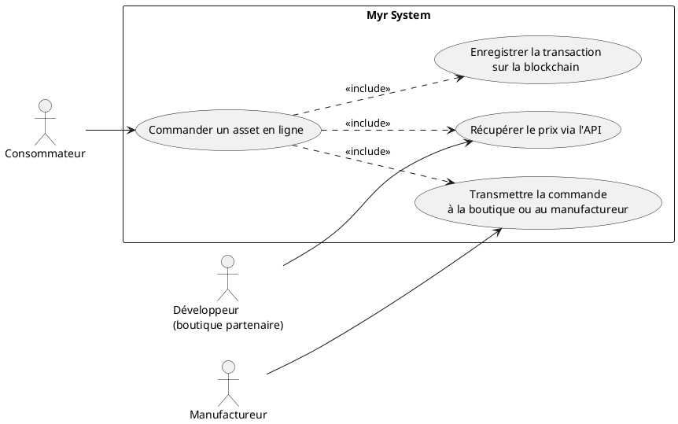
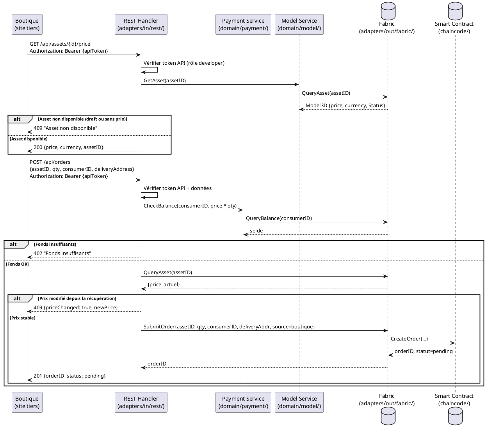

# Commande en ligne de Asset

## Diagramme d'acteurs

## Contexte

Ce use case couvre le passage de commande via une boutique partenaire tierce intégrée à l'API MYR. Contrairement à UCPI01 (commande directe depuis l'interface Myr), ici c'est une boutique externe (site e-commerce, plugin, application tierce) qui appelle l'API REST MYR pour passer une commande au nom d'un consommateur.

Le développeur de la boutique intègre l'API MYR pour récupérer les prix à jour et soumettre les commandes. L'avantage est que les commissions et la traçabilité restent gérées par Myr même si la transaction e-commerce est sur une plateforme tierce.

## Pré-conditions

- Le consommateur est identifié et authentifié (via token JWT ou token API de la boutique partenaire)
- L'asset est disponible à la commande et a un prix défini sur la blockchain
- La boutique partenaire dispose d'un token API MYR valide avec le rôle `developer`
- L'adresse de livraison est fournie dans la requête

## Scénario

**Étape initiale :** Le consommateur finalise son panier sur la boutique partenaire et valide sa commande

### Flux nominal — Commande passée via boutique partenaire

1. La boutique envoie une requête à l'API MYR : `GET /api/assets/{id}/price` pour récupérer le prix en temps réel
2. L'API retourne le prix actuel depuis la blockchain (prix enregistré lors de UCPI04/UCPI05)
3. Le prix est affiché au consommateur sur la boutique
4. Le consommateur confirme l'achat sur la boutique
5. La boutique envoie la commande à l'API MYR : `POST /api/orders` avec les détails (assetID, quantité, adresse, consommateur)
6. L'API MYR valide la requête (token API, données, fonds)
7. La transaction de commande est enregistrée sur la blockchain (statut `pending`)
8. L'API retourne un `orderID` à la boutique
9. La boutique affiche la confirmation au consommateur avec le numéro de commande MYR
10. La commande suit ensuite le flux de UCAUT01 (fabrication/livraison)

### Flux alternatif — Prix mis à jour entre l'affichage et la validation

1. Entre l'étape 2 et l'étape 5, le prix du composant a été mis à jour sur la blockchain (via UCPI04)
2. L'API MYR retourne une erreur `PriceChanged` avec le nouveau prix
3. La boutique affiche : "Le prix de cet article a changé : {ancien prix} → {nouveau prix}. Confirmez-vous ?"
4. Le consommateur confirme avec le nouveau prix — la commande est soumise avec le prix actualisé

### Flux erreur A — Token API invalide ou expiré

1. La boutique présente un token API expiré ou révoqué
2. L'API retourne : `401 Unauthorized — Token API invalide`
3. La boutique doit renouveler son token API (hors périmètre de ce UC)

### Flux erreur B — Asset non disponible à la commande

1. L'asset est en statut `draft` ou son prix n'est pas défini
2. L'API retourne : `409 Asset non disponible à la commande`
3. La boutique affiche un message d'indisponibilité

### Flux erreur C — Fonds insuffisants côté consommateur

1. Le Payment Service détecte que le consommateur n'a pas les fonds suffisants sur son wallet MYR
2. L'API retourne : `402 Fonds insuffisants`
3. La boutique gère le refus de paiement selon ses propres règles (paiement fiat alternatif hors périmètre)

## Post-conditions

- La commande est enregistrée sur la blockchain avec statut `pending` et un `orderID`
- La boutique partenaire dispose du `orderID` pour le suivi
- Le consommateur reçoit une confirmation (via la boutique et/ou via son interface MYR)
- La livraison sera traitée via UCAUT01

## Diagramme de séquence

## Règles métier déclenchées

| Règle | Description | Détail |
|-------|-------------|--------|
| RM22 | Contrôle d'accès par rôle | Token API avec rôle `developer` requis pour les boutiques partenaires |
| RM07 | Validation avant soumission blockchain | Prix, fonds et disponibilité vérifiés avant toute transaction |
| RM23 | Commissions distribuées à la livraison | La livraison ultérieure (UCAUT01) distribuera les commissions |

## Exigences non-fonctionnelles

| ENF | Description |
|-----|-------------|
| ENF01 | Récupération du prix en ≤ 500 ms |
| ENF14 | API REST documentée pour les intégrations tierces (OpenAPI) |
| ENF16 | Rate limiting sur les endpoints publics de prix pour éviter le scraping |
| ENF12 | Validation du token API côté serveur |

## Notes d'implémentation

- **Non implémenté** : Aucun endpoint de commande ni de récupération de prix dans `adapters/in/rest/`
- **À créer** : Routes `GET /api/assets/{id}/price` et `POST /api/orders` dans `adapters/in/rest/handlers_payment.go`
- **À créer** : Mécanisme de tokens API pour les boutiques partenaires (distinct des JWT utilisateurs) — peut s'appuyer sur `adapters/out/sqlite/` pour la gestion des tokens
- Le rôle `developer` n'existe pas encore dans le code (`domain/auth/`) — à créer
- La gestion du "prix mis à jour entre affichage et commande" (race condition e-commerce classique) nécessite un mécanisme de price lock ou de validation côté client — à discuter avec le PO
- L'API `GET /api/assets/{id}/price` peut être publique (sans auth) pour faciliter l'intégration — à décider avec le PO
