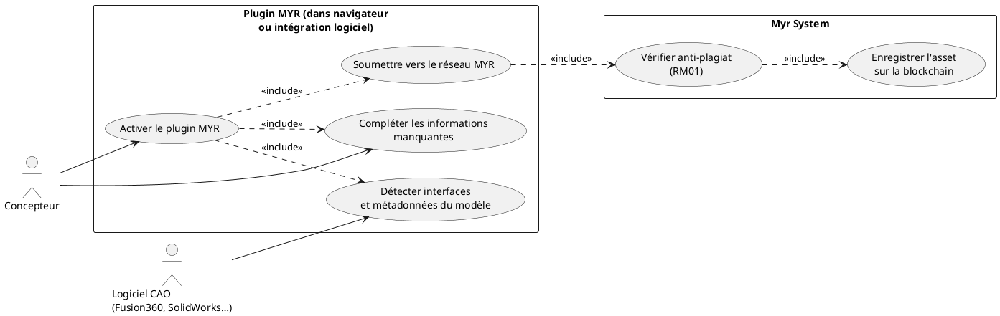
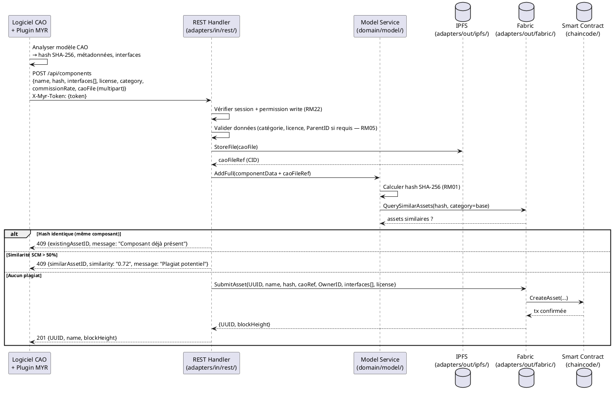

# Ajouter un modèle 3D depuis un logiciel CAO

## Diagramme d'acteurs

## Contexte

Ce use case décrit l'intégration entre un logiciel CAO tiers (Fusion 360, AutoCAD, SolidWorks, FreeCAD…) et le réseau MYR via un plugin. L'objectif est de permettre au concepteur de publier directement ses modèles 3D sur MYR sans quitter son environnement de travail.

Le plugin détecte les interfaces physiques et les métadonnées du modèle, puis soumet la transaction vers l'API REST MYR. La soumission déclenche la vérification anti-plagiat standard (RM01) comme pour toute création d'asset.

## Pré-conditions

- Le plugin MYR est installé dans le logiciel CAO ou accessible via navigateur
- Le concepteur dispose d'un compte MYR actif avec le rôle `designer`
- Un modèle 3D est ouvert dans le logiciel CAO
- Le concepteur a configuré le plugin avec l'URL et les credentials du réseau MYR souhaité

## Scénario

**Étape initiale :** Le concepteur ouvre son modèle dans le logiciel CAO et active le plugin MYR

### Flux nominal — Intégration réussie (nouveau composant)

1. Le plugin se connecte à l'API MYR avec le token de session du concepteur (`X-Myr-Token`)
2. Le plugin analyse le modèle ouvert et extrait :
   - Le fichier CAO (hash SHA-256 calculé localement)
   - Les métadonnées détectables : nom, dimensions, matériaux (si présents dans le modèle)
   - Les interfaces physiques détectées : connecteurs, trous de fixation, ports (selon les bibliothèques CAO)
3. Le plugin affiche un formulaire pré-rempli avec les données extraites
4. Le concepteur complète les informations manquantes : nom, catégorie d'asset, licence, taux de commission
5. Le concepteur valide — le plugin envoie la requête à l'API MYR : `POST /api/components`
6. L'API MYR calcule le SHA-256, lance la vérification anti-plagiat (RM01)
7. Aucune similarité détectée — l'asset est enregistré sur la blockchain
8. Le plugin affiche : "Composant enregistré sur MYR — UUID : {id}"

### Flux alternatif — Modèle déjà présent sur le réseau (même hash ou UUID)

1. À l'étape 6, la vérification anti-plagiat détecte un asset avec le même hash SHA-256
2. Le plugin affiche : "Ce modèle existe déjà sur le réseau (UUID : {id})"
3. Le plugin propose deux options :
   - **Créer une nouvelle version** (amélioration, variation, etc.) : le concepteur choisit la catégorie et définit le `ParentID`
   - **Annuler** : le composant local est déjà synchronisé — aucune action
4. Si "Nouvelle version" : la transaction est soumise avec le `ParentID` de l'asset existant

### Flux alternatif — Interfaces physiques non détectées automatiquement

1. Le logiciel CAO ne fournit pas suffisamment de métadonnées pour détecter les interfaces
2. Le plugin affiche le formulaire sans interfaces pré-remplies
3. Le concepteur définit manuellement les interfaces physiques (catégorie, type, direction, valeurs)
4. Le flux continue normalement

### Flux erreur A — Plugin non authentifié (token expiré)

1. Le plugin détecte que le token de session est expiré
2. Message : "Session MYR expirée — reconnectez-vous dans le plugin"
3. Le concepteur se reconnecte via le formulaire de login du plugin (ou renouvelle le token)

### Flux erreur B — Plagiat détecté (similarité SCM > 50%)

1. La vérification RM01 détecte une similarité structurelle > 50% avec un asset existant
2. L'API retourne : `409 Plagiat potentiel détecté — asset similaire : {id}`
3. Le plugin affiche les détails de l'asset similaire
4. Le concepteur peut soit déclarer une dérivation (avec `ParentID`), soit contester (UCPI06)

### Flux erreur C — Connexion réseau MYR perdue

1. La soumission échoue (timeout ou erreur réseau)
2. Le plugin conserve les données du formulaire localement
3. Message : "Connexion perdue — données sauvegardées. Réessayez ultérieurement."

## Post-conditions

- Le composant est enregistré sur la blockchain MYR avec un UUID unique
- Les interfaces physiques détectées ou saisies manuellement sont enregistrées
- Le composant est consultable via l'API MYR (`GET /api/components/:id`) par tout client autorisé
- Le fichier CAO est stocké dans le dépôt distribué (IPFS) et référencé par son hash sur la blockchain

## Diagramme de séquence

## Règles métier déclenchées

| Règle | Description | Détail |
|-------|-------------|--------|
| RM01 | Vérification anti-plagiat obligatoire pour les assets `base` | SHA-256 + SCM > 50% avant tout enregistrement |
| RM02 | Catégorie d'asset obligatoire parmi les 8 types | Le concepteur doit sélectionner la catégorie |
| RM04 | UUID unique et immuable | Généré par le système, pas par le plugin |
| RM05 | ParentID obligatoire pour tout asset non-`base` | Le plugin doit le présenter si catégorie dérivée |
| RM22 | Contrôle d'accès par rôle | Rôle designer vérifié côté serveur |

## Exigences non-fonctionnelles

| ENF | Description |
|-----|-------------|
| ENF12 | Authentification par token de session vérifiée côté serveur |
| ENF15 | Stockage IPFS du fichier CAO avec CID retourné |
| ENF30 | En cas d'échec blockchain, le fichier IPFS est conservé (reprise possible) |

## Notes d'implémentation

- **Partiellement implémenté** : `POST /api/components` existe et appelle `AddFull()` — mais la comparaison anti-plagiat avec les assets existants est incomplète (écart E4 de l'Analyse des besoins)
- **Non implémenté** : Le plugin CAO lui-même — c'est une intégration tierce qui appelle l'API REST MYR standard
- **À corriger** : La comparaison SHA-256 avec les assets existants dans `domain/model/service.go` (écart E4)
- Le plugin CAO peut être implémenté comme une application web autonome, un script Python injecté dans les logiciels CAO supportant des plugins Python, ou une extension navigateur — la décision d'implémentation est hors périmètre serveur
- La détection automatique des interfaces physiques dépend du format CAO (STEP, STL, FBX…) — les fichiers STL ne contiennent pas de métadonnées structurelles ; STEP/IGES en contiennent davantage
- Question ouverte : quels logiciels CAO sont prioritaires pour le plugin ? Fusion 360, FreeCAD, SolidWorks ?
- **Parité CLI :** ce use case recoupe `ModelService.AddFull`, exposé côté REST (`POST /api/components`) et côté CLI par `myr model add`, qui expose `Category`, `ParentID`, `LicenseID` (voir `specs/3-Conception/DC_CLI_Model.md` § 3.1), comme pour UCCE01/03. Le plugin CAO constitue lui-même un canal non-GUI équivalent en esprit à un script CLI : il appelle l'API REST de façon programmatique — le principe de parité CLI/REST est donc respecté par construction ; aucune lacune de conception domaine ici, contrairement aux autres UC de ce lot.
