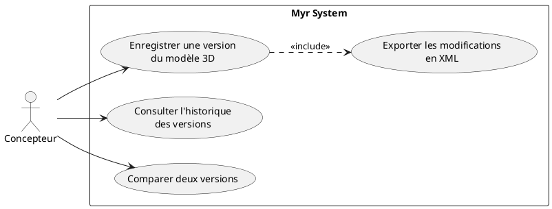
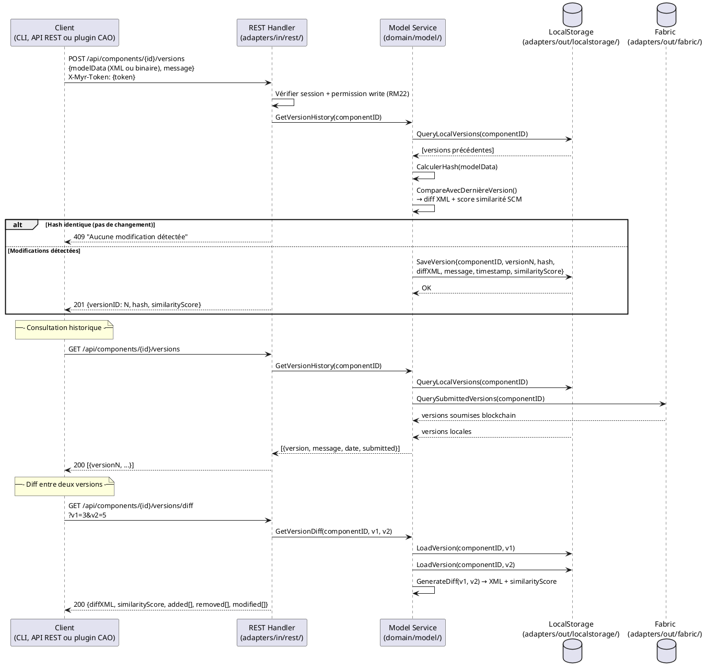

# Gestion SCM d'un modèle 3D

## Diagramme d'acteurs

## Contexte

Le Source Control Management (SCM) d'un modèle 3D permet au concepteur de versionner ses modifications itératives sur un composant, indépendamment des soumissions blockchain (une soumission blockchain crée une `ModuleVersion` immuable, mais les itérations intermédiaires de travail ne sont pas toutes soumises). Le format d'export est XML, permettant la portabilité entre outils.

L'intérêt de ce UC est la traçabilité fine des évolutions d'un design — similaire à git pour le code source, mais pour des modèles 3D. La similarité SCM est aussi un algorithme métier de RM01 (anti-plagiat) — les deltas XML enregistrés ici peuvent alimenter cet algorithme.

## Pré-conditions

- Le concepteur est authentifié avec le rôle `designer` ou `contributor`
- Un modèle 3D est en cours d'édition (composant existant sur la blockchain ou draft local)
- Le modèle a déjà au moins une version de référence pour permettre un diff

## Scénario

**Étape initiale :** `POST /api/components/{id}/versions` est appelée (ou l'équivalent CLI `myr model version save`) avec un message de version

### Flux nominal — Enregistrement d'une version

1. Le message de version descriptif est transmis (ex. : "Ajout interface USB-C sur face avant")
2. Le système calcule un diff par rapport à la version précédente (modifications géométriques, interfaces, attributs)
3. Les modifications sont exportées en format XML structuré
4. La version est enregistrée avec : hash du fichier courant, message, horodatage, numéro de version incrémental
5. La version est stockée localement (pas sur la blockchain — c'est un outil de travail)
6. Confirmation : "Version {N} enregistrée"

### Flux alternatif — Consultation de l'historique

1. `GET /api/components/{id}/versions` est appelée (ou l'équivalent CLI `myr model version list`)
2. La liste des versions est retournée avec : numéro, message, horodatage, auteur, statut (local ou soumis blockchain)
3. Une version précédente peut être consultée individuellement en lecture seule

### Flux alternatif — Comparaison de deux versions

1. `GET /api/components/{id}/versions/diff` est appelée avec les deux numéros de version (ou l'équivalent CLI `myr model version diff`)
2. Le système génère un diff XML entre les deux versions
3. Les modifications sont retournées : éléments ajoutés, supprimés, modifiés
4. Un score de similarité SCM est calculé (utilisé par RM01 pour l'anti-plagiat)

### Flux alternatif — Export XML pour portabilité

1. Les modifications d'une version sont exportées en fichier XML via la réponse de l'API
2. Ce fichier peut être importé dans un autre outil compatible

### Flux erreur A — Aucune version précédente (premier enregistrement)

1. Il n'existe aucune version précédente pour le modèle
2. Le système crée une version initiale sans diff (version 0 = état complet)
3. Confirmation : "Version initiale enregistrée"

### Flux erreur B — Modèle inchangé depuis la dernière version

1. Le système détecte que le hash du modèle courant est identique à la version précédente
2. Message : "Aucune modification détectée depuis la dernière version"
3. L'enregistrement est annulé (pas de version doublon)

## Post-conditions

- La version est enregistrée localement avec son diff XML, son message et son horodatage
- L'historique des versions est consultable et exportable
- Le score de similarité SCM est calculé et disponible pour l'algorithme anti-plagiat (RM01)
- Si une version SCM correspond à une soumission blockchain, elle est marquée comme `submitted`

## Diagramme de séquence

## Règles métier déclenchées

| Règle | Description | Détail |
|-------|-------------|--------|
| RM01 | Vérification anti-plagiat (similarité SCM) | Le score SCM calculé ici alimente l'algorithme anti-plagiat lors de la soumission |
| RM18 | ModuleVersion immuable créée à la soumission blockchain | Les versions SCM locales ≠ versions blockchain — les deux coexistent |
| RM22 | Contrôle d'accès | Seul le concepteur peut versionner ses propres modèles |

## Exigences non-fonctionnelles

| ENF | Description |
|-----|-------------|
| ENF12 | Contrôle du rôle designer côté serveur |

## Notes d'implémentation

- **Non implémenté** : Aucun endpoint de gestion de versions SCM dans `adapters/in/rest/`
- **À créer** : Routes `POST /api/components/{id}/versions`, `GET /api/components/{id}/versions`, `GET /api/components/{id}/versions/diff` dans `adapters/in/rest/handlers_model.go`
- **À créer** : Entité `SCMVersion` et logique de diff dans `domain/model/` (ou service dédié)
- **À créer** : Store local pour les versions SCM dans `adapters/out/localstorage/` (fichiers JSON ou SQLite)
- La définition du format XML d'export est un sujet ouvert — il doit être suffisamment structuré pour que l'algorithme SCM puisse calculer un score de similarité. S'inspirer des formats diff Git (patch) ou des formats XML CAO standards (STEP-242, IFC)
- L'algorithme SCM de similarité structurelle (> 50% = plagiat potentiel — RM01) est mentionné dans les specs mais non implémenté — ce UC est l'occasion de définir précisément cet algorithme
- Ce UC est de faible priorité dans la roadmap (priorité "Could have" en MoSCoW) — à implémenter après les UC de plus haute importance
- Question ouverte : les versions SCM sont-elles stockées uniquement localement (serveur) ou aussi sur la blockchain ? Les stocker sur la blockchain alourdirait les transactions pour un usage intermédiaire de travail
- **Parité CLI/REST :** conformément au principe de parité (CLAUDE.md), l'enregistrement et la consultation de versions SCM devraient être exposables en CLI. Comme noté ci-dessus, l'entité `SCMVersion` et le store local correspondant n'existent pas encore — des commandes CLI (par ex. `myr model version save/list/diff <id>`) ne pourront être ajoutées qu'une fois ce domaine conçu, en parallèle des routes REST manquantes.
