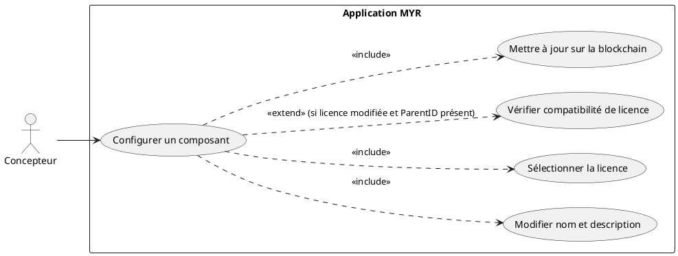
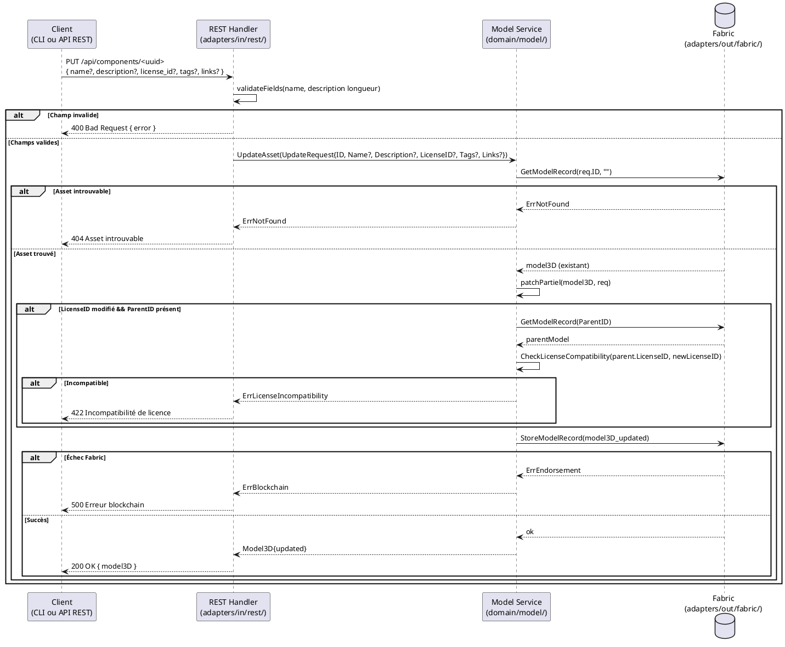
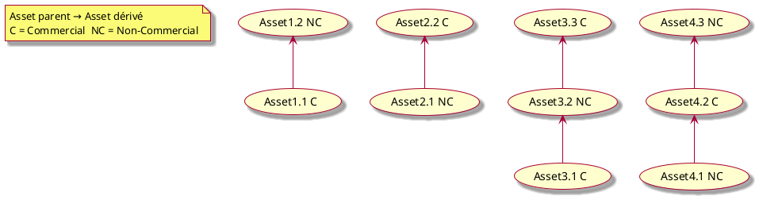

# Configurer un Composant

## Diagramme d'acteurs

## Contexte

Après création, un composant peut être reconfiguré par son propriétaire : modification du nom, de la description, de la licence ou des tags. Cette opération ne modifie pas le fichier 3D ni le hash — elle met à jour les métadonnées de l'asset.

La mise à jour est soumise à la blockchain Fabric via `PUT /api/components/:id` → `service.UpdateAsset()` → `blockchain.StoreModelRecord()`. Chaque appel produit un nouveau bloc sur le ledger : l'historique des configurations est traçable.

**Contrainte clé :** Si l'asset a un `ParentID` et que la nouvelle licence est modifiée, la compatibilité de licence avec le parent doit être re-vérifiée (RM03) — `UpdateAsset()` applique cette vérification au même titre que `AddFull()` à la création.

## Pré-conditions

- Le Concepteur est authentifié avec le rôle `contributor` (session REST valide).
- L'asset existe sur le canal Fabric et son ID est connu.
- Le Concepteur est propriétaire de l'asset (`OwnerID` correspond à son identité).

## Scénario

**Étape initiale :** `PUT /api/components/<uuid>` est appelée (ou l'équivalent CLI `myr model update`) avec un ou plusieurs champs à modifier

### Flux nominal — Configuration réussie

1. Un ou plusieurs champs sont transmis : nom, description, licence, tags, liens (JSON body ou form).
2. Le REST Handler valide les champs (name max 256, description max 10000, IDs valides).
3. Le handler appelle `service.UpdateAsset(UpdateRequest{ID, Name, Description, LicenseID, Tags, Links})`.
4. Le service récupère l'asset existant : `blockchain.GetModelRecord(req.ID, "")`.
5. Le service applique le patch partiel : seuls les champs non vides de `UpdateRequest` écrasent les valeurs actuelles.
6. Si `LicenseID` est modifié et que l'asset a un `ParentID` : le service vérifie la compatibilité de licence avec le parent.
7. Le service soumet la transaction : `blockchain.StoreModelRecord(m)`.
8. Fabric valide et ancre le nouveau bloc.
9. L'API retourne `200 OK` avec le `Model3D` mis à jour.

### Flux alternatif — Patch partiel (mise à jour d'un seul champ)

1. Seule la licence est transmise (ex : passe de CC BY à CC BY-SA).
2. Seul le champ `license_id` est envoyé dans la requête.
3. Le service applique uniquement ce champ — les autres restent inchangés (`UpdateAsset` est un patch partiel).
4. La compatibilité de licence avec le parent est vérifiée si applicable.
5. La transaction est soumise normalement.

### Flux erreur — Incompatibilité de licence avec le parent (RM03)

1. L'asset a un `ParentID` et la nouvelle licence est incompatible avec la licence du parent.
2. `CheckLicenseCompatibility(parent.LicenseID, newLicenseID)` retourne `Compatible: false`.
3. Le service retourne l'erreur avant toute soumission Fabric.
4. L'API retourne `422 Unprocessable Entity` : `{ "error": "Incompatibilité de licence : <raison>." }`.

### Flux erreur — Asset introuvable

1. `blockchain.GetModelRecord(req.ID, "")` retourne une erreur (ID inexistant sur le canal).
2. L'API retourne `404 Not Found` : `{ "error": "asset introuvable" }`.

### Flux erreur — Échec endorsement Fabric

1. `blockchain.StoreModelRecord(m)` retourne une erreur Fabric.
2. L'état de l'asset en mémoire n'est pas persisté.
3. L'API retourne `500 Internal Server Error` : `{ "error": "Erreur blockchain : <message>." }`.

## Post-conditions

- Les métadonnées mises à jour sont inscrites sur la blockchain (nouveau bloc — immuable).
- L'historique des configurations est traçable via les blocs successifs du ledger.
- Les informations mises à jour (nom, licence) sont visibles par les autres utilisateurs du réseau.

## Diagramme de séquence

## Règles métier déclenchées

| Règle | Description |
|-------|-------------|
| **RM03** | Si `ParentID != ""` et `LicenseID` modifié : re-vérification de compatibilité de licence obligatoire |
| **RM07** | Validation complète côté serveur avant toute soumission blockchain |

### Héritage de licences Commercial / Non-Commercial

La compatibilité de licence suit ces règles :
- Un asset Commercial peut dériver d'un asset Non-Commercial (si la licence du parent l'autorise).
- Un asset Non-Commercial peut dériver d'un asset Commercial.
- La compatibilité exacte dépend du catalogue de licences (`ListLicenses()` / `CheckLicenseCompatibility()`).

## Exigences non-fonctionnelles

| ID | Exigence |
|----|---------|
| **EF12** | La configuration d'un composant (nom, licence) est modifiable par son propriétaire |
| **ENF12** | Contrôle du rôle `contributor` côté serveur avant toute écriture |
| **ENF30** | En cas d'échec blockchain, l'état du composant reste celui du dernier enregistrement valide |

## Notes d'implémentation

**Route existante :** `PUT /api/components/:id` → `handler.updateAsset()` → `service.UpdateAsset()` → `fabric.StoreModelRecord()`.

**Commande CLI équivalente :** `myr model update <id> --description <texte> --license <id> --tags <a,b>` (voir `specs/3-Conception/DC_CLI_Model.md` § 5), appelant la même méthode `service.UpdateAsset(UpdateRequest{...})` que le handler REST `updateAsset()`, avec le même comportement de patch partiel et la même vérification de compatibilité de licence (RM03).

**Patch partiel :** `service.UpdateAsset()` applique uniquement les champs non-vides de `UpdateRequest`. Les champs `Tags` et `Links` sont des slices — si `nil`, ils ne sont pas écrasés ; si `[]string{}` (slice vide), ils effacent les valeurs existantes.

**Vérification de licence manquante dans UpdateAsset :** `service.UpdateAsset()` ne vérifie pas actuellement la compatibilité de licence lors d'une modification. À ajouter : si `req.LicenseID != ""` et que l'asset a un `ParentID`, appeler `CheckLicenseCompatibility(parent.LicenseID, req.LicenseID)` avant `StoreModelRecord`.

**Catalogue de licences :** `service.ListLicenses()` et `service.GetLicense(id)` sont déjà implémentés dans `domain/model/`. L'interface REST d'exposition du catalogue (`GET /api/licenses`) est à créer.
