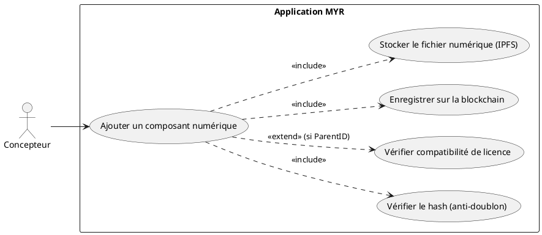
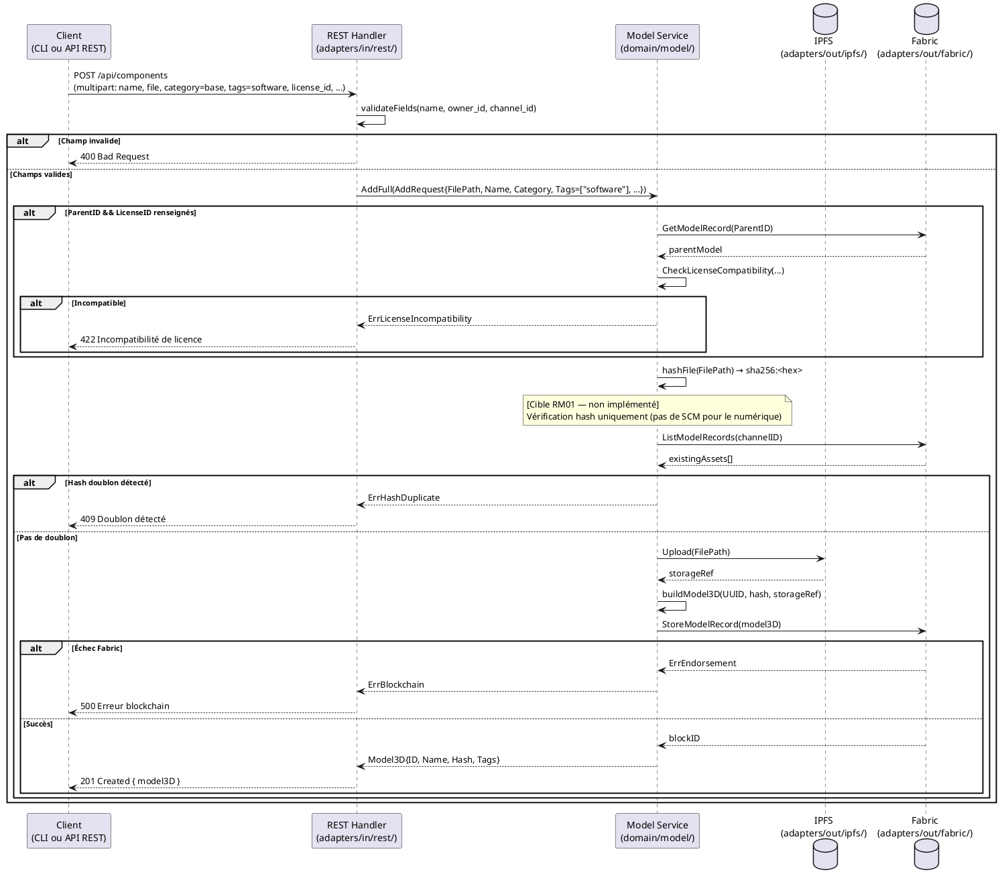

# Ajout d'un composant Numérique

## Diagramme d'acteurs

## Contexte

Un **composant numérique** est un asset de type logiciel, firmware, driver ou tout élément numérique intégré dans un système physique. Contrairement au composant physique (UCCE01), il ne possède pas de géométrie 3D à analyser par SCM, mais il est soumis à la même vérification de doublon par hash SHA-256.

L'entité produite est identique à un composant physique : un `Model3D` avec `Hash` renseigné. La distinction entre composant physique et numérique est sémantique — elle est portée par les `Tags` (ex : `software`, `firmware`) et/ou par la catégorie d'asset.

**Différence clé avec UCCE01 :** L'analyse de similarité SCM n'est **pas applicable** aux fichiers numériques (logiciel, firmware…). Seule la vérification par hash SHA-256 est requise pour détecter les doublons exacts.

## Pré-conditions

- Le Concepteur est authentifié avec le rôle `contributor` (session REST valide).
- Un canal Fabric est opérationnel et accessible.
- Le Concepteur dispose du fichier numérique à intégrer (binaire, archive, source…).
- Pour une catégorie non-`base` : l'asset parent existe sur le canal et son ID est connu.

## Scénario

**Étape initiale :** `POST /api/components` est appelée (ou l'équivalent CLI `myr model add`) avec la catégorie `base`, le tag numérique (`software`/`firmware`) et le fichier

### Flux nominal — Composant numérique nouveau

1. La catégorie `base` et le type numérique (tag `software` ou `firmware`) sont transmis
2. Le fichier numérique est transmis (champ `file` — multipart/form-data)
3. Les métadonnées sont transmises : nom, description, version, licence, auteur, tags
4. Le REST Handler valide les champs obligatoires.
5. Le handler appelle `service.AddFull(AddRequest{...})`.
6. Le service calcule le SHA-256 du fichier.
7. **[Cible RM01]** Le service interroge Fabric et compare le hash avec les assets existants.
8. Si aucun doublon : le service téléverse le fichier vers IPFS.
9. Le service construit le `Model3D` et soumet `StoreModel` sur Fabric.
10. L'API retourne `201 Created` avec le `Model3D` JSON.

### Flux alternatif — Composant numérique dérivé (firmware basé sur un firmware existant)

1. Une catégorie dérivée (ex : `amelioration`) et un `parent_id` sont transmis.
2. Si une `license_id` est fournie : vérification de compatibilité de licence avec le parent.
3. L'analyse SCM n'est pas déclenchée (non applicable aux fichiers numériques).
4. La transaction est soumise avec `ParentID` renseigné.

### Flux erreur — Doublon détecté (hash identique)

1. La comparaison SHA-256 (étape 8) détecte un hash identique à un asset existant.
2. Le service retourne une erreur avant toute soumission Fabric.
3. L'API retourne `409 Conflict` : `{ "error": "Composant numérique déjà enregistré — doublon détecté." }`.

### Flux erreur — Incompatibilité de licence (RM03)

1. `CheckLicenseCompatibility(parentLicenseID, req.LicenseID)` retourne `Compatible: false`.
2. L'API retourne `422 Unprocessable Entity` : `{ "error": "Incompatibilité de licence : <raison>." }`.

### Flux erreur — Échec endorsement Fabric

1. `blockchain.StoreModelRecord(m)` retourne une erreur Fabric.
2. L'API retourne `500 Internal Server Error` : `{ "error": "Erreur blockchain : <message>." }`.

## Post-conditions

- Le `Model3D` est inscrit sur la blockchain Fabric (immuable — RM07).
- Un UUID unique est attribué au composant (généré par le service — RM04).
- Le fichier numérique est stocké dans IPFS avec une référence dans `Versions[0].Hash`.
- Le droit d'auteur est enregistré via `OwnerID`.

## Diagramme de séquence

## Règles métier déclenchées

| Règle | Description |
|-------|-------------|
| **RM01** | Anti-doublon SHA-256 obligatoire pour tout asset `base` — SCM non applicable au numérique |
| **RM02** | Catégorie obligatoire parmi les 8 types |
| **RM03** | Si `ParentID != ""` et `LicenseID != ""` : vérification de compatibilité de licence obligatoire |
| **RM04** | UUID généré par le service, jamais par le client |
| **RM05** | `ParentID` obligatoire pour tout asset non-`base` |
| **RM07** | Validation complète côté serveur avant toute soumission blockchain |

## Exigences non-fonctionnelles

| ID | Exigence |
|----|---------|
| **EF13** | Import de fichiers numériques (binaires, archives, sources) |
| **EF11** | Vérification anti-doublon (hash) avant enregistrement — SCM non requis pour le numérique |
| **ENF12** | Contrôle du rôle `contributor` côté serveur avant toute écriture |
| **ENF30** | En cas d'échec blockchain, aucune donnée n'est enregistrée |

## Notes d'implémentation

**Route existante :** `POST /api/components` — même route que UCCE01. La distinction physique/numérique est portée par les `Tags` (`software`, `firmware`…) et/ou par la catégorie. Aucun changement de route n'est nécessaire.

**Commande CLI équivalente (existante, à étendre) :** `myr model add <file> --name <nom> --channel <id> --category base --tags software [--description <texte>] [--owner-id <id>]` — même commande que UCCE01, la distinction physique/numérique étant portée par `--tags` et non par la commande elle-même. Aujourd'hui seuls `--name`/`--channel`/`--tags` sont câblés via `modelSvc.Add()` ; la cible `modelSvc.AddFull()` (même méthode que le handler REST `createAsset()`) reste à câbler pour exposer `--category`, `--parent`, `--license` (voir `specs/3-Conception/DC_CLI_Model.md` § 3.1).

**Différence avec UCCE01 :** Seule la vérification hash SHA-256 est requise. L'analyse SCM (similarité géométrique 3D) n'est pas applicable à un fichier binaire ou source — le service doit détecter le type de composant (via tags ou extension de fichier) pour sélectionner la bonne stratégie de vérification.

**Écart E4 (RM01 incomplet) :** Identique à UCCE01 — la comparaison de hash avec les assets existants n'est pas encore implémentée dans `service.AddFull()`.

**Champ `version` :** La spec Expression mentionne une métadonnée `version` pour les composants numériques. Dans le code actuel, la version est portée par `Versions[]` (tableau de `Version{Number, Hash, CreatedAt}`). La version sémantique (ex : `v1.2.3`) peut être ajoutée dans les `Tags` ou dans `Description` en attendant un champ dédié.
