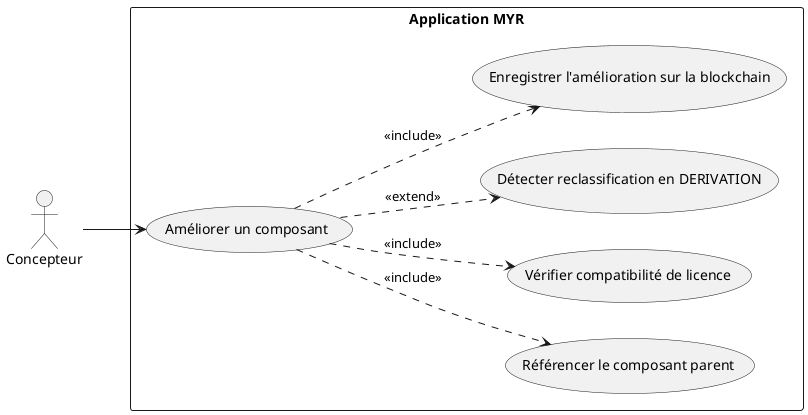
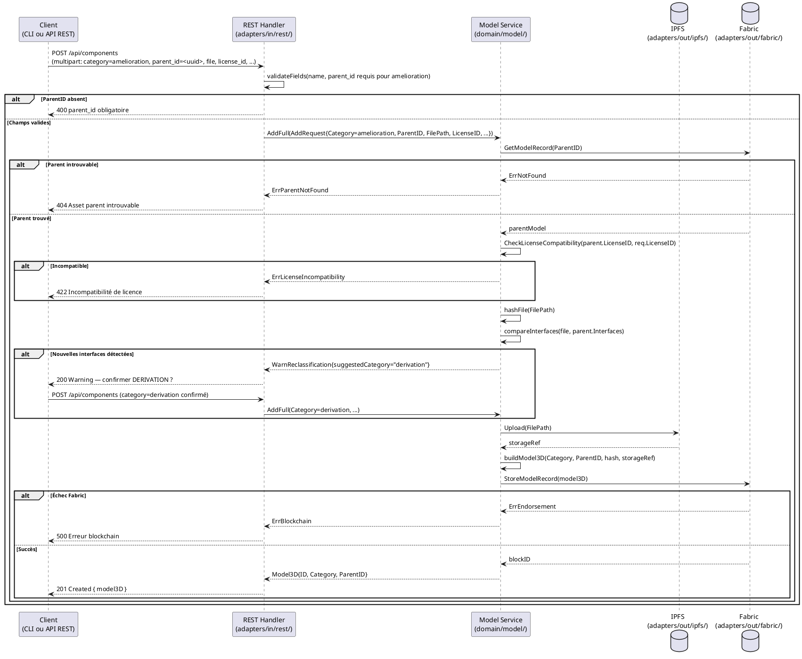
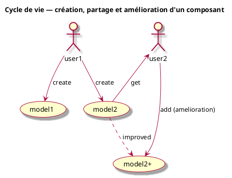

# Améliorer un Composant

## Diagramme d'acteurs

## Contexte

Une **amélioration** (`amelioration`) est une évolution d'un composant existant qui conserve les mêmes fonctionnalités mais les renforce (performances, matériaux, tolérance, finitions…). La liste des interfaces reste identique ou inchangée — c'est la condition qui distingue une amélioration d'une dérivation.

Si l'amélioration introduit de **nouvelles interfaces**, le système détecte automatiquement que le type doit être reclassifié en `derivation` (ajout de fonctionnalité). Le Concepteur confirme ou corrige le type retenu.

Ce use case crée un nouvel asset `Model3D` avec `ParentID` renseigné — il ne modifie pas l'asset parent (immuabilité Fabric).

## Pré-conditions

- Le Concepteur est authentifié avec le rôle `contributor` (session REST valide).
- L'asset parent existe sur le canal Fabric et son ID est connu.
- Le Concepteur a les droits d'amélioration sur cet asset (propriétaire ou droits délégués — à vérifier selon config réseau).
- Le Concepteur dispose de la version améliorée du fichier 3D.

## Scénario

**Étape initiale :** `POST /api/components` est appelée (ou l'équivalent CLI `myr model add`) avec `category=amelioration` et `parent_id=<uuid>`

### Flux nominal — Amélioration réussie (mêmes interfaces)

1. La version améliorée du composant, `category=amelioration`, `parent_id=<uuid>` et les modifications apportées (description, licence si différente) sont transmises
2. Le REST Handler valide les champs et vérifie la présence du `parent_id` (RM05).
3. `service.AddFull()` vérifie la compatibilité de licence avec le parent (RM03).
4. Le service calcule le SHA-256 de la version améliorée.
5. Le service compare les interfaces du fichier amélioré avec celles du parent : aucune nouvelle interface détectée → catégorie `amelioration` confirmée.
6. Le service téléverse le fichier vers IPFS.
7. Le service construit le `Model3D` (`amelioration`, `ParentID`) et soumet `StoreModel` sur Fabric.
8. L'API retourne `201 Created` avec le nouvel asset.

### Flux alternatif — Amélioration avec ajout d'interfaces (reclassification DERIVATION)

1. La version améliorée introduit de nouvelles interfaces non présentes dans le composant parent.
2. Le service compare les interfaces du fichier amélioré avec celles du parent et détecte l'ajout.
3. Le service retourne un avertissement : `{ "warning": "Nouvelles interfaces détectées — type reclassifié en DERIVATION.", "suggestedCategory": "derivation" }`.
4. Le type retenu (`derivation` ou `amelioration` forcé via `--category`) est confirmé par une nouvelle requête
5. La transaction est soumise avec le type final et la référence au composant parent.
6. L'API retourne `201 Created` avec le type définitif.

### Flux erreur — ParentID absent (RM05)

1. La requête ne contient pas de `parent_id`.
2. Le REST Handler retourne `400 Bad Request` : `{ "error": "parent_id obligatoire pour la catégorie amelioration." }`.

### Flux erreur — Incompatibilité de licence avec le parent (RM03)

1. `CheckLicenseCompatibility(parent.LicenseID, req.LicenseID)` retourne `Compatible: false`.
2. L'API retourne `422 Unprocessable Entity` : `{ "error": "Incompatibilité de licence : <raison>." }`.

### Flux erreur — Asset parent introuvable

1. `blockchain.GetModelRecord(req.ParentID, channelID)` retourne une erreur.
2. L'API retourne `404 Not Found` : `{ "error": "Asset parent introuvable." }`.

### Flux erreur — Échec endorsement Fabric

1. `blockchain.StoreModelRecord(m)` retourne une erreur Fabric.
2. L'API retourne `500 Internal Server Error`.

## Post-conditions

- Un nouvel asset `amelioration` est inscrit sur la blockchain avec `ParentID` renseigné.
- L'asset parent reste inchangé (immuabilité Fabric — RM07, RM08).
- La lignée généalogique de l'asset est traçable via `ParentID`.

## Diagramme de séquence

## Règles métier déclenchées

| Règle | Description |
|-------|-------------|
| **RM02** | Catégorie `amelioration` parmi les 8 types valides |
| **RM03** | Vérification de compatibilité de licence avec le parent obligatoire |
| **RM05** | `ParentID` obligatoire pour la catégorie `amelioration` |
| **RM07** | Validation complète côté serveur avant toute soumission blockchain |
| **RM08** | L'asset parent reste inscrit et inchangé sur Fabric — pas de suppression |

## Exigences non-fonctionnelles

| ID | Exigence |
|----|---------|
| **EF14** | Un composant existant peut être amélioré avec référence au parent |
| **ENF12** | Contrôle du rôle `contributor` côté serveur avant toute écriture |
| **ENF30** | En cas d'échec blockchain, aucune donnée n'est enregistrée |

## Notes d'implémentation

**Route existante :** `POST /api/components` — même route que UCCE01. La catégorie `amelioration` est transmise dans le champ `category` de la requête multipart.

**Commande CLI équivalente (cible, n'existe pas encore) :** `myr model add <file> --name <nom> --channel <id> --category amelioration --parent <id> --license <id>` (voir `specs/3-Conception/DC_CLI_Model.md` § 3.1 et § 5). Comme pour UCCE01, la cible est `modelSvc.AddFull(AddRequest{Category: "amelioration", ParentID, LicenseID, ...})` — même méthode domaine que le handler REST `createAsset()`, donc même vérification `CheckLicenseCompatibility` (RM03) et même validation de présence du `parent_id` (RM05). La reclassification automatique en `derivation` (flux alternatif ci-dessus) reste un comportement du service, identique quel que soit le canal ; en CLI, la confirmation du Concepteur se ferait par un nouvel appel `myr model add ... --category derivation` (pas d'interaction interactive, cf. DC-CLIM-03).

**Validation ParentID côté serveur :** Le handler actuel (`createAsset()`) ne valide pas explicitement la présence de `parent_id` pour les catégories dérivées. À ajouter : si `category != "base"` et `parent_id == ""` → `400 Bad Request`.

**Détection de reclassification :** La comparaison d'interfaces entre le fichier amélioré et le parent est un mécanisme à implémenter dans le service domaine. Pour une v1, cette détection peut être déléguée à l'interface utilisateur (le Concepteur déclare lui-même s'il a ajouté des interfaces) plutôt qu'automatisée côté serveur.

**Taxonomie de reclassification :**
- Mêmes interfaces + fonctionnalité renforcée → `amelioration`
- Nouvelles interfaces ajoutées → `derivation`
- Interface supprimée → `regression`
- Dimensions modifiées, même fonctionnalité → `adaptation`

