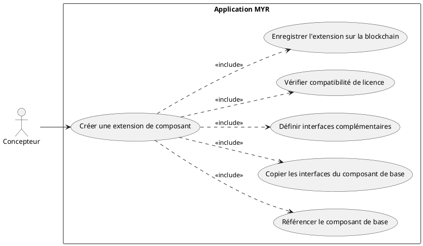
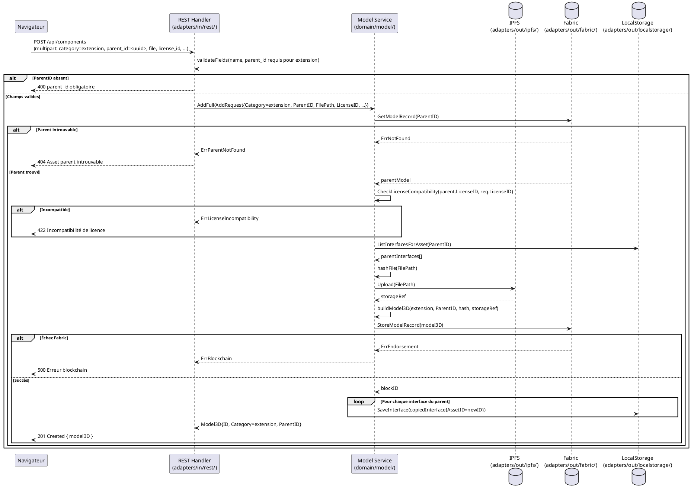

# Créer une extension de Composant

## Diagramme d'acteurs

## Contexte

Une **extension** (`extension`) est une pièce complémentaire conçue pour fonctionner avec un composant existant sans modifier ce dernier. Elle ne remplace pas le composant de base — elle le complète (ex : un capot, une fixation, un module additionnel).

Contrairement à une `amelioration` (même pièce, meilleure), une `extension` est une **nouvelle pièce distincte** qui s'assemble avec le composant de base via des interfaces compatibles.

La particularité de l'extension est que les **interfaces du composant de base sont copiées comme référence** sur le nouvel asset — elles définissent les points de connexion garantissant la compatibilité avec le composant parent. Le Concepteur définit ensuite les interfaces complémentaires propres à l'extension.

## Pré-conditions

- Le Concepteur est authentifié avec le rôle `contributor` (JWT valide).
- Le composant de base existe sur le canal Fabric et son ID est connu.
- Le Concepteur dispose d'un fichier 3D de l'extension.
- La licence choisie pour l'extension est compatible avec celle du composant de base (RM03).

## Scénario

**Étape initiale :** Le Concepteur sélectionne un composant de base existant et choisit "Créer une extension".

### Flux nominal — Extension créée avec succès

1. La catégorie `extension` est sélectionnée dans le formulaire, le `parent_id` est pré-rempli.
2. Le Concepteur importe le fichier 3D de l'extension.
3. Le Concepteur définit ou confirme les interfaces complémentaires de l'extension.
4. Il soumet → `POST /api/components` avec `category=extension`, `parent_id=<uuid>`.
5. Le REST Handler valide les champs et vérifie la présence du `parent_id` (RM05).
6. `service.AddFull()` vérifie la compatibilité de licence avec le parent (RM03).
7. Le service récupère les interfaces du composant de base via `service.ListInterfacesForAsset(parentID)`.
8. Le service copie les interfaces du parent comme interfaces de référence sur le nouvel asset.
9. Le service calcule le SHA-256 du fichier d'extension.
10. Le service téléverse le fichier vers IPFS.
11. Le service construit le `Model3D` (`extension`, `ParentID`) et soumet `StoreModel` sur Fabric.
12. Les interfaces copiées et les interfaces complémentaires sont sauvegardées via `service.AddInterface()` pour chaque interface.
13. L'API retourne `201 Created` avec le nouvel asset.

### Flux alternatif — Extension sans fichier 3D (composant virtuel/numérique)

1. Le Concepteur ne fournit pas de fichier 3D (composant d'extension purement logiciel ou virtuel).
2. La soumission se fait sans `FilePath` — `Hash` reste vide dans le `Model3D`.
3. Les interfaces complémentaires sont définies manuellement (UCCE06).
4. La transaction est soumise normalement.

### Flux erreur — ParentID absent (RM05)

1. La requête ne contient pas de `parent_id`.
2. Le REST Handler retourne `400 Bad Request` : `{ "error": "parent_id obligatoire pour la catégorie extension." }`.

### Flux erreur — Incompatibilité de licence (RM03)

1. `CheckLicenseCompatibility(parent.LicenseID, req.LicenseID)` retourne `Compatible: false`.
2. L'API retourne `422 Unprocessable Entity` : `{ "error": "Incompatibilité de licence : <raison>." }`.

### Flux erreur — Asset parent introuvable

1. `blockchain.GetModelRecord(req.ParentID, channelID)` retourne une erreur.
2. L'API retourne `404 Not Found` : `{ "error": "Asset parent introuvable." }`.

### Flux erreur — Échec endorsement Fabric

1. `blockchain.StoreModelRecord(m)` retourne une erreur Fabric.
2. L'API retourne `500 Internal Server Error`.

## Post-conditions

- Un nouvel asset `extension` est inscrit sur la blockchain avec `ParentID` renseigné.
- Les interfaces du composant de base sont copiées sur l'extension comme interfaces de référence.
- Les interfaces complémentaires définies par le Concepteur sont sauvegardées localement.
- L'extension est disponible pour les liaisons dans l'Atelier (compatible avec le composant de base).
- Le composant de base reste inchangé (immuabilité Fabric).

## Diagramme de séquence

## Règles métier déclenchées

| Règle | Description |
|-------|-------------|
| **RM02** | Catégorie `extension` parmi les 8 types valides |
| **RM03** | Vérification de compatibilité de licence avec le parent obligatoire |
| **RM05** | `ParentID` obligatoire pour la catégorie `extension` |
| **RM07** | Validation complète côté serveur avant toute soumission blockchain |
| **RM08** | Le composant de base reste inscrit et inchangé sur Fabric |

## Exigences non-fonctionnelles

| ID | Exigence |
|----|---------|
| **EF15** | Une extension peut être créée depuis un composant de base existant |
| **ENF12** | Contrôle du rôle `contributor` côté serveur avant toute écriture |
| **ENF30** | En cas d'échec blockchain, aucune donnée n'est enregistrée |

## Notes d'implémentation

**Route existante :** `POST /api/components` — même route que les autres use cases d'écriture. La catégorie `extension` est transmise dans le champ `category`.

**Copie des interfaces du parent :** Cette logique n'est pas encore implémentée dans `service.AddFull()`. À ajouter : après `StoreModelRecord()` réussi, récupérer les interfaces du parent via `ifaceStore.ListInterfacesForAsset(parentID)` et les dupliquer sur le nouvel asset (avec un nouvel `ID` et `AssetID` mis à jour).

**Distinction extension vs adaptation :**
- `extension` : nouvelle pièce complémentaire, interfaces additionnelles sur base du même périmètre d'attache.
- `adaptation` : même fonctionnalité, dimensions différentes (ex : même vis mais en M4 au lieu de M3).

**Interfaces de référence vs interfaces complémentaires :** Les interfaces copiées du parent ne sont pas modifiables (elles définissent la compatibilité). Les interfaces complémentaires définies par le Concepteur (via UCCE06) sont propres à l'extension.
