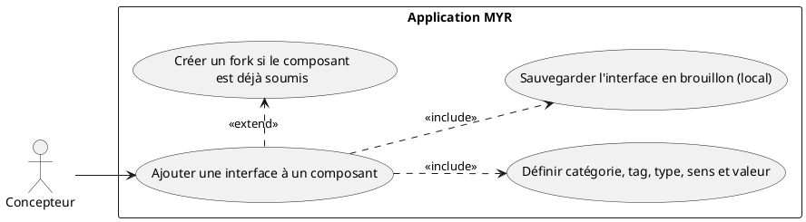
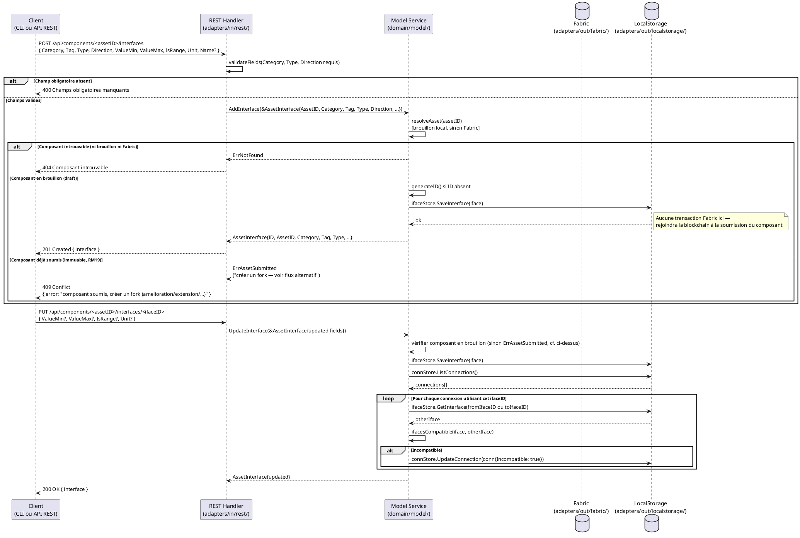

# Ajouter une interface à un Composant déjà créé

## Diagramme d'acteurs



## Contexte

Une **interface** (`AssetInterface`) est un point de connexion physique d'un composant — elle définit comment ce composant peut être assemblé avec d'autres. Exemples : alimentation 5 V (`ELEC/USB-C/out`), fixation par vis M3 (`MECA/Vis M3/in`), sortie fluide (`HYD/Push-fit 6mm/out`).

Les interfaces sont détectées automatiquement à l'import du fichier 3D lorsque la géométrie le permet. Quand la détection automatique est insuffisante ou absente, le Concepteur les ajoute manuellement via ce use case.

**Les interfaces suivent le cycle brouillon → soumission (ADR-02, `specs/3-Conception/Conception_intro.md`), généralisé du module (RM16/RM19) à tout asset.** Tant que le composant qui les porte est en brouillon, ses interfaces sont éditées librement en local (`InterfaceStore`, `adapters/out/localstorage/`) — aucune transaction Fabric par édition. Elles ne rejoignent la blockchain (`Model3D.Interfaces`) qu'à la soumission du composant. **Un composant déjà soumis est immuable (règle 7, RM19)** : ce use case ne peut alors pas lui ajouter directement une interface — l'opération doit passer par un **fork** (nouveau `Model3D` en brouillon, `ParentID` = composant d'origine, catégorie `amelioration`/`extension`/… selon RM02) qui démarre avec les interfaces copiées du parent et reçoit la nouvelle interface, avant sa propre soumission ultérieure.

**Décision de conception (RM16/RM19 généralisées, `Regles_Metier.md` §5 ; ADR-02, `Conception_intro.md`) :** un composant est `submitted` par défaut dès sa création (UCCE01 nominal, comportement actuel inchangé) — ce use case ne s'applique alors qu'en créant un **fork** (flux alternatif ci-dessous). Il ne s'applique directement, sans fork, que si le composant a été créé avec `draft: true` (UCCE01, « Flux alternatif — Création en brouillon ») et n'a pas encore été soumis. **Écart de code restant (E8, `Conception_intro.md` §9) :** `domain/model/entity.go`/`service.go` ne portent pas encore cette distinction — c'est une tâche d'implémentation, la décision de conception est prise.

**Écart code connu (E2) :** Le champ `Tag` est défini dans les specs (RM11) comme l'un des 6 attributs d'une `AssetInterface`, mais il est **absent de la struct `AssetInterface` dans `domain/model/entity.go`**. Il doit être ajouté. Sans ce champ, la vérification de compatibilité (`ifacesCompatible`) ne peut pas vérifier le 5e critère de RM11.

**`AssetInterface` cible (avec `Tag`) :**

| Champ | Type | Description |
|-------|------|-------------|
| `ID` | string | UUID généré par le service |
| `AssetID` | string | ID du composant auquel appartient l'interface |
| `Name` | string | Label optionnel (ex : "Alimentation principale") |
| `Category` | string | Famille physique : `ELEC`, `MECA`, `HYD`, custom |
| `Tag` | string | Type de connecteur : `Câble`, `Vis`, `Connecteur`, `Push-fit`… **(à ajouter — E2)** |
| `Type` | string | Standard précis : `USB-C`, `Vis M3`, `BSP 1/4"` |
| `Direction` | string | `in`, `out`, `bidir` |
| `ValueMin` | float64 | Valeur unique ou borne basse |
| `ValueMax` | float64 | Borne haute (si `IsRange`) |
| `IsRange` | bool | `true` si plage de valeurs |
| `Unit` | string | `V`, `mm`, `bar`… |
| `Virtual` | bool | `true` = slot non encore matérialisé |

## Pré-conditions

- Le Concepteur est authentifié avec le rôle `contributor` (session REST valide).
- Le composant existe (créé via UCCE01, UCCE03, UCCE04 ou UCCE05).
- Le Concepteur est propriétaire du composant ou dispose des droits d'édition.

## Scénario

**Étape initiale :** `POST /api/components/:id/interfaces` est appelée (ou l'équivalent CLI `myr model interface add`) avec les attributs de l'interface

### Flux nominal — Composant en brouillon : interface ajoutée localement

1. La **catégorie** est transmise (`ELEC`, `MECA`, `HYD` ou personnalisée — référentiel via `GetRefs()`)
2. Le **tag** est transmis : type de connecteur physique (ex : `Câble`, `Vis`, `Connecteur`, `Push-fit`)
3. Le **type** est transmis : standard précis (ex : `USB-C`, `Vis M3`, `BSP 1/4"`)
4. Le **sens** est transmis : `in`, `out`, ou `bidir`
5. La **valeur** ou plage de valeurs (`ValueMin`, `ValueMax`) et l'**unité** (`Unit`) sont transmises
6. Le REST Handler valide les champs obligatoires (`Category`, `Type`, `Direction`).
7. Le handler appelle `service.AddInterface(iface)`.
8. Le service vérifie que le composant est encore en `draft` (pas encore soumis).
9. Le service génère un UUID pour l'interface si absent et la sauvegarde localement via `ifaceStore.SaveInterface(iface)` — **aucune transaction Fabric à cette étape**.
10. L'API retourne `201 Created` avec l'`AssetInterface` créée (en brouillon). Elle rejoindra la blockchain à la prochaine soumission du composant.

### Flux alternatif — Composant déjà soumis : création d'un fork

1. Le composant identifié par `:id` a `Status: submitted` — il est immuable (règle 7, RM19).
2. Le service refuse la mutation directe et propose de créer un fork : un nouveau `Model3D` en brouillon avec `ParentID = <id>` et une catégorie parmi `amelioration`, `extension`, `variation`, `adaptation`, `derivation`, `regression` (RM02).
3. Le fork démarre avec les interfaces du parent dupliquées localement (nouveaux `ID`, `AssetID` du fork).
4. La nouvelle interface est ajoutée au brouillon du fork (flux nominal ci-dessus, appliqué au fork).
5. Le fork suit son propre cycle brouillon → soumission (voir UCCE04/UCCE05) ; ses interfaces (parent copiées + nouvelle) ne rejoignent la blockchain qu'à **sa** soumission.

### Flux alternatif — Interface virtuelle (slot de connexion non encore typé)

1. Une interface est créée sans préciser la catégorie, le type ou le sens
2. L'interface est créée avec `Virtual: true` — elle représente un point de connexion disponible sur le composant
3. Lors d'une liaison (UCAM01/UCAM03), le slot virtuel sera matérialisé en interface physique via `ConnectVirtualToPhysical()`.

### Flux alternatif — Mise à jour d'une interface existante (UpdateInterface)

1. Une modification d'une interface existante est demandée (ex : changer la plage de valeurs) — uniquement possible tant que le composant reste en brouillon (sinon flux fork ci-dessus)
2. `PUT /api/components/:id/interfaces/:ifaceID` est appelée
3. `service.UpdateInterface(iface)` met à jour l'interface localement et vérifie les connexions existantes du composant
4. Si une connexion utilisant cette interface n'est plus compatible, elle est marquée `Incompatible: true` (RM12).
5. L'API retourne `200 OK` avec l'interface mise à jour.

### Flux erreur — Champ obligatoire absent

1. `Category`, `Type` ou `Direction` est absent de la requête.
2. L'API retourne `400 Bad Request` : `{ "error": "Champs obligatoires manquants : Category, Type, Direction." }`.

### Flux erreur — Valeurs de plage incohérentes

1. `ValueMin > ValueMax` alors que `IsRange: true`.
2. L'API retourne `400 Bad Request` : `{ "error": "Plage de valeurs invalide : ValueMin doit être ≤ ValueMax." }`.

### Flux erreur — Composant introuvable

1. Le composant identifié par `:id` n'existe ni localement (brouillon) ni sur Fabric (soumis).
2. L'API retourne `404 Not Found` : `{ "error": "Composant introuvable." }`.

## Post-conditions

- L'interface est sauvegardée en brouillon local et associée au composant (`AssetID`) — ou, si le composant était déjà soumis, un fork est créé en brouillon avec l'interface incluse.
- Elle est disponible pour créer des liaisons (UCAM01) même avant soumission.
- Elle ne rejoint la blockchain qu'à la soumission du composant (ou du fork) qui la porte.
- Les connexions existantes du composant sont vérifiées pour compatibilité si l'interface est mise à jour.

## Diagramme de séquence



## Règles métier déclenchées

| Règle | Description |
|-------|-------------|
| **RM11** | Une interface est définie par 6 attributs : Catégorie + **Tag** + Type + Sens + ValeurMin/Max + Unité |
| **RM12** | Lors de la mise à jour d'une interface : les connexions devenues incompatibles reçoivent `Incompatible: true` sans suppression automatique |
| **RM13** | Chaque asset dispose toujours d'au moins un slot virtuel (`EnsureVirtualSlot`) |

## Exigences non-fonctionnelles

| ID | Exigence |
|----|---------|
| **EF16** | Les interfaces physiques d'un composant peuvent être définies ou modifiées manuellement |
| **ENF12** | Contrôle du rôle `contributor` côté serveur avant toute écriture |

## Notes d'implémentation

**Écart code connu (E8, décision de conception prise — voir `Conception_intro.md` §9) :** Le code actuel persiste l'interface localement via `ifaceStore.SaveInterface()` (`adapters/out/localstorage/`) — ce qui est correct pour un composant en brouillon — mais synchronise ensuite Fabric de façon **facultative** (`StoreModelRecord()` optionnel, jamais lié à un véritable événement de soumission), et les composants standalone n'ont pas de champ `Status` (`draft`/`submitted`) dans `domain/model/entity.go` (contrairement au module). À corriger : rendre `Status` disponible pour les composants (`AddFull(AddRequest{Draft: true, ...})`), refuser toute mutation d'interface si `Status == submitted` (proposer un fork à la place, RM19), et déclencher l'écriture Fabric de `Interfaces` uniquement à la soumission explicite du composant (`myr model submit <id>`, voir UCCE01) — jamais de façon facultative ou par appel individuel.

**Commande CLI équivalente (cible, n'existe pas encore) :** `myr model interface add <assetID> --category <ELEC|MECA|HYD|...> --type <type> --direction <in|out|bidir> [--value-min <f>] [--value-max <f>] [--unit <u>] [--name <label>]` (voir `specs/3-Conception/DC_CLI_Model.md` § 3.2). Cette sous-commande n'est pas encore câblée dans `adapters/in/cli/model.go` — elle appellera `service.AddInterface(*AssetInterface)`, la même méthode domaine que le handler REST `handleComponentInterfaces()`, avec le même comportement (génération d'UUID, sauvegarde en brouillon local via `ifaceStore.SaveInterface()`, refus si le composant est déjà soumis). Note : le flag `--tag` devra être ajouté au même moment que le champ `Tag` sur `AssetInterface` (écart E2 ci-dessous), pour rester cohérent entre CLI et REST.

**Écart E2 — Champ `Tag` absent :** `AssetInterface` dans `domain/model/entity.go` ne contient pas de champ `Tag`. À ajouter :
```go
Tag  string `json:"tag,omitempty"` // ex: "Câble", "Vis", "Connecteur", "Push-fit"
```
Sans ce champ, `ifacesCompatible()` dans `service.go` ne vérifie que 4 critères sur 5 (RM11). Après ajout, mettre à jour `ifacesCompatible()` :
```go
if a.Tag != "" && b.Tag != "" && a.Tag != b.Tag {
    return false
}
```

**Référentiel des catégories, tags, types et unités :** `service.GetRefs()` retourne un `InterfaceRefs` avec les listes prédéfinies, consultable par tout client avant de transmettre une interface. L'ajout de nouvelles catégories/types/unités est possible via `AddRefCategory()`, `AddRefType()`, `AddRefUnit()`.

**Slot virtuel :** Chaque asset possède automatiquement au moins un slot virtuel (`Virtual: true`) créé par `EnsureVirtualSlot()`. Ce slot devient une interface physique lors de la première liaison via `ConnectVirtualToPhysical()`.

**Synchronisation Fabric :** Les interfaces restent en brouillon local tant que le composant n'est pas soumis — aucune écriture Fabric par action individuelle (ajout, mise à jour, matérialisation de slot virtuel). La synchronisation vers `Model3D.Interfaces` a lieu **une seule fois**, à la soumission du composant (sa création finale, ou celle d'un fork si le composant d'origine était déjà soumis) — jamais de façon facultative après coup.
