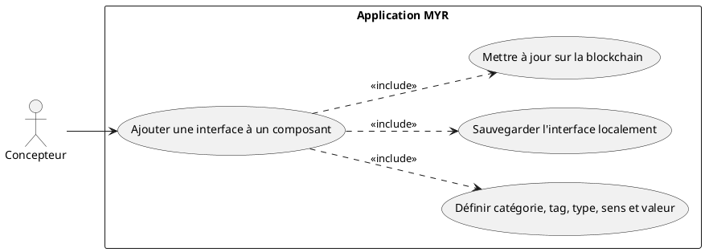
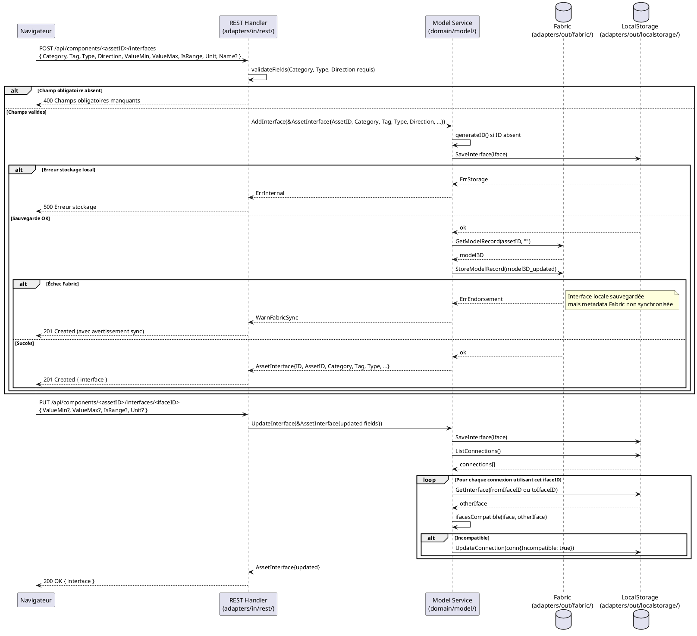

# Ajouter une interface à un Composant déjà créé

## Diagramme d'acteurs



## Contexte

Une **interface** (`AssetInterface`) est un point de connexion physique d'un composant — elle définit comment ce composant peut être assemblé avec d'autres dans l'Atelier. Exemples : alimentation 5 V (`ELEC/USB-C/out`), fixation par vis M3 (`MECA/Vis M3/in`), sortie fluide (`HYD/Push-fit 6mm/out`).

Les interfaces sont détectées automatiquement à l'import du fichier 3D lorsque la géométrie le permet. Quand la détection automatique est insuffisante ou absente, le Concepteur les ajoute manuellement via ce use case.

**Les interfaces sont stockées localement** (côté serveur, dans `adapters/out/localstorage/`) et non directement sur Fabric — elles font partie des métadonnées de l'Atelier. Elles sont référencées dans les transactions Fabric lors de la soumission d'une liaison ou d'un module.

**Écart code connu (E2) :** Le champ `Tag` est défini dans les specs (RM11) comme l'un des 6 attributs d'une `AssetInterface`, mais il est **absent de la struct `AssetInterface` dans `domain/model/entity.go`**. Il doit être ajouté. Sans ce champ, la vérification de compatibilité (`ifacesCompatible`) ne peut pas vérifier le 5e critère de RM11.

**`AssetInterface` cible (avec `Tag`) :**

| Champ | Type | Description |
|-------|------|-------------|
| `ID` | string | UUID généré par le service |
| `AssetID` | string | ID du composant auquel appartient l'interface |
| `Name` | string | Label optionnel (ex : "Alimentation principale") |
| `Category` | string | Famille physique : `ELEC`, `MECA`, `HYD`, custom |
| `Tag` | string | Type de connecteur : `Câble`, `Vis`, `Connecteur`, `Push-fit`… **(à ajouter — E2)** |
| `Type` | string | Standard précis : `USB-C`, `Vis M3`, `BSP 1/4"` |
| `Direction` | string | `in`, `out`, `bidir` |
| `ValueMin` | float64 | Valeur unique ou borne basse |
| `ValueMax` | float64 | Borne haute (si `IsRange`) |
| `IsRange` | bool | `true` si plage de valeurs |
| `Unit` | string | `V`, `mm`, `bar`… |
| `Virtual` | bool | `true` = slot cliquable non encore matérialisé |

## Pré-conditions

- Le Concepteur est authentifié avec le rôle `contributor` (JWT valide).
- Le composant existe (créé via UCCE01, UCCE03, UCCE04 ou UCCE05).
- Le Concepteur est propriétaire du composant ou dispose des droits d'édition.

## Scénario

**Étape initiale :** Le Concepteur sélectionne son composant dans l'Asset UI et accède à la gestion des interfaces.

### Flux nominal — Interface ajoutée avec succès

1. Le Concepteur clique sur "Ajouter une interface".
2. Il sélectionne la **catégorie** depuis le référentiel (`ELEC`, `MECA`, `HYD` ou personnalisée via `GetRefs()`).
3. Il sélectionne ou saisit le **tag** : type de connecteur physique (ex : `Câble`, `Vis`, `Connecteur`, `Push-fit`).
4. Il sélectionne ou saisit le **type** : standard précis (ex : `USB-C`, `Vis M3`, `BSP 1/4"`).
5. Il définit le **sens** : `in`, `out`, ou `bidir`.
6. Il renseigne la **valeur** ou plage de valeurs (`ValueMin`, `ValueMax`) et l'**unité** (`Unit`).
7. Il valide → `POST /api/components/:id/interfaces` (JSON body).
8. Le REST Handler valide les champs obligatoires (`Category`, `Type`, `Direction`).
9. Le handler appelle `service.AddInterface(iface)`.
10. Le service génère un UUID pour l'interface si absent.
11. Le service sauvegarde l'interface localement via `ifaceStore.SaveInterface(iface)`.
12. La transaction de mise à jour est soumise sur Fabric via `blockchain.StoreModelRecord(m)` (mise à jour des métadonnées de l'asset).
13. L'API retourne `201 Created` avec l'`AssetInterface` créée.

### Flux alternatif — Interface virtuelle (slot de connexion non encore typé)

1. Le Concepteur ajoute une interface sans préciser la catégorie, le type ou le sens.
2. L'interface est créée avec `Virtual: true` — elle représente un point de connexion disponible dans l'Atelier.
3. Lors d'une liaison dans l'Atelier, le slot virtuel sera matérialisé en interface physique via `ConnectVirtualToPhysical()`.

### Flux alternatif — Mise à jour d'une interface existante (UpdateInterface)

1. Le Concepteur modifie une interface existante (ex : change la plage de valeurs).
2. Il soumet → `PUT /api/components/:id/interfaces/:ifaceID`.
3. `service.UpdateInterface(iface)` met à jour l'interface et vérifie les connexions existantes dans l'Atelier.
4. Si une connexion utilisant cette interface n'est plus compatible, elle est marquée `Incompatible: true` (RM12).
5. L'API retourne `200 OK` avec l'interface mise à jour.

### Flux erreur — Champ obligatoire absent

1. `Category`, `Type` ou `Direction` est absent de la requête.
2. L'API retourne `400 Bad Request` : `{ "error": "Champs obligatoires manquants : Category, Type, Direction." }`.

### Flux erreur — Valeurs de plage incohérentes

1. `ValueMin > ValueMax` alors que `IsRange: true`.
2. L'API retourne `400 Bad Request` : `{ "error": "Plage de valeurs invalide : ValueMin doit être ≤ ValueMax." }`.

### Flux erreur — Composant introuvable

1. Le composant identifié par `:id` n'existe pas localement ni sur Fabric.
2. L'API retourne `404 Not Found` : `{ "error": "Composant introuvable." }`.

## Post-conditions

- L'interface est sauvegardée localement et associée au composant (`AssetID`).
- Elle est disponible pour créer des liaisons dans l'Atelier.
- Les connexions existantes dans l'Atelier sont vérifiées pour compatibilité si l'interface est mise à jour.

## Diagramme de séquence



## Règles métier déclenchées

| Règle | Description |
|-------|-------------|
| **RM11** | Une interface est définie par 6 attributs : Catégorie + **Tag** + Type + Sens + ValeurMin/Max + Unité |
| **RM12** | Lors de la mise à jour d'une interface : les connexions devenues incompatibles reçoivent `Incompatible: true` sans suppression automatique |
| **RM13** | Chaque asset dans l'Atelier dispose toujours d'au moins un slot virtuel (`EnsureVirtualSlot`) |

## Exigences non-fonctionnelles

| ID | Exigence |
|----|---------|
| **EF16** | Les interfaces physiques d'un composant peuvent être définies ou modifiées manuellement |
| **ENF12** | Contrôle du rôle `contributor` côté serveur avant toute écriture |

## Notes d'implémentation

**Route existante :** `POST /api/components/:id/interfaces` → `handler.handleComponentInterfaces()` → `service.AddInterface()` → `ifaceStore.SaveInterface()`. Implémenté et opérationnel.

**Écart E2 — Champ `Tag` absent :** `AssetInterface` dans `domain/model/entity.go` ne contient pas de champ `Tag`. À ajouter :
```go
Tag  string `json:"tag,omitempty"` // ex: "Câble", "Vis", "Connecteur", "Push-fit"
```
Sans ce champ, `ifacesCompatible()` dans `service.go` ne vérifie que 4 critères sur 5 (RM11). Après ajout, mettre à jour `ifacesCompatible()` :
```go
if a.Tag != "" && b.Tag != "" && a.Tag != b.Tag {
    return false
}
```

**Référentiel des catégories, tags, types et unités :** `service.GetRefs()` retourne un `InterfaceRefs` avec les listes prédéfinies. L'interface peut proposer des suggestions depuis ce référentiel (autocomplétion). L'ajout de nouvelles catégories/types/unités est possible via `AddRefCategory()`, `AddRefType()`, `AddRefUnit()`.

**Slot virtuel :** Chaque asset ajouté dans l'Atelier possède automatiquement au moins un slot virtuel (`Virtual: true`) créé par `EnsureVirtualSlot()`. Ce slot devient une interface physique lors de la première liaison via `ConnectVirtualToPhysical()`.

**Synchronisation Fabric :** Les interfaces sont stockées localement (non sur Fabric directement). La mise à jour de Fabric via `StoreModelRecord()` après `SaveInterface()` est facultative en v1 — les interfaces locales suffisent pour l'Atelier. La synchronisation complète vers Fabric est à planifier pour la publication d'un module (UCMOD06).
