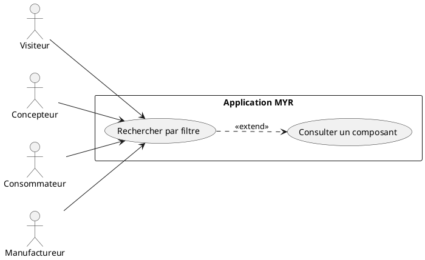
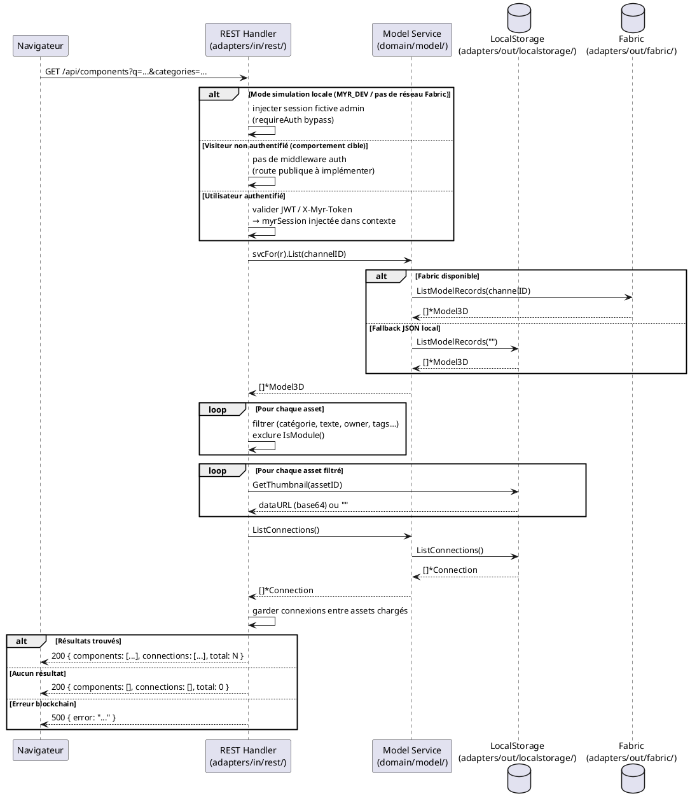

# Faire une recherche par filtre

## Diagramme d'acteurs



## Contexte

La recherche par filtre est le point d'entrée principal sur les assets du réseau. Elle doit être accessible sans authentification pour les visiteurs (accès public), conformément à l'exigence EF17 du domaine D4.

Le système interroge la blockchain via `GET /api/components` avec des paramètres de filtre. Le résultat est un graphe `{ components, connections, total }` décrivant les assets correspondants et leurs liaisons.

**Écart connu (E-UCCL01) :** La route `GET /api/components` est actuellement enveloppée dans `contrib()` (middleware `requireAuth` pour GET, `requireRole("contributor")` pour POST). L'accès visiteur non authentifié n'est pas encore implémenté — le middleware en mode simulation locale (`netInfo.Network == ""`) contourne cette contrainte en injectant une session fictive `admin`.

## Pré-conditions

- Le serveur Myr est démarré et joignable
- La blockchain (ou le stockage local JSON en mode développement) est accessible
- Pour un visiteur : aucune authentification requise (comportement cible — voir écart ci-dessus)
- Pour un utilisateur authentifié : token JWT valide dans l'en-tête `Authorization: Bearer <token>` ou token legacy `X-Myr-Token`

## Scénario

**Étape initiale :** L'utilisateur ouvre l'application et accède à la vue Recherche depuis la MenuBar

### Flux nominal — Résultats trouvés

1. L'utilisateur sélectionne un ou plusieurs critères de filtre dans la Search UI :
   - texte libre (`q`) : recherche dans nom, description, tags
   - catégories (`categories`) : `base`, `amelioration`, `variation`, `adaptation`, `derivation`, `extension`, `regression`
   - auteur (`owner_id`), parent (`parent_id`), hash exact (`hash`), tags (`tags`)
   - limite de résultats (`limit`, défaut 200, max 1000)
2. Le navigateur envoie `GET /api/components?q=...&categories=...&limit=...`
3. Le handler `listGraph` interroge le service domaine via `svcFor(r).List(channel)`
4. Le service appelle `blockchain.ListModelRecords(channelID)` — retourne tous les assets du canal
5. Le handler filtre côté serveur (catégorie, texte, owner, parent, hash, tags) et exclut les modules
6. Les DTOs `componentDTO` sont construits avec miniatures (thumbnails)
7. Les connexions entre assets chargés sont incluses dans la réponse
8. Le navigateur reçoit `{ components: [...], connections: [...], total: N }` et affiche la liste

### Flux nominal — Aucun résultat

1. Le filtrage ne retourne aucun asset correspondant
2. La réponse est `{ components: [], connections: [], total: 0 }`
3. Un message "Aucun composant ne correspond aux critères" est affiché

### Flux alternatif — Affinement des filtres

1. L'utilisateur modifie un ou plusieurs critères sans quitter la vue
2. Une nouvelle requête `GET /api/components` est émise avec les critères mis à jour
3. La liste est rechargée (pas de rechargement de page — SPA)

### Flux erreur — Blockchain indisponible

1. `blockchain.ListModelRecords()` retourne une erreur
2. Le handler renvoie HTTP 500 avec `{ "error": "..." }`
3. L'UI affiche un message d'erreur technique

### Flux erreur — Accès refusé (écart actuel)

1. Un visiteur non authentifié tente d'accéder à `GET /api/components` (hors mode simulation)
2. Le middleware `requireAuth` renvoie HTTP 401 `{ "error": "authentification requise" }`
3. **Comportement cible :** la route doit être ouverte en lecture pour les visiteurs — corriger le routage dans `server.go`

## Post-conditions

- La liste des composants correspondant aux critères est affichée dans l'Explorer UI
- Les connexions entre les composants affichés sont visibles
- L'état du système est inchangé (lecture seule)

## Diagramme de séquence



## Règles métier déclenchées

Aucune règle métier de modification n'est déclenchée (lecture seule). Points de conformité :

- **EF17** — Accès public (sans authentification) aux composants d'un réseau Myr : la route `GET /api/components` doit être accessible aux visiteurs
- La distinction composant/module est assurée par `Model3D.IsModule()` — les modules sont exclus de cette route (exposés via `/api/modules`)
- Le canal actif est résolu depuis la session (`sess.Channel`) ou depuis la configuration du réseau (`netInfo.Channel`)

## Exigences non-fonctionnelles

- **ENF01 / ENF14** — Temps de réponse : `< 2 s` pour 100 assets (objectif charge nominale)
- **ENF22** — Compatibilité navigateur : Chrome 120+, Firefox 120+, Safari 17+, Edge 120+
- **ENF12** — Contrôle d'accès vérifié côté serveur (pas côté client uniquement)
- La pagination côté serveur (paramètre `limit`) protège contre les réponses trop volumineuses (max 1000)

## Notes d'implémentation

**Écart à corriger — accès visiteur :**
Dans `adapters/in/rest/server.go`, la route `/api/components` est enveloppée dans `contrib()` qui impose `requireAuth` pour les requêtes GET. Pour autoriser les visiteurs, remplacer par un middleware conditionnel :

```go
// Lecture publique, écriture restreinte au rôle contributor
mux.HandleFunc("/api/components", func(w http.ResponseWriter, r *http.Request) {
    switch r.Method {
    case http.MethodPost, http.MethodPut, http.MethodPatch, http.MethodDelete:
        s.handler.requireRole("contributor", s.handler.handleComponents)(w, r)
    default:
        s.handler.handleComponents(w, r) // GET : public
    }
})
```

**Paramètres de filtre supportés par `listGraph` :**

| Paramètre    | Type   | Description                                      |
|-------------|--------|--------------------------------------------------|
| `q`          | string | Recherche textuelle (nom, description, tags)    |
| `categories` | string | Catégories séparées par virgule                 |
| `owner_id`   | string | Filtrer par propriétaire                         |
| `parent_id`  | string | Filtrer par asset parent (lignée)                |
| `hash`       | string | Hash SHA-256 exact                               |
| `tags`       | string | Tags séparés par virgule (match OR)              |
| `limit`      | int    | Nombre max de résultats (défaut 200, max 1000)   |

**Miniatures :** Récupérées depuis `ThumbnailStore` (SQLite ou local JSON). Si absente, `thumbnail` est une chaîne vide dans le DTO.

**Connexions :** Seules les connexions dont `From` ET `To` font partie des assets filtrés sont incluses dans la réponse — évite les connexions orphelines côté client.
