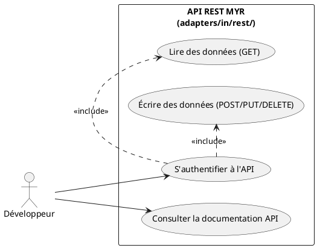
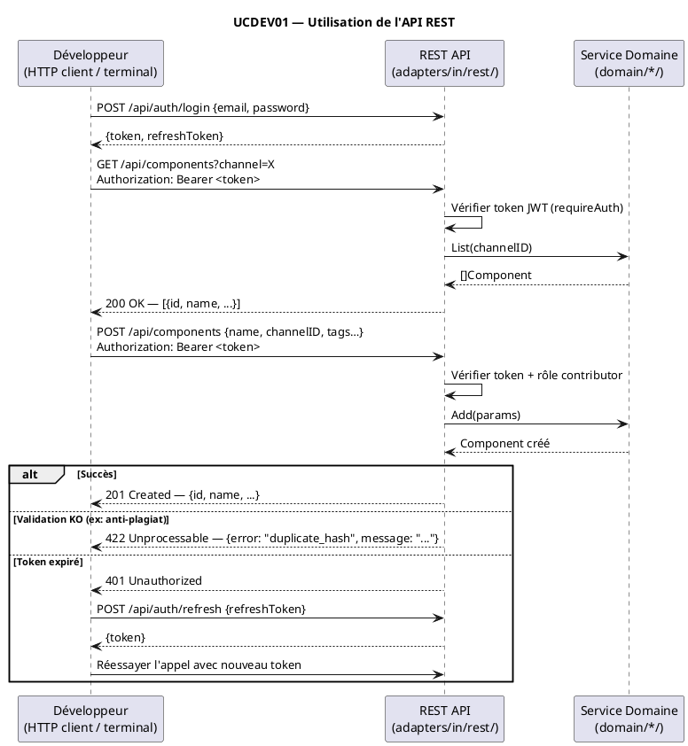

# Utilisation de l'API

## Diagramme d'acteurs

## Contexte

Les développeurs tiers peuvent utiliser l'API REST MYR pour intégrer ses fonctionnalités dans leurs applications (boutiques, éditeurs 3D, plugins CAO, systèmes de gestion). L'API REST est exposée sous le préfixe `/api/` par `myr-app.exe`.

L'API est **implémentée** et opérationnelle (`adapters/in/rest/`). Elle couvre les opérations sur les composants, modules, liaisons, canaux, réseaux, licences et l'authentification JWT.

L'acteur "Développeur" est distinct de l'Administrateur : il accède à MYR exclusivement via l'API REST depuis son environnement (jamais via le CLI qui est réservé au serveur). Il possède un compte avec un rôle approprié (minimum Lecteur pour les lectures, Concepteur pour les écritures).

## Pré-conditions

- `myr-app.exe` est en cours d'exécution et accessible
- Le développeur dispose d'un compte MYR avec les droits nécessaires (rôle Lecteur minimum)
- Le développeur dispose d'un token JWT valide (obtenu via `POST /api/auth/login`)
- La documentation de l'API est consultable (UCDOC01 / UCDOC03)

## Scénario

**Étape initiale :** Le développeur consulte la documentation API MYR

### Flux nominal — Lecture de données (query)

1. Le développeur obtient un token JWT via `POST /api/auth/login`
2. Il effectue un appel GET avec l'en-tête `Authorization: Bearer <token>`
3. Exemple : `GET /api/components?channel=greenchannel`
4. Le serveur vérifie le token (`withJWTAuth` / `requireAuth`)
5. Le handler retourne les données en JSON
6. Le développeur intègre les données dans son application tierce

### Flux nominal — Écriture de données (invoke)

1. Le développeur dispose d'un token JWT avec rôle Concepteur (contributor)
2. Il effectue un appel POST/PUT/PATCH/DELETE avec l'en-tête Authorization
3. Exemple : `POST /api/components` avec body JSON
4. Le serveur vérifie le token ET le rôle (`requireRole("contributor", ...)`)
5. La validation métier est effectuée côté serveur
6. Si valide : la transaction est soumise à Fabric ; la réponse JSON confirme le succès

### Flux alternatif — Token expiré

1. Le développeur effectue un appel avec un token expiré
2. Le serveur retourne `401 Unauthorized`
3. Le développeur appelle `POST /api/auth/refresh` avec son refreshToken
4. Un nouveau token JWT est retourné
5. Le développeur réessaie l'appel avec le nouveau token

### Flux erreur — Droits insuffisants

1. Le développeur tente une écriture avec un rôle Lecteur
2. Le serveur retourne `403 Forbidden` : "Droits insuffisants"
3. Aucune modification n'est effectuée

### Flux erreur — Ressource introuvable

1. Le développeur appelle `GET /api/components/{id}` avec un ID inexistant
2. Le serveur retourne `404 Not Found`
3. Un corps JSON structuré décrit l'erreur

## Post-conditions

- Pour une lecture : les données sont retournées en JSON, prêtes à être intégrées
- Pour une écriture : la ressource est créée/modifiée sur la blockchain Fabric ; l'ID est retourné
- Le token JWT est toujours valide pour les appels suivants

## Diagramme de séquence

## Règles métier déclenchées

- **EF55** (ENF55) : API REST disponible pour les intégrations tierces
- **RM07** : Validation côté serveur avant toute soumission blockchain
- **ENF12** : Vérification du rôle côté serveur (jamais côté client uniquement)
- **RM01** : Anti-plagiat SHA-256 + similarité SCM > 50 % avant ajout d'asset `base`
- **RM08** : Vérification compatibilité de licence si `ParentID != ""` et `LicenseID != ""`

## Exigences non-fonctionnelles

- L'API doit répondre en moins de 500 ms pour les opérations de lecture (hors Fabric)
- Le format JSON des erreurs doit être standardisé (code machine + message lisible)
- L'API est versionnée implicitement — les changements cassants doivent être anticipés
- La documentation de l'API doit couvrir toutes les routes exposées dans `server.go`

## Notes d'implémentation

**État actuel :** Implémenté. Routes exposées dans `adapters/in/rest/server.go` :
- Auth : `/api/auth/register`, `/api/auth/login`, `/api/auth/refresh`, `/api/auth/logout`, `/api/auth/me`, `/api/auth/enroll-wallet`
- Données : `/api/components`, `/api/components/`, `/api/connections`, `/api/connections/`, `/api/assembly-links`, `/api/virtual-connect`, `/api/modules`, `/api/modules/`, `/api/interfaces/`
- Référentiel : `/api/refs`, `/api/refs/categories`, `/api/refs/types`, `/api/refs/units`
- Réseau : `/api/channels`, `/api/networks`, `/api/networks/active`
- Utilitaire : `/api/ping`, `/api/status`, `/api/health`, `/metrics`
- Licences : `/api/licenses`, `/api/licenses/`
- Admin : `/api/admin/users`, `/api/admin/users/`, `/api/admin/sessions`, `/api/admin/sessions/`

**Authentification :** JWT via `withJWTAuth()` et `requireAuth()`. Accès en lecture : rôle Lecteur minimum. Accès en écriture (POST/PUT/PATCH/DELETE) : rôle Concepteur (`contributor`) via le middleware `contrib`.

**Documentation API :** `api/` contient les specs OpenAPI. À intégrer dans UCDOC03 pour l'accessibilité depuis la SPA.
