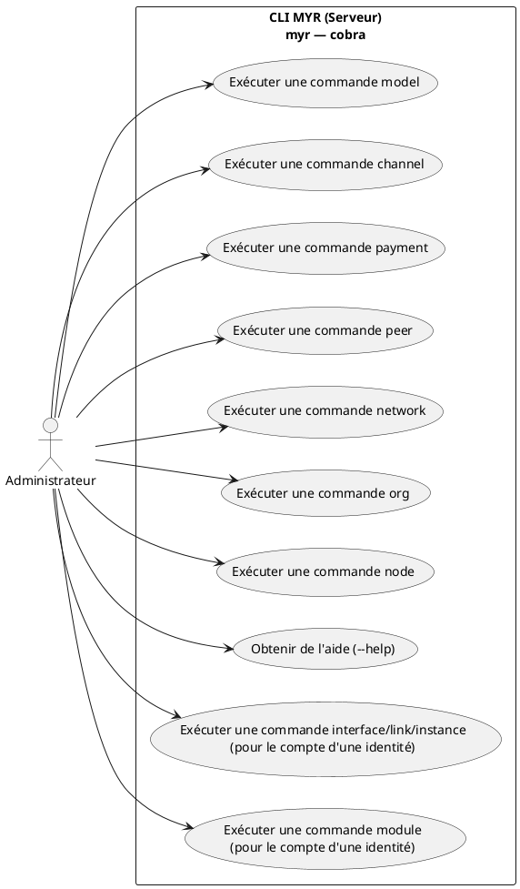
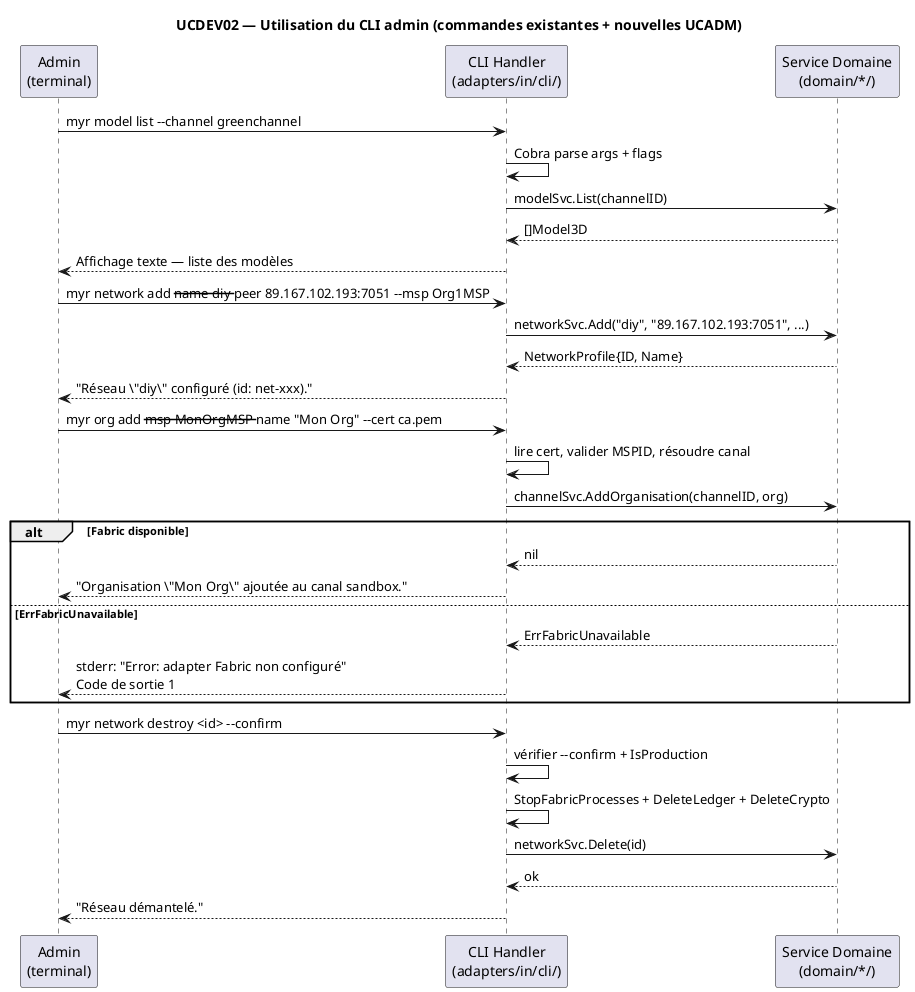

# Utilisation du CLI

## Diagramme d'acteurs

## Contexte

L'administrateur peut utiliser le CLI MYR (`myr`) directement sur le serveur (via SSH) pour administrer le réseau. Le CLI est un outil cobra exposant sept groupes de commandes : `model`, `channel`, `payment`, `peer`, `network`, `org`, `node`.

Le Développeur n'a **pas** accès au CLI — il interagit avec MYR exclusivement via l'API REST (UCDEV01). Le CLI est réservé aux opérations serveur nécessitant un accès direct aux services domaine sans passer par HTTP.

Les groupes `model`, `channel`, `payment` et `peer` sont **implémentés** (`adapters/in/cli/`). Les groupes `network`, `org` et `node` (UCADM01–05) sont **à implémenter** — leur contrat d'interface complet est défini dans `specs/3-Conception/DC_CLI_Admin.md`.

`myr model` n'est aujourd'hui qu'un sous-ensemble de `ModelService` (`add`/`get`/`list`/`verify`). Le port domaine expose déjà les interfaces physiques, les liaisons, les instances et les modules (UCCE02/06, UCAM01–05/07/08, UCMOD01–06) — leur exposition CLI cible (`myr model interface/link/instance`, `myr module`) est définie dans `specs/3-Conception/DC_CLI_Model.md`, sur le même principe que `DC_CLI_Admin.md` pour l'administration réseau : aucun changement de domaine requis, seul l'adaptateur `adapters/in/cli/` reste à écrire.

## Pré-conditions

- L'administrateur est connecté au serveur distant (SSH ou accès direct)
- `myr` est déployé sur le serveur (`make deploy` → installé dans `~/.local/bin/myr`)
- Les variables d'environnement Fabric sont configurées (`fabricadapter.ConfigFromEnv()` ou `fabric.env`)
- Les services domaine sont disponibles (adapter Fabric configuré pour les opérations blockchain)

## Scénario

**Étape initiale :** L'administrateur ouvre un terminal sur le serveur distant

### Flux nominal — Commandes opérationnelles existantes

1. L'administrateur saisit une commande MYR CLI
   - Exemple : `myr model list --channel greenchannel`
   - Exemple : `myr model add roue.stl --name "Roue avant" --channel greenchannel --tags "impression3d"`
   - Exemple : `myr channel list`
   - Exemple : `myr peer add --peer-id peer1.org1.com --out ./peer-crypto`
2. Cobra parse les arguments et drapeaux
3. La commande appelle le service domaine correspondant (`modelSvc`, `channelSvc`, `paymentSvc`, `networkSvc`)
4. Le service domaine exécute l'opération (lecture blockchain ou écriture via `adapters/out/fabric/`)
5. Le résultat est affiché en sortie texte dans le terminal

### Flux nominal — Commandes d'administration réseau (UCADM01–05)

1. L'administrateur configure un réseau :
   - `myr network add --name diy --peer 89.167.102.193:7051 --msp Org1MSP --channel sandbox`
   - `myr network activate <id>`
   - `myr network test`
   - `myr network import --profile connection-profiles/connection-org1.json`
2. L'administrateur ajoute une organisation au réseau (UCADM01) :
   - `myr org add --msp MonOrgMSP --name "Mon Organisation" --cert ca-root.pem --channel sandbox`
3. L'administrateur étend le réseau avec un nouveau nœud (UCADM03) :
   - `myr node add --type peer --addr 89.167.102.194:7051 --org Org1MSP --channel sandbox`
4. L'administrateur retire un nœud (UCADM04) :
   - `myr node remove --addr 89.167.102.194:7051 --channel sandbox`
5. L'administrateur démantèle un réseau de test (UCADM05) :
   - `myr network destroy <id> --confirm`

> La référence complète des commandes UCADM (flags, sorties, erreurs, services appelés) est dans `specs/3-Conception/DC_CLI_Admin.md`.

### Flux nominal — Vérification d'intégrité d'un modèle

1. `myr model verify <id>`
2. Le service recalcule le hash SHA-256 du fichier associé
3. Comparaison avec le hash enregistré sur la blockchain
4. Affichage : "OK modele [id] : integrité vérifiée" ou "KO modele [id] : integrité compromise"

### Flux erreur — Adapter Fabric non configuré

1. Fabric n'est pas disponible (pas de réseau configuré)
2. Les commandes `myr org add`, `myr node add`, `myr node remove` retournent `ErrFabricUnavailable` — elles nécessitent un adapter Fabric configuré, sans repli vers un autre stockage.

### Flux erreur — Commande invalide ou arguments manquants

1. L'administrateur saisit une commande avec des arguments incorrects
2. Cobra détecte l'erreur (argument manquant, flag inconnu…)
3. Un message d'aide est affiché avec la syntaxe correcte
4. Exemple : `Error: required flag(s) "name" not set` suivi de la syntaxe de la commande

### Flux erreur — Erreur Fabric (peer indisponible)

1. La commande tente d'interagir avec Fabric
2. Le peer est inaccessible
3. Une erreur est affichée sur stderr : `Error: fabric gateway: ...`
4. Le code de sortie est non-zéro (exploitable dans les scripts CI/CD)

## Post-conditions

- La commande a été exécutée et le résultat est affiché en sortie texte
- Le code de sortie est 0 en cas de succès, non-zéro en cas d'erreur
- Les modifications blockchain sont enregistrées sur Fabric (si opération d'écriture)

## Diagramme de séquence

## Règles métier déclenchées

- **EF56** (ENF56) : CLI d'administration disponible pour les opérations serveur
- **RM01** : Anti-plagiat SHA-256 déclenché lors de `myr model add` (via service domaine)
- **RM07** : Validation côté service avant soumission Fabric (même pipeline que l'API REST)
- Fabric ne supporte pas la suppression — `ErrNotSupported` retourné, pas de panic

## Exigences non-fonctionnelles

- Le CLI doit être utilisable dans des scripts (code de sortie 0/non-zéro, sortie structurée)
- Les man pages doivent être générées via `cmd/mangen/` (go run ./cmd/mangen → docs/man/)
- La sortie doit être lisible (pas de JSON brut par défaut — sortie texte tabulaire)
- Compatible avec les shells Unix/Linux sur le serveur de déploiement

## Notes d'implémentation

**État actuel :**

| Groupe | Commandes | Fichier | État |
|--------|-----------|---------|------|
| `myr model` | `add`, `get`, `list`, `verify` | `adapters/in/cli/model.go` | ✅ Implémenté |
| `myr channel` | `get`, `list` | `adapters/in/cli/channel.go` | ✅ Implémenté |
| `myr payment` | — | `adapters/in/cli/payment.go` | ✅ Implémenté |
| `myr peer` | `add` (CA registration) | `adapters/in/cli/peer.go` | ✅ Implémenté |
| `myr network` | `list`, `show`, `add`, `update`, `activate`, `delete`, `test`, `import`, `destroy` | `adapters/in/cli/network.go` | ❌ À implémenter (UCADM02, UCADM05) |
| `myr org` | `add` | `adapters/in/cli/org.go` | ❌ À implémenter (UCADM01) |
| `myr node` | `add`, `remove` | `adapters/in/cli/node.go` | ❌ À implémenter (UCADM03, UCADM04) |
| `myr model interface`, `myr model link`, `myr model instance` | `add`/`update`/`remove`/`list` | `adapters/in/cli/model.go` (à étendre) | ❌ À implémenter (UCCE06, UCAM01–04/07/08) |
| `myr module` | `create`, `get`, `list`, `add-assembly`, `remove-assembly`, `submit`, `remove`, `interfaces` | `adapters/in/cli/module.go` (à créer) | ❌ À implémenter (UCMOD01–06) |

**Référence contrat CLI :** `specs/3-Conception/DC_CLI_Admin.md` (administration réseau) et `specs/3-Conception/DC_CLI_Model.md` (composants, interfaces, liaisons, instances, modules) — syntaxe complète, flags, sorties, erreurs, ports requis.

**Injection de services :** `cli.Execute(modelSvc, channelSvc, paymentSvc, networkSvc)` dans `cmd/cli/main.go`. Les services sont injectés au démarrage — la CLI respecte l'architecture hexagonale.

**Ports domaine à créer :** `ChannelService` doit être étendu avec `AddOrganisation()`, `AddNode()`, `RemoveNode()`. `NetworkProfile` doit recevoir le champ `IsProduction bool`. Voir `DC_CLI_Admin.md` § 6.

**Adapter Fabric non configuré :** les commandes `myr org add`, `myr node add`, `myr node remove` retournent `ErrFabricUnavailable` sans adapter Fabric — elles nécessitent une connexion blockchain réelle, sans repli vers un autre stockage.

**Domaines manquants dans le CLI :** `identity`, `session`, `auth` n'ont pas de commandes CLI. Ces domaines sont priorité HAUTE pour l'exposition REST — leur exposition CLI est MOYENNE.

**Man pages :** `cmd/mangen/` — `go run ./cmd/mangen` → `docs/man/`. Consultables via `man myr-model`, `man myr-channel`, etc.
