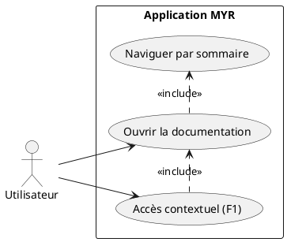
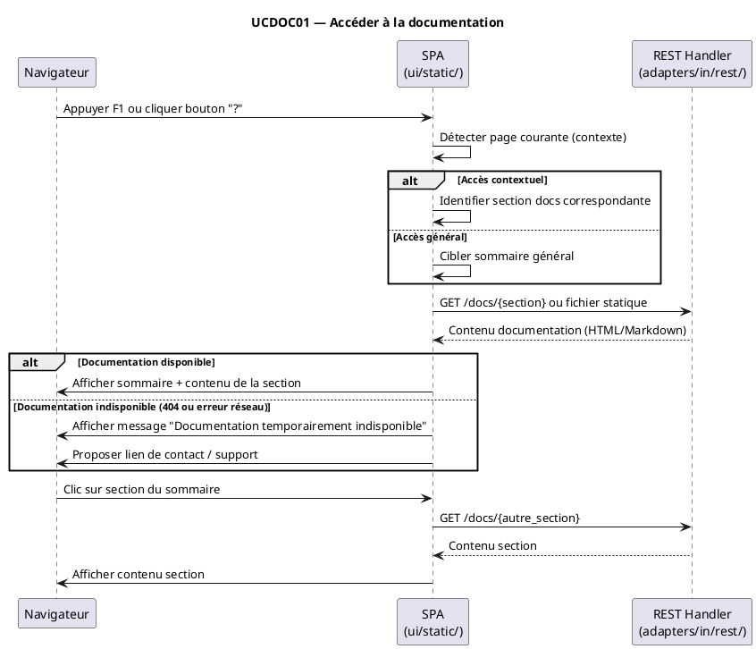

# Accéder à la documentation

## Diagramme d'acteurs

## Contexte

Les utilisateurs ont besoin d'accéder à la documentation du système MYR sans quitter l'application. La documentation doit être accessible depuis n'importe quelle page, idéalement via la touche `F1` ou un bouton dédié dans l'interface.

Aucun endpoint de documentation n'est actuellement implémenté. `cmd/mangen/` génère des man pages pour la CLI (`myr.exe`), mais aucune page d'aide n'est présente dans la SPA.

Ce use case couvre l'accès à la documentation générale du système (guide utilisateur, présentation des concepts). UCDOC02 couvre la FAQ, UCDOC03 la compréhension approfondie (recherche plein texte).

## Pré-conditions

- L'application MYR est ouverte dans le navigateur
- L'utilisateur est connecté ou sur la page de connexion (la documentation peut être publique)

## Scénario

**Étape initiale :** L'utilisateur appuie sur `F1` ou clique sur le bouton "?" / "Documentation"

### Flux nominal — Documentation ouverte avec succès

1. L'utilisateur déclenche l'accès à la documentation (touche F1 ou bouton dédié)
2. La SPA navigue vers la page `/docs` ou ouvre un panneau latéral de documentation
3. Le sommaire de la documentation est affiché (liste des chapitres)
4. L'utilisateur peut naviguer dans les sections par clic sur le sommaire
5. Le contenu de la section sélectionnée est affiché dans la zone principale

### Flux alternatif — Accès contextuel depuis une page spécifique

1. L'utilisateur appuie sur `F1` depuis la page "Atelier"
2. La documentation s'ouvre directement à la section correspondant à l'Atelier
3. Un lien "Retour au sommaire" est disponible

### Flux alternatif — Documentation en langue sélectionnée

1. Si l'utilisateur a sélectionné l'anglais (UCPAR01), la documentation s'affiche en anglais
2. Si la version anglaise n'est pas disponible, la version française est affichée avec une note

### Flux erreur — Documentation inaccessible

1. La SPA tente de charger la documentation
2. Le fichier ou la route `/docs` retourne une erreur
3. Un message d'erreur explicite est affiché : "Documentation temporairement indisponible"
4. Un lien de contact ou de support est proposé

## Post-conditions

- La documentation est affichée avec son sommaire
- L'utilisateur peut naviguer entre les sections
- Le contexte de navigation précédent est conservé (retour possible)

## Diagramme de séquence

## Règles métier déclenchées

- **EF52** : La documentation doit être accessible depuis l'interface
- aucune règle métier blockchain — la documentation est un service frontend

## Exigences non-fonctionnelles

- L'accès à la documentation ne doit pas nécessiter de connexion (accessible en tant que Visiteur)
- Le chargement d'une page de documentation doit être inférieur à 500 ms
- Compatible ENF22 : Chrome 120+, Firefox 120+, Safari 17+, Edge 120+

## Notes d'implémentation

**État actuel :** Non implémenté. Aucun endpoint ni page docs dans la SPA.

**Architecture cible :**

Option A — Documentation statique embarquée :
- Les fichiers Markdown sont convertis en HTML et embarqués dans `ui/embed.go`
- Servis directement par `staticHandler` de `buildMux()` sous `/docs/`
- Aucun endpoint REST dédié requis

Option B — Documentation externe :
- La SPA redirige vers une URL externe (ex : `docs.myr.io`)
- Avantage : mise à jour indépendante du binaire
- Inconvénient : dépendance réseau, non disponible hors ligne

**Recommandation :** Option A pour v1 — la documentation est embarquée dans le binaire, cohérente avec la philosophie "sans logiciel client supplémentaire" (ENF24). Les man pages CLI générées par `cmd/mangen/` ne couvrent que `myr.exe`, pas la documentation utilisateur SPA.

**Raccourci clavier F1 :** À implémenter dans `ui/static/js/` avec `document.addEventListener('keydown', ...)` — vérifier que le raccourci ne conflicte pas avec les raccourcis navigateur.
