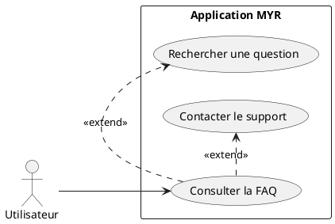
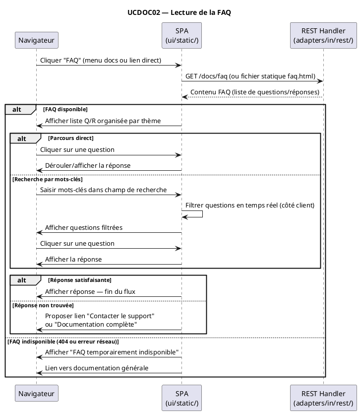

# Lecture de la FAQ

## Diagramme d'acteurs

## Contexte

La FAQ (Foire Aux Questions) centralise les réponses aux questions récurrentes posées par les utilisateurs. Elle est accessible depuis la documentation (UCDOC01 — pré-condition) et peut être consultée indépendamment via un lien direct depuis le profil ou la page d'aide.

La FAQ est distincte de la documentation générale (UCDOC01) et de la documentation de compréhension approfondie (UCDOC03). Elle répond à des questions concrètes de type "Comment faire X ?" ou "Pourquoi est-ce que Y ne fonctionne pas ?".

Aucun endpoint FAQ n'est actuellement implémenté dans la SPA ou l'API REST.

## Pré-conditions

- L'application MYR est ouverte dans le navigateur
- La documentation est accessible (UCDOC01 implémenté ou accès direct à `/docs/faq`)

## Scénario

**Étape initiale :** L'utilisateur accède à la section FAQ

### Flux nominal — Réponse trouvée par parcours

1. L'utilisateur ouvre la FAQ (depuis le menu documentation ou un lien direct)
2. La liste des questions fréquentes est affichée, organisée par thème (Compte, Assets, Atelier, API…)
3. L'utilisateur parcourt les questions et clique sur celle qui correspond à son problème
4. La réponse se déroule (accordéon) ou la page fait défiler jusqu'à la section
5. L'utilisateur lit la réponse et résout son problème

### Flux alternatif — Réponse trouvée par recherche

1. L'utilisateur saisit des mots-clés dans le champ de recherche de la FAQ
2. Les questions correspondantes sont filtrées en temps réel
3. L'utilisateur clique sur la question correspondante et lit la réponse

### Flux alternatif — Réponse non trouvée

1. L'utilisateur ne trouve pas de réponse satisfaisante dans la FAQ
2. Un lien "Contacter le support" ou "Consulter la documentation complète" est proposé
3. L'utilisateur est redirigé vers le formulaire de contact ou UCDOC03

### Flux erreur — FAQ inaccessible

1. La SPA tente de charger la page FAQ
2. Une erreur réseau ou une ressource absente est détectée
3. Un message d'erreur est affiché : "FAQ temporairement indisponible"
4. Un lien vers la documentation générale reste disponible

## Post-conditions

- L'utilisateur a obtenu une réponse à sa question (flux nominal)
- Ou l'utilisateur a été redirigé vers le support ou la documentation complète (flux alternatif)

## Diagramme de séquence

## Règles métier déclenchées

- **EF53** : Une FAQ doit être accessible depuis l'interface
- aucune règle métier blockchain

## Exigences non-fonctionnelles

- La recherche dans la FAQ doit être instantanée (filtrage côté client, sans appel serveur)
- La FAQ doit être lisible sans connexion si elle est embarquée dans le binaire
- Compatible ENF22 : Chrome 120+, Firefox 120+, Safari 17+, Edge 120+

## Notes d'implémentation

**État actuel :** Non implémenté. Dépend de UCDOC01 (infrastructure documentation).

**Architecture cible :**
- La FAQ est un fichier statique Markdown ou HTML embarqué dans `ui/embed.go`
- Servie sous `/docs/faq` par `staticHandler` (pas d'endpoint REST dédié)
- La recherche est implémentée en JavaScript côté client (filtrage sur les titres de questions)
- Le contenu FAQ peut être externalisé dans `ui/static/docs/faq.md` pour faciliter les mises à jour en mode `MYR_DEV=1`

**Organisation thématique suggérée pour la FAQ :**
- Compte & accès (UCA01–02)
- Assets et composants (UCCE01–06)
- Atelier et liaisons (UCAM01–08)
- Modules et blockchain (UCMOD01–06)
- API et CLI (UCDEV01–02)
- Problèmes courants (erreurs E01–E12 de UCIG02)
