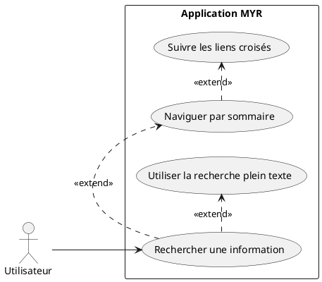
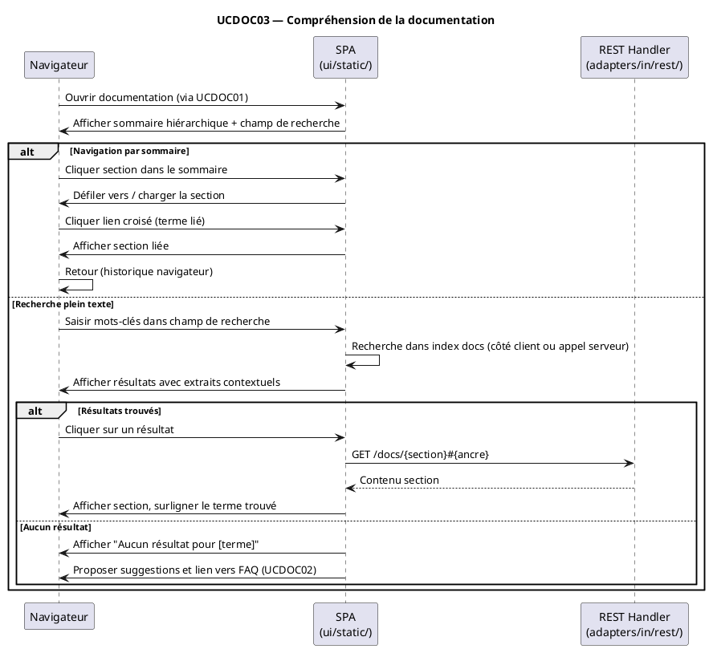

# Compréhension de la documentation

## Diagramme d'acteurs

## Contexte

Ce use case s'intéresse à la qualité intrinsèque de la documentation plutôt qu'à son accès. Il décrit les exigences que la documentation doit satisfaire pour être réellement utile : clarté, navigabilité, recherche efficace, et accessibilité à tous les profils d'utilisateurs (novice à expert).

Ce use case est complémentaire de UCDOC01 (accès) et UCDOC02 (FAQ). Il s'applique à la documentation technique destinée aux développeurs (API REST, CLI) ainsi qu'au guide utilisateur général.

La priorité est faible (importance = 1) — la documentation doit exister avant d'être optimisée pour la compréhension.

## Pré-conditions

- L'utilisateur a accès à la documentation (UCDOC01 implémenté)
- L'utilisateur cherche une information précise (concept, procédure, référence API…)

## Scénario

**Étape initiale :** L'utilisateur cherche une information précise dans la documentation

### Flux nominal — Information trouvée rapidement par sommaire

1. L'utilisateur ouvre la documentation (UCDOC01)
2. Le sommaire hiérarchique est visible (chapitres → sous-sections)
3. L'utilisateur identifie visuellement la section pertinente
4. Il clique sur l'entrée du sommaire
5. La page défile ou navigue vers la section correspondante
6. L'information est trouvée en moins de 3 clics depuis le sommaire

### Flux alternatif — Recherche plein texte

1. L'utilisateur saisit des mots-clés dans le champ de recherche global de la documentation
2. Les résultats sont affichés avec contexte (extraits de texte autour du terme trouvé)
3. L'utilisateur clique sur un résultat
4. La documentation ouvre la page correspondante, le terme est surligné

### Flux alternatif — Navigation par liens croisés

1. L'utilisateur lit une section et rencontre un terme ou concept lié
2. Un lien hypertexte vers la section de définition est disponible
3. L'utilisateur clique sur le lien et accède à la définition ou section concernée
4. Un bouton "Retour" ou l'historique navigateur permet de revenir

### Flux erreur — Recherche sans résultat

1. L'utilisateur saisit des mots-clés
2. Aucun résultat ne correspond
3. Un message "Aucun résultat pour [terme]" est affiché
4. Des suggestions sont proposées (termes proches, lien vers la FAQ UCDOC02)

## Post-conditions

- L'information recherchée a été trouvée en moins de 3 clics ou en moins de 30 secondes
- L'utilisateur a compris le concept ou la procédure

## Diagramme de séquence

## Règles métier déclenchées

- **EF54** : La documentation doit être claire et les informations facilement trouvables
- aucune règle métier blockchain

## Exigences non-fonctionnelles

- Tout contenu documentaire doit être atteignable en moins de 3 clics depuis le sommaire principal
- La recherche plein texte doit retourner des résultats en moins de 200 ms
- Les ancres de section doivent être stables (URLs partageables)
- Compatible ENF22 : Chrome 120+, Firefox 120+, Safari 17+, Edge 120+

## Notes d'implémentation

**État actuel :** Non implémenté. Dépend de UCDOC01.

**Architecture cible :**

- **Sommaire** : généré automatiquement depuis les titres Markdown (H2, H3) — rendu côté client via JS
- **Recherche plein texte** : index statique côté client (ex : lunr.js ou implémentation minimaliste) — compatible avec la philosophie "Vanilla JS sans framework"
- **Liens croisés** : assurés par les ancres HTML standards (`#section-id`) — générés à partir des titres Markdown
- **Surligna ge des termes** : via l'API `window.find()` ou implémentation JS légère

**Documentation API REST :**
- La documentation de l'API REST (routes `server.go`) peut être générée à partir de commentaires ou d'une spec OpenAPI dans `api/`
- À terme : intégrer une page Swagger/OpenAPI statique embarquée dans `ui/static/`

**Documentation CLI :**
- `cmd/mangen/` génère les man pages pour `myr.exe` (cobra)
- Ces man pages peuvent être converties en HTML et intégrées dans la section docs de la SPA
