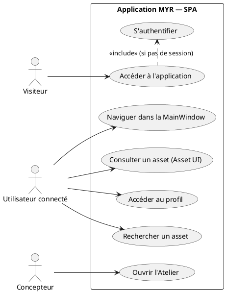
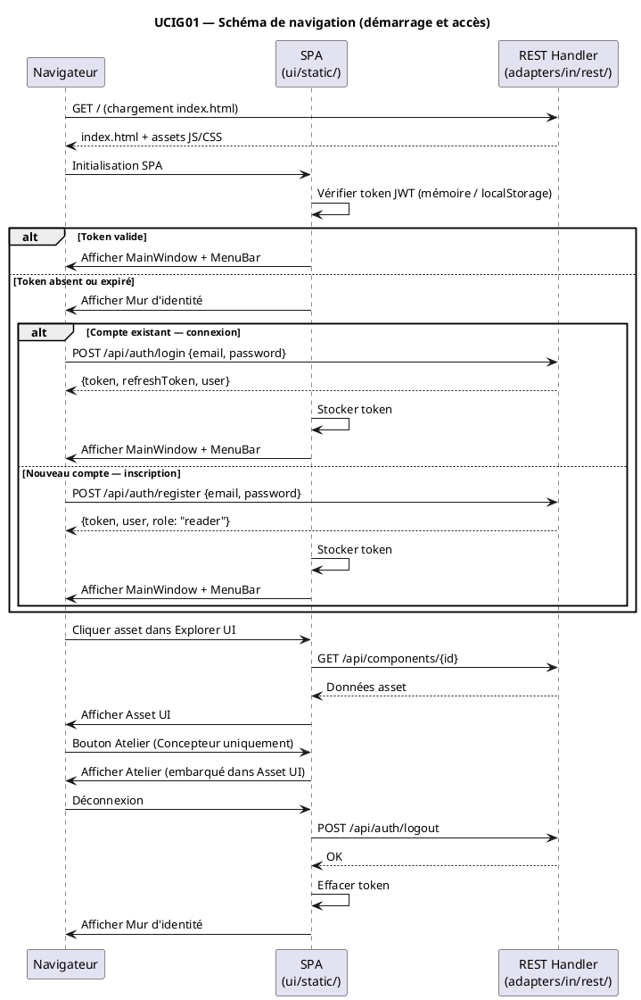

# Schéma de navigation

## Diagramme d'acteurs

## Contexte

Ce use case décrit la structure de navigation globale de l'interface MYR. L'interface est une Single Page Application (SPA) en Vanilla JS sans framework, servie par `myr-app.exe` depuis `ui/static/`.

Le client n'installe rien : il se connecte à l'adresse du serveur MYR de son organisation depuis son navigateur. Compatible Chrome 120+, Firefox 120+, Safari 17+, Edge 120+ (ENF22, ENF24).

La SPA est opérationnelle — `ui/static/index.html` est servi par `staticHandler` dans `buildMux()`. En mode développement (`MYR_DEV=1`), les fichiers sont servis depuis le disque sans recompilation (hot-reload).

## Pré-conditions

- Le serveur `myr-app.exe` est en cours d'exécution et accessible
- L'utilisateur dispose d'un navigateur compatible (ENF22)
- Aucun logiciel client supplémentaire n'est requis (ENF24)

## Scénario

**Étape initiale :** L'utilisateur ouvre l'application MYR dans son navigateur

### Flux nominal — Utilisateur avec session active

1. Le navigateur charge `index.html` depuis `myr-app.exe`
2. La SPA s'initialise et vérifie la présence d'un token JWT valide (mémoire ou localStorage)
3. Le token est valide → la MainWindow s'affiche directement
4. La MenuBar est visible en permanence : Recherche, Profil, New Asset
5. L'utilisateur navigue : recherche → Explorer UI → Asset UI (clic sur un asset)
6. Depuis Asset UI, l'utilisateur peut ouvrir l'Atelier (bouton Atelier — rôle Concepteur requis)
7. Les modales s'ouvrent depuis l'Atelier ou Asset UI selon l'action (créer, dériver, lier, soumettre…)

### Flux alternatif — Utilisateur sans session (compte existant)

1. La SPA détecte l'absence de token valide
2. Le Mur d'identité s'affiche (écran de connexion)
3. L'utilisateur saisit email + mot de passe → POST `/api/auth/login`
4. Authentification réussie → token JWT retourné
5. La SPA stocke le token et navigue vers la MainWindow
6. (À la première connexion) : provisionnement blockchain transparent (enrollment wallet Fabric)

### Flux alternatif — Nouvel utilisateur (inscription)

1. Le Mur d'identité affiche un lien "Créer un compte"
2. L'utilisateur remplit le formulaire → POST `/api/auth/register`
3. Le compte est créé avec le rôle **Lecteur** par défaut (RM21)
4. Connexion automatique → MainWindow affichée

### Flux alternatif — Mode hot-reload développement

1. `MYR_DEV=1` est défini dans l'environnement
2. `staticHandler` sert les fichiers depuis le disque `ui/static/`
3. Toute modification de fichier JS/HTML/CSS est visible au rechargement sans recompilation

### Flux erreur — Page introuvable (404)

1. L'utilisateur navigue vers une route inexistante
2. La SPA intercepte la route et affiche la page Erreur 404 (dans la MainWindow)
3. Un lien "Retour à l'accueil" est proposé

### Flux erreur — Serveur inaccessible

1. Le navigateur ne peut pas atteindre `myr-app.exe`
2. Le navigateur affiche une erreur réseau standard
3. La SPA ne peut pas se charger — aucun comportement SPA possible

## Post-conditions

- L'utilisateur est sur la MainWindow avec la MenuBar visible
- La session est active et le token JWT est mémorisé
- L'utilisateur peut accéder à toutes les fonctionnalités correspondant à son rôle

## Diagramme de séquence

## Règles métier déclenchées

- **EF48** : L'interface doit être cohérente et navigable
- **EF49** : La MenuBar est persistante sur toutes les pages
- **ENF22** : Navigateurs supportés — Chrome 120+, Firefox 120+, Safari 17+, Edge 120+
- **ENF24** : Aucun logiciel client requis — navigateur uniquement
- **RM21** : Rôle Lecteur attribué par défaut à l'inscription

## Exigences non-fonctionnelles

- Le chargement initial de la SPA (TTFB + First Contentful Paint) doit être inférieur à 2 s sur une connexion standard
- La navigation entre pages SPA ne doit pas provoquer de rechargement complet
- Compatible Chrome 120+, Firefox 120+, Safari 17+, Edge 120+ (ENF22)
- Aucun logiciel client supplémentaire requis (ENF24)
- En mode `MYR_DEV=1` : hot-reload des assets statiques sans recompilation

## Notes d'implémentation

**État actuel :** Implémenté. `ui/static/index.html` est servi par `myr-app.exe`. Hot-reload opérationnel avec `MYR_DEV=1`.

**Routing SPA :** La SPA gère le routing côté client. Le serveur sert toujours `index.html` pour toute route non-API (pattern `"/"` dans `buildMux()`). Le routing SPA est assuré par l'historique navigateur (`history.pushState`).

**Headers de sécurité :** `secureHeaders()` dans `server.go` applique CSP, X-Frame-Options, X-Content-Type-Options, Referrer-Policy sur toutes les réponses.

**Token JWT :** Émis par `POST /api/auth/login`, rafraîchi par `POST /api/auth/refresh`, révoqué par `POST /api/auth/logout`. L'endpoint `/api/auth/me` (GET protégé) retourne les données de l'utilisateur courant.

**Provisionnement wallet :** À la première connexion, l'endpoint `/api/auth/enroll-wallet` est appelé automatiquement par la SPA pour provisionner le wallet Fabric CA (transparent pour l'utilisateur).
